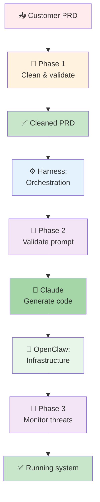

# Dev-House Foundation Summary

**Date**: 2026-02-28
**Status**: Architecture & documentation foundation complete
**Phase**: Ready for exploration & implementation planning

---

## What We've Built

A **secure, productionizable AI harness framework** for customers to convert business requirements (PRDs) into running infrastructure.

### The Core Idea

```
Customer provides PRD → Harness → Claude (code + architecture) → OpenClaw (infrastructure) → Running system
```

Plus: **Three-phase security pipeline** to prevent prompt injection, handle typos, and detect attacks.

---

## Foundation Documents Created

### Architecture & Vision (6 docs)
- **README.md** — Project overview, quick start, tech stack
- **docs/README.md** — Documentation index (fridge pattern)
- **docs/architecture/overview.md** — System design (7 layers, data flow)
- **docs/architecture/decisions.md** — Why we chose this architecture
- **docs/architecture/security-integration.md** — Where security fits (critical)

### Component Details (4 docs)
- **docs/harness/orchestration.md** — Orchestration engine, state management
- **docs/codex/generation.md** — Code generation patterns
- **docs/openclaw/integration.md** — Infrastructure orchestration
- **docs/deployment/customer-deployment.md** — Customer deployment guide

### Patterns & Security (3 docs)
- **docs/patterns/harness-patterns.md** — 8 reusable orchestration patterns
- **docs/security/prompt-security.md** — Three-phase security pipeline (detailed)
- **docs/security/local-guard-implementation.md** — Building a local LLM security guard (code examples)

### Project Context (2 docs)
- **CLAUDE.local.md** — Session cache + project patterns
- **.claude/memory/PATTERNS.md** — Session-persistent insights

---

## Architecture at a Glance



### Key Components

| Component | Purpose |
|-----------|---------|
| **Harness** | Orchestrate Claude calls, manage state, coordinate deployment |
| **Claude** | Code generation (Sonnet), architecture (Opus), validation (Haiku) |
| **OpenClaw** | Provision infrastructure, enforce policies, track costs |
| **Local Security Guard** | Validate prompts/responses offline (Mistral 7B or BERT) |

---

## Three-Phase Security Pipeline

### Phase 1: Discovery (PRD Cleaning)
- **When**: Customer submits PRD
- **What**: Fix typos, normalize structure, detect contradictions, block injection patterns
- **Tool**: Local LLM (Mistral 7B)
- **Cost**: ~100ms per PRD (one-time)
- **Output**: Cleaned, normalized PRD

### Phase 2: Development (Prompt Validation)
- **When**: Harness generates prompt to send to Claude
- **What**: Pattern matching → PII check → Intent analysis → Send to Claude → Validate response
- **Tool**: Pattern matcher + Local LLM
- **Cost**: ~50ms per prompt
- **Output**: Safe prompt, validated response

### Phase 3: Runtime (Threat Monitoring)
- **When**: Harness is running, OpenClaw is deploying
- **What**: Anomaly detection, threat scoring, cost tracking, behavior analysis
- **Tool**: Statistical models + telemetry
- **Cost**: ~20ms per interaction + background analysis
- **Output**: Incidents, alerts, audit logs

---

## Why This Architecture

### Harness-First ✅
- Modular: Different generators for different targets
- Validatable: Check outputs at each step
- Recoverable: Save checkpoints, resume on failure
- Observable: Customer sees progress

### State-Based ✅
- Reliable: Survive crashes, restart from checkpoint
- Debuggable: Know exactly where it failed
- Reusable: Generated artifacts can be reviewed/modified
- Cost-efficient: Don't regenerate if already cached

### Hybrid Claude Models ✅
- Cost-efficient: Sonnet for routine work, Haiku for validation
- High-capability: Opus for critical architectural decisions
- Flexible: Easy to adjust ratios as we learn

### OpenClaw Orchestration ✅
- Workflow management: Execute multi-step deployments
- Infrastructure as Code: Terraform, CloudFormation, Ansible
- Policy enforcement: Compliance, tagging, cost limits
- State tracking: Rollback, audit trails

### Three-Phase Security ✅
- Catches different threats at different times
- Phase 1 distinguishes honest mistakes from attacks
- Phase 2 validates every prompt before sending to Claude
- Phase 3 detects sophisticated attacks that slip through earlier phases

---

## Documentation Strategy

### The "Fridge" Pattern

Like checking a fridge before going to the store, check the index before searching:

1. **Start with docs/README.md** — Index of all documentation
2. **Find the right doc** — Table tells you what to read
3. **Read the specific doc** — Deep dive without context bloat
4. **Link back to related docs** — Navigate via hyperlinks

**Benefits**:
- Minimal CLAUDE.local.md (stays <200 lines)
- Fast navigation (no grepping, no blind searching)
- Scalable (add new docs, update index)
- Cacheable (links + index = session efficient)

### Mermaid Diagrams Policy

All diagrams use Mermaid (never ANSI art):
- Renderable in GitHub, browsers, markdown
- Text-based (version control friendly)
- Composable (build complex from simple)

---

## Security Decision Matrix

| Threat | Phase 1 | Phase 2 | Phase 3 | Decision |
|--------|---------|---------|---------|----------|
| Honest typos | ✅ Fix | ✅ OK | ✅ OK | Proceed |
| Contradictions | ⚠️ Flag | ✅ OK | ✅ Monitor | Review |
| Injection attempts | ❌ Block | ❌ Block | ❌ Alert | Reject |
| Jailbreak attempts | ✅ Pass | ⚠️ Medium-risk | ✅ Detailed | Investigate |

---

## Ready for Exploration

This foundation enables:

✅ **Clear architecture** — 7 layers, known components, documented decisions
✅ **Security by design** — Three-phase pipeline, local guards, audit trails
✅ **Documentation at scale** — Index-based navigation, always-current docs
✅ **Token efficiency** — Links instead of full content, session-persistent memory
✅ **Extensibility** — Patterns documented, new components can be added

---

## What's Next

You're ready to explore:

1. **Harness implementation** — State machine, task orchestration
2. **Claude integration** — Prompt engineering, response validation
3. **OpenClaw workflows** — Infrastructure templates, policy enforcement
4. **Security guard fine-tuning** — Real attack patterns from your domain
5. **Customer deployment** — Setup guides, operations playbooks

Each exploration should:
- Read relevant docs first
- Update docs as you learn
- Add patterns to PATTERNS.md
- Design before implementing

---

## File Structure

```
dev-house/
├── README.md                           # Project overview
├── CLAUDE.local.md                     # Project patterns & links
├── FOUNDATION_SUMMARY.md              # This file
│
├── docs/
│   ├── README.md                       # Documentation index
│   │
│   ├── architecture/
│   │   ├── overview.md                # System design
│   │   ├── decisions.md               # Why this architecture
│   │   └── security-integration.md    # Where security fits
│   │
│   ├── harness/
│   │   └── orchestration.md           # Orchestration engine
│   │
│   ├── codex/
│   │   └── generation.md              # Code generation
│   │
│   ├── openclaw/
│   │   └── integration.md             # Infrastructure orchestration
│   │
│   ├── deployment/
│   │   └── customer-deployment.md     # Customer setup
│   │
│   ├── patterns/
│   │   └── harness-patterns.md        # Reusable patterns
│   │
│   └── security/
│       ├── prompt-security.md         # Three-phase pipeline
│       └── local-guard-implementation.md  # Code examples
│
├── .claude/
│   └── memory/
│       └── PATTERNS.md                 # Session insights
│
└── [src/, tests/, examples/, scripts/ — to be built]
```

---

## Key Takeaways

1. **Architecture is modular** — Harness + Claude + OpenClaw are separate, composable
2. **Security is pipelined** — Each phase catches different threats at different times
3. **Documentation scales** — Index-based navigation, not content bloat
4. **Typos ≠ attacks** — Phase 1 distinguishes honest mistakes from malicious attempts
5. **Local LLM guards are valuable** — Offline, fast, zero token cost per check

---

**Status**: Ready to build. Let's explore together.

