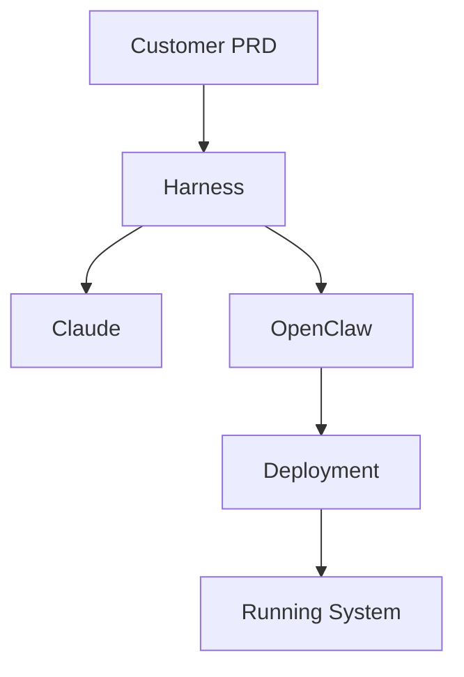

# Dev-House: AI Harness Automation Framework

## Project Vision

Build a customer-deployable **AI automation framework** for PRD-based (business specs) development using Claude as a core engine. This enables customers to leverage AI-assisted development patterns for infrastructure and code without deep AI expertise.

**Key Focus**: Productionization — not just architecture exploration, but deployable systems that customers can run themselves.

**Technology Stack**: Each AI employee node runs two concurrent code generation agents — Claude Code (Anthropic, ~$200/month) + OpenAI Codex (OpenAI, ~$200/month). Both implement tickets from the queue. Provider redundancy: if one goes down, the other continues. The Harness is a separate orchestration engine (not an AI subscription).

---

## Architecture Layers

### Three Critical Separations:

**1. Productionization vs Product Creation**
- **Productionization**: Dev-House infrastructure (where our AI agents run)
- **Product**: Customer's application code (what Codex generates)
- **Do not conflate**: Costs, ownership, operational complexity differ

**2. Two Execution Streams (Separate Worktrees)**
- **Stream 1 (Harness)**: PRD analysis → PRD breakdown and dependency mapping → Task generation and prioritisation → Architectural decisions → Repo structure
- **Stream 2 (Claude Code)**: Code generation → Services → Infrastructure templates
- **Do not merge**: Different concerns, different tokens, different timelines

**3. Local-to-Cloud Parity**
- **Local**: Docker Compose with all services running locally
- **Cloud**: Equivalent managed services (Container Apps, Managed DB, etc.)
- **Principle**: If it works in docker-compose, it works in production

---

## Architecture Layers

1. **Customer PRD Input** → Business specifications (what to build)
2. **Harness Orchestration** → Analyze PRD, decide architecture, plan repo structure
3. **Codex Code Generation** → Generate customer services, Terraform, CI/CD
4. **OpenClaw** → Infrastructure orchestration, deployment automation, policy enforcement
5. **Validation & Testing** → Automated correctness verification
6. **Deployment Engine** → Customer-facing infrastructure provisioning (Docker, Terraform, serverless containers [ACA, Cloud Run, Fargate], K8s) — see `docs/research/20260302_OPUS_aca-vs-kubernetes.md`

---

## Must Read: Session Start

**Read [`docs/README.md`](docs/README.md) before anything else — every session.**

It tells you exactly where every document lives. Checking it takes 30 seconds and prevents blind searching. If you're about to grep or glob, check the index first — the answer is probably already documented.

## Start Here

**New to Dev-House?** Start here:
1. **[docs/project-overview.md](docs/project-overview.md)** — Project vision and quick start (5 min)
2. **[docs/architecture/getting-started.md](docs/architecture/getting-started.md)** — Architecture story (30 min)
3. **[docs/README.md](docs/README.md)** — Documentation index (find what you need)

Then use [docs/README.md](docs/README.md) to navigate to specific topics.

---

## File Organization

**Golden Rule**: Never save working files to root. Use these directories:

```
dev-house/
├── docs/                    # All documentation (stateful, always current)
│   ├── README.md           # Documentation index/catalog
│   ├── architecture/        # System design documents
│   ├── harness/            # Harness-specific patterns
│   ├── deployment/         # Customer deployment procedures
│   ├── patterns/           # Reusable design patterns
│   └── standards/          # Ticket templates (versioned: v1/, v2/, ...)
├── src/                    # Source code
│   ├── harness/            # Core harness orchestration
│   ├── ai/                 # AI provider integrations (Claude Code, Claude API, OpenAI)
│   └── deployment/         # Deployment utilities
├── examples/               # Example PRDs, configurations
├── tests/                  # Test files
└── scripts/                # Utility/build scripts
```

---

## Context & Caching Strategy

**Problem**: `claude-flow init` overwrites CLAUDE.md on every initialisation, destroying any additions. Solution: Use CLAUDE.local.md — claude-flow does not touch it. Also serves as project-specific cache + memory files for patterns.

### What Goes Where

| Content | File | Rationale |
|---------|------|-----------|
| Generic rules (batching, git, code style) | ~/.claude/CLAUDE.md (global) | Shared across all projects |
| Project-specific patterns | CLAUDE.local.md (THIS FILE) | Stays small, project context |
| Architecture decisions | `docs/architecture/` | Link from CLAUDE.local.md |
| How things work (harness, codex) | `docs/harness/`, `docs/codex/` | Link from CLAUDE.local.md |
| Recurring debugging insights | Memory files | Fast retrieval, session persistent |
| Indexes to find things | `docs/README.md` | Start here, never search blind |

### Token Efficiency

- **Index files first** — docs/README.md is your fridge. Never grep blind; check the index first.
- **Link, don't repeat** — CLAUDE.local.md links to docs/, not full content
- **Stable knowledge in docs** — updates persist across sessions
- **Volatile knowledge in memory** — debugging patterns, session-specific insights
- **Naming standards** — Quick router in `docs/naming-standards.md` (also cached in `.claude/memory/NAMING-STANDARDS.md`)

---

## Development Workflow

### Before Starting Work

1. **Check docs/README.md** — Is there a doc for what I'm about to do?
2. **Read the relevant doc** — Don't grep; navigate via index
3. **Read architecture/decisions.md** — Understand why things are structured this way
4. **Read CLAUDE.local.md patterns section** — Any gotchas for this type of work?

### When Evaluating a New Customer PRD

5. **Use docs/deployment/pattern-selection-workbook.md** — 10-minute checklist to assess requirements and select appropriate deployment pattern
6. **Check deployment-patterns.md** — Understand full specifications of selected pattern
7. **Verify against pattern weaknesses** — Does selection handle all customer requirements?

### When Exploring

- Use **Glob/Grep tools** (not raw `find`/`grep`) — they respect exclusions
- Search **src/** first, then **docs/**
- Spawn a subagent (Explore) when the task has significant breadth or depth — judge by context cost, not file count

### When Implementing

- **Orchestrator** = you (preserve context; spawn subagents for significant breadth or depth)
- **Subagents** = heavy lifting (reading, analysis, implementation) — write a complete self-contained prompt, zero session context assumed
- **Logical group batching** — batch all operations within one logical group in a single message; don't batch across different tickets or unrelated concerns

### Documentation & Review Policy

**RULE: Code changes = docs updated in same commit. No deferred documentation.**

1. **Before committing**: Check [docs/documentation-maintenance.md](docs/documentation-maintenance.md)
   - What did I change?
   - What docs must I update?
   - Update them before committing

2. **Gotchas discovered?** Add to [docs/gotchas.md](docs/gotchas.md)
   - Problem, why, solution, prevention
   - Link from relevant docs

3. **Pattern learned?** Add to [.claude/memory/PATTERNS.md](.claude/memory/PATTERNS.md)
   - Persistent knowledge across sessions
   - Add to "Session Learnings" table

4. **Review policy**: [docs/review-policy.md](docs/review-policy.md)
   - Per-commit (immediate): Check map, update docs
   - Per-session (every few commits): Spot-check consistency
   - Quarterly deep review: Verify all docs against implementation

5. **GitHub workflow**: [docs/workflow/github-workflow.md](docs/workflow/github-workflow.md)
   - Use issues/PRs as narrative history of decisions
   - Issue descriptions capture "what" and "why", PRs show "how"
   - Together: complete story of project evolution

---

## Search Exclusions

Always exclude these to save context:

```
__pycache__/
*.pyc, *.pyo
.pytest_cache/
.mypy_cache/
node_modules/
venv/, .venv/
build/
dist/
```

Use Grep/Glob tools — they auto-exclude. Favour internal tools over raw `grep`/`find`.

---

## Critical Patterns

### 1. File Organization Rule
**NEVER save working files to root.** Subdirs only: `src/`, `tests/`, `docs/`, `scripts/`, `examples/`.

### 2. Logical Group Batching
Always batch all operations within one logical group in a single message:
- File reads (parallel)
- File writes/edits (parallel)
- Bash commands (parallel if independent)
- Task spawns (parallel)

Multiple messages = wasted context + worse parallelization. Don't batch across different tickets or unrelated concerns.

### 3. Search Before Write
Before writing a function/utility, grep for it. Assume it exists. Rewriting = bloat + bugs.

### 4. Documentation Maintenance Table
Keep a table of "when you do X, update Y docs". Update in the same commit as code changes. No deferred doc updates.

### 5. Subagent Contract
Subagents have zero session context. When spawning one, write a complete self-contained prompt: task, context, file paths, expected output format, and model selection (see `docs/architecture/model-router.md`). An incomplete handover = an unreliable result.

### 6. Worktrees Are a Concurrency Pattern
Worktrees enable concurrent work on the same repo. If working alone sequentially, use branches and PRs — not worktrees. Use worktrees when running multiple agents simultaneously on isolated tasks.

### 7. Documentation Reference in Tickets
Every ticket must list docs a subagent must read before implementing. Subagents have no session context; links prevent re-invention.

### 8. Critical Gotchas Section
Document the pitfalls for your domain:
- Common mistakes (what breaks)
- Why they're hard to debug
- The correct pattern

---

## How to Use This File

**This is your session cache.** When context fills up:
1. Session learning → update `docs/patterns/` with recurring discoveries
2. Links here → CLAUDE.local.md points to detailed docs
3. Repeat patterns → memory files for debugging insights
4. Token cost → docs + links + memory = fast restarts

---

## Ticket Standards

**Templates**: `docs/standards/` — feature, bug, infra, refactor (semver in file header)
**Index**: `docs/README.md#ticket-standards` — selection guide, provenance tuple, versioning rules

### Ticket Self-Containment Rules

Every ticket must be implementable by an agent with zero session context.

**SUPPLY (mandatory):**
- **What**: Problem statement, expected outcome, acceptance criteria
- **Why**: Business motivation, PRD reference, customer impact
- **Context**: File paths (with line numbers), related ticket IDs, existing infrastructure to reuse
- **Documentation Reference**: Every doc the implementer MUST read before starting (see pattern below)
- **Scope boundary**: What's in/out of scope, definition of done
- **Provenance**: PRD source, template version, harness type, target repo

**DO NOT SUPPLY:**
- **How**: Solution approach is free — implementer chooses design
- Architecture decisions that conflict with existing patterns
- Hardcoded values that belong in config
- Exception: if a technical constraint leaves only one viable approach, state the constraint (not the solution)

### Documentation Reference Pattern (Mandatory in Every Ticket)

```markdown
## Documentation Reference
> Read EVERY doc listed here before writing any code.

**Always read:**
- [ ] `docs/architecture/decisions.md`
- [ ] `CLAUDE.local.md` — gotchas, criminal offences, patterns

**Specific to this ticket:**
- [ ] `docs/<path>` — [why relevant]

**Search before write:**
- [ ] Grep `src/` for: `<function_name>` before creating new code
```

### Automated Pipeline Auto-Commit

The interactive "no auto-commit" rule applies to human-supervised Claude sessions.
Automated harness pipelines (Codex, OpenClaw runs) **should commit automatically** — that's their purpose. Each completed feature = one commit, one progress update.

---

## Sources of Truth

| Data Type | Canonical Location | Anti-pattern |
|-----------|-------------------|--------------|
| Customer PRD | `examples/<customer>.md` or customer-provided | Never duplicate in tickets |
| Deployment pattern specs | `docs/deployment/deployment-patterns.md` | Not in CLAUDE.local.md |
| Architecture decisions | `docs/architecture/decisions.md` | Not in tickets |
| Ticket templates | `docs/standards/*.md` | Semver in file header — bump version + add changelog entry to update |
| Harness workflow | `docs/architecture/anthropic-harness-pattern-extended.md` | Not in code |
| Security pipeline | `docs/security/prompt-security.md` | Not duplicated |
| Naming standards | `docs/naming-standards.md` | Not re-specified in tickets |
| Gotchas | `docs/gotchas.md` | Discovered = document there immediately |

---

## Criminal Offences

Things that cause silent failures or hard-to-debug problems. Don't do these.

1. **Creating a ticket without a Documentation Reference section** — subagents have no session context; they will reinvent everything
2. **Implementing without reading the referenced docs** — leads to duplication, misuse of existing patterns
3. **Updating a template without bumping its version** — always increment semver and add a changelog entry; old tickets record which version they used
4. **Conflating productionization cost with product cost** — Dev-House infra cost (where we run) is separate from customer infra cost (what we deploy)
5. **Writing new utility code without grepping first** — assume it exists; duplicate implementations always diverge
6. **Renaming anything without grepping the entire repo** — one missed reference = production bug
7. **Running harness agents without PRD provenance fields in the ticket** — traceability breaks; quality audits become impossible

---

## Standing Tickets / Common Tasks

*To be filled in as patterns emerge.*

---

## Security Architecture (CRITICAL)

**Dev-House receives customer PRDs and generates prompts for Claude. Both are attack surfaces.**

Three-phase security pipeline:
1. **Discovery phase** — Clean customer PRD (fix typos, detect injection)
2. **Development phase** — Validate generated prompts (before sending to Claude)
3. **Runtime phase** — Monitor Claude responses (detect jailbreaks, anomalies)

**Local security guard** (small local LLM):
- Pattern matching (1ms, 100% accuracy on known attacks)
- Fast classification (5ms, BERT-based safe/unsafe check)
- Detailed analysis (100ms, Mistral 7B intent verification)

**Key insight**: Customers make typos (honest mistakes). Phase 1 fixes them. Phases 2-3 catch malicious attempts.

See: [docs/security/prompt-security.md](docs/security/prompt-security.md) and [docs/security/local-guard-implementation.md](docs/security/local-guard-implementation.md)

---

## Gotchas for This Project

- **Prompt injection is subtle** — Clever attacks may slip through pattern matching
- **User typos are honest** — Don't treat all unusual input as attacks; Phase 1 cleans
- **Claude can be jailbroken** — Local guard validates responses too, not just prompts
- **Cost of security** — Phase 1+2 add ~100ms latency; Phase 3 is background; worth it

---

## Documentation Style Policies

### Diagrams
- **Use Mermaid** for all diagrams (flowcharts, architecture, state machines, etc.)
- Never use ANSI/Unicode box drawing characters
- Mermaid is renderable in GitHub, browsers, and markdown viewers
- Update existing ANSI diagrams to Mermaid

### Example Mermaid Diagram


---

## Important Reminders

- **Do what is asked; nothing more, nothing less**
- **Prefer editing existing files to creating new ones**
- **In interactive sessions**: don't create documentation unless asked. In automated pipeline runs (Codex, Harness), documentation generation is implied by the workflow.
- **Never save working files to root**
- **Batch all related operations in a single message**
- **Use Mermaid for all diagrams** (never ANSI art)

