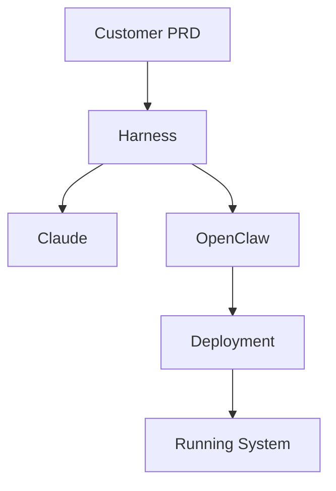

# Dev-House: AI Harness Automation Framework

## Project Vision

Build a customer-deployable **AI automation framework** for PRD-based (business specs) development using Claude as a core engine. This enables customers to leverage AI-assisted development patterns for infrastructure and code without deep AI expertise.

**Key Focus**: Productionization — not just architecture exploration, but deployable systems that customers can run themselves.

**Technology Stack**: Claude API (Codex for code generation, Harness for orchestration)

---

## Architecture Layers

### Three Critical Separations:

**1. Productionization vs Product Creation**
- **Productionization**: Dev-House infrastructure (where our AI agents run)
- **Product**: Customer's application code (what Codex generates)
- **Do not conflate**: Costs, ownership, operational complexity differ

**2. Two Execution Streams (Separate Worktrees)**
- **Stream 1 (Harness)**: PRD analysis → Architectural decisions → Repo structure
- **Stream 2 (Codex)**: Code generation → Services → Infrastructure templates
- **Do not merge**: Different concerns, different tokens, different timelines

**3. Local-to-Cloud Parity**
- **Local**: Docker Compose with all services running locally
- **Cloud**: Equivalent managed services (Container Apps, Managed DB, etc.)
- **Principle**: If it works in docker-compose, it works in production

---

## Architecture Layers

1. **Customer PRD Input** → Business specifications (what to build)
2. **Harness Orchestration** → Analyze PRD, decide architecture, plan repo structure
3. **Codex Code Generation** → Generate customer services, Terraform, CI/CD
4. **OpenClaw** → Infrastructure orchestration, deployment automation, policy enforcement
5. **Validation & Testing** → Automated correctness verification
6. **Deployment Engine** → Customer-facing infrastructure provisioning (Docker, Terraform, K8s)

---

## Start Here: Read the Architecture Story

**New to Dev-House?** Start with [docs/architecture/GETTING-STARTED.md](docs/architecture/GETTING-STARTED.md)

It explains the complete story in 30 minutes:
1. The three separations we don't conflate
2. How Anthropic's Harness pattern works
3. How our architecture extends it
4. The workflow timeline

Then use [docs/README.md](docs/README.md) as the index to find specific docs.

---

## File Organization

**Golden Rule**: Never save working files to root. Use these directories:

```
dev-house/
├── docs/                    # All documentation (stateful, always current)
│   ├── README.md           # Documentation index/catalog
│   ├── architecture/        # System design documents
│   ├── harness/            # Harness-specific patterns
│   ├── deployment/         # Customer deployment procedures
│   └── patterns/           # Reusable design patterns
├── src/                    # Source code
│   ├── harness/            # Core harness orchestration
│   ├── codex/              # Claude Codex integration
│   └── deployment/         # Deployment utilities
├── examples/               # Example PRDs, configurations
├── tests/                  # Test files
└── scripts/                # Utility/build scripts
```

---

## Context & Caching Strategy

**Problem**: CLAUDE.md gets large fast. Solution: Use CLAUDE.local.md as project-specific cache + memory files for patterns.

### What Goes Where

| Content | File | Rationale |
|---------|------|-----------|
| Generic rules (batching, git, code style) | ~/.claude/CLAUDE.md (global) | Shared across all projects |
| Project-specific patterns | CLAUDE.local.md (THIS FILE) | Stays small, project context |
| Architecture decisions | `docs/architecture/` | Link from CLAUDE.local.md |
| How things work (harness, codex) | `docs/harness/`, `docs/codex/` | Link from CLAUDE.local.md |
| Recurring debugging insights | Memory files | Fast retrieval, session persistent |
| Indexes to find things | `docs/README.md` | Start here, never search blind |

### Token Efficiency

- **Index files first** — docs/README.md is your fridge. Never grep blind; check the index first.
- **Link, don't repeat** — CLAUDE.local.md links to docs/, not full content
- **Stable knowledge in docs** — updates persist across sessions
- **Volatile knowledge in memory** — debugging patterns, session-specific insights
- **Naming standards in memory** — Quick router in `.claude/memory/NAMING-STANDARDS.md` for when creating files

---

## Development Workflow

### Before Starting Work

1. **Check docs/README.md** — Is there a doc for what I'm about to do?
2. **Read the relevant doc** — Don't grep; navigate via index
3. **Read architecture/decisions.md** — Understand why things are structured this way
4. **Read CLAUDE.local.md patterns section** — Any gotchas for this type of work?

### When Evaluating a New Customer PRD

5. **Use docs/deployment/pattern-selection-workbook.md** — 10-minute checklist to assess requirements and select appropriate deployment pattern
6. **Check deployment-patterns.md** — Understand full specifications of selected pattern
7. **Verify against pattern weaknesses** — Does selection handle all customer requirements?

### When Exploring

- Use **Glob/Grep tools** (not raw `find`/`grep`) — they respect exclusions
- Search **src/** first, then **docs/**
- If search requires 4+ files, spawn a subagent (Explore)

### When Implementing

- **Orchestrator** = you (preserve context, 3-file max in main context)
- **Subagents** = heavy lifting (reading, analysis, implementation)
- **Batch operations** — 1 message = all related reads, writes, edits

### Documentation & Review Policy

**RULE: Code changes = docs updated in same commit. No deferred documentation.**

1. **Before committing**: Check [DOCUMENTATION_MAINTENANCE.md](DOCUMENTATION_MAINTENANCE.md)
   - What did I change?
   - What docs must I update?
   - Update them before committing

2. **Gotchas discovered?** Add to [GOTCHAS.md](GOTCHAS.md)
   - Problem, why, solution, prevention
   - Link from relevant docs

3. **Pattern learned?** Add to [.claude/memory/PATTERNS.md](.claude/memory/PATTERNS.md)
   - Persistent knowledge across sessions
   - Add to "Session Learnings" table

4. **Review policy**: [REVIEW_POLICY.md](REVIEW_POLICY.md)
   - Per-commit (immediate): Check map, update docs
   - Per-session (every few commits): Spot-check consistency
   - Quarterly deep review: Verify all docs against implementation

5. **GitHub workflow**: [docs/workflow/GITHUB_WORKFLOW.md](docs/workflow/GITHUB_WORKFLOW.md)
   - Use issues/PRs as narrative history of decisions
   - Issue descriptions capture "why", PRs show "how"
   - Together: complete story of project evolution

---

## Search Exclusions

Always exclude these to save context:

```
__pycache__/
*.pyc, *.pyo
.pytest_cache/
.mypy_cache/
node_modules/
venv/, .venv/
build/
dist/
```

Use Grep/Glob tools — they auto-exclude. Never raw `grep`/`find`.

---

## Critical Patterns (From Sibling Projects)

### 1. File Organization Rule
**NEVER save working files to root.** Every sibling project enforces this. Subdirs only: `src/`, `tests/`, `docs/`, `scripts/`, `examples/`.

### 2. Batching (1 MESSAGE = ALL OPS)
From chatbot/SPARC: Always batch in a single message:
- File reads (parallel)
- File writes/edits (parallel)
- Bash commands (parallel if independent)
- Task spawns (parallel)

Multiple messages = wasted context + worse parallelization.

### 3. Search Before Write
From tic-tac-toe: Before writing a function/utility, grep for it. Assume it exists. Rewriting = bloat + bugs.

### 4. Documentation Maintenance Table
From tic-tac-toe: Keep a table of "when you do X, update Y docs". Update in the same commit as code changes. No deferred doc updates.

### 5. Orchestrator Pattern
From tic-tac-toe: Claude is the orchestrator (preserve context). Read ≤3 files. For 4+ files, spawn a subagent (Explore type).

### 6. No Worktrees Without Explicit Ask
From tic-tac-toe CLAUDE.local.md: **NEVER use worktrees unless user says "use a worktree"**. Worktrees caused stale branch issues.

### 7. Documentation Reference in Tickets
From tic-tac-toe: Every ticket must list docs a subagent must read before implementing. Subagents have no session context; links prevent re-invention.

### 8. Critical Gotchas Section
Document the pitfalls for your domain:
- Common mistakes (what breaks)
- Why they're hard to debug
- The correct pattern

---

## How to Use This File

**This is your session cache.** When context fills up:
1. Session learning → update `docs/patterns/` with recurring discoveries
2. Links here → CLAUDE.local.md points to detailed docs
3. Repeat patterns → memory files for debugging insights
4. Token cost → docs + links + memory = fast restarts

---

## Standing Tickets / Common Tasks

*To be filled in as patterns emerge.*

---

## Security Architecture (CRITICAL)

**Dev-House receives customer PRDs and generates prompts for Claude. Both are attack surfaces.**

Three-phase security pipeline:
1. **Discovery phase** — Clean customer PRD (fix typos, detect injection)
2. **Development phase** — Validate generated prompts (before sending to Claude)
3. **Runtime phase** — Monitor Claude responses (detect jailbreaks, anomalies)

**Local security guard** (small local LLM):
- Pattern matching (1ms, 100% accuracy on known attacks)
- Fast classification (5ms, BERT-based safe/unsafe check)
- Detailed analysis (100ms, Mistral 7B intent verification)

**Key insight**: Customers make typos (honest mistakes). Phase 1 fixes them. Phases 2-3 catch malicious attempts.

See: [docs/security/prompt-security.md](docs/security/prompt-security.md) and [docs/security/local-guard-implementation.md](docs/security/local-guard-implementation.md)

---

## Gotchas for This Project

- **Prompt injection is subtle** — Clever attacks may slip through pattern matching
- **User typos are honest** — Don't treat all unusual input as attacks; Phase 1 cleans
- **Claude can be jailbroken** — Local guard validates responses too, not just prompts
- **Cost of security** — Phase 1+2 add ~100ms latency; Phase 3 is background; worth it

---

## Documentation Style Policies

### Diagrams
- **Use Mermaid** for all diagrams (flowcharts, architecture, state machines, etc.)
- Never use ANSI/Unicode box drawing characters
- Mermaid is renderable in GitHub, browsers, and markdown viewers
- Update existing ANSI diagrams to Mermaid

### Example Mermaid Diagram


---

## Important Reminders

- **Do what is asked; nothing more, nothing less**
- **Prefer editing existing files to creating new ones**
- **Never proactively create documentation** unless explicitly asked
- **Never save working files to root**
- **Batch all related operations in a single message**
- **Use Mermaid for all diagrams** (never ANSI art)

