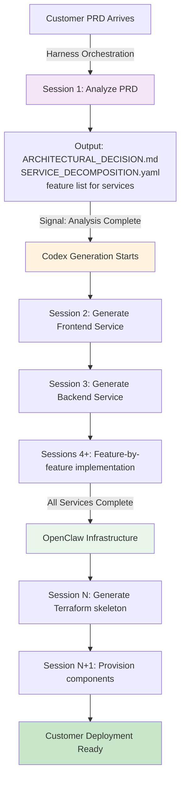

# Anthropic Harness Pattern: How Dev-House Extends It

**Dev-House builds on Anthropic's proven Harness pattern for long-running agents. This document explains the relationship.**

---

## What is Anthropic's Harness Pattern?

[Reference: Effective Harnesses for Long-Running Agents](https://www.anthropic.com/engineering/effective-harnesses-for-long-running-agents)

Anthropic defines a two-phase agent pattern:

### Phase 1: Initializer Agent (First Session)

Sets up the structured environment:
```
init.sh                    - Script to run dev environment
claude-progress.txt        - Document what's been done
features.json             - Feature list (200+ items, marked passing/failing)
.git/ (initial commits)   - Baseline codebase
```

**Purpose**: Establish a clear handoff point for future sessions

### Phase 2: Coding Agent (Subsequent Sessions)

Incremental work, session-by-session:
1. Read progress files and git logs
2. Select ONE feature from feature list
3. Implement in isolated git branch
4. Test (browser automation, unit tests)
5. Update progress file
6. Commit to main

**Purpose**: Make reproducible progress; avoid "one-shotting" entire projects

---

## The Problem Anthropic Solved

**Traditional approach (fails):**
```
Session 1: Build entire app in one shot
→ Claude tries to do everything
→ Hallucinations about side effects
→ Incomplete implementation
→ No progress tracking
```

**Anthropic's approach (succeeds):**
```
Session 1 (Initializer):
  ├── Create feature list (200 items)
  ├── Build baseline (git commit #1)
  └── Document: "features.json has 0/200 passing"

Session 2 (Coding Agent):
  ├── Read: 0/200 passing
  ├── Pick Feature #1 (user auth)
  ├── Implement + test
  ├── Commit (auth: implement login form)
  └── Update: "1/200 passing"

Session 3 (Coding Agent):
  ├── Read: 1/200 passing
  ├── Pick Feature #2
  ├── Continue...
```

**Result**: Clear progress, reproducible, testable, no hallucinations about prior work.

---

## How Dev-House EXTENDS This Pattern

We apply Anthropic's Harness pattern **three levels up**:

```
Dev-House Harness (Level 3)
│
├─ Harness Orchestration (Anthropic Pattern applied to PRD analysis)
│  └─ Initializer: Analyze PRD → produce ARCHITECTURAL_DECISION.md + feature list
│  └─ Analyzer: Each session, implement one architectural decision
│
├─ Codex Code Generation (Anthropic Pattern applied to service repos)
│  └─ Initializer: Generate service repos → baseline code + feature list
│  └─ Generator: Each session, implement one service feature
│
└─ OpenClaw Infrastructure (Anthropic Pattern applied to Terraform)
   └─ Initializer: Generate Terraform skeleton → baseline infra
   └─ Orchestrator: Each session, provision one resource

All three layers use: [Initializer] → [Progress files] → [Coding loop]
```

---

## Layer 1: Harness Orchestration (Analyzing PRDs)

**Our "Initializer Agent":**
```
When new PRD arrives:
1. Spawn Harness agent (Claude Opus)
2. Analyze PRD in one session
3. Produce:
   ├── ARCHITECTURAL_DECISION.md   (analogous to init.sh)
   ├── SERVICE_DECOMPOSITION.yaml  (analogous to feature list)
   ├── REPO_STRUCTURE.yaml
   ├── COMPONENT_REQUIREMENTS.yaml
   └── Git commit: "feat: initial architecture for [customer]"
```

**Reasoning**: Instead of decomposing a codebase (like Anthropic's pattern), we're decomposing a business requirement (PRD).

**Progress tracking:**
```yaml
# claude-progress.txt equivalent
harness_analysis_status:
  customer: acme-corp
  phase: analysis
  completed:
    - customer_profile_analysis
    - service_decomposition
    - pattern_selection
  pending:
    - capacity_planning
    - cost_estimation
  progress: 3/5
```

---

## Layer 2: Codex Code Generation (Building Services)

**Our "Initializer Agent":**
```
When Harness analysis completes:
1. Spawn Codex agent for each service
2. Generate baseline code in one session:
   ├── Service repo created (GitHub)
   ├── Dockerfile + docker-compose.yaml
   ├── feature.json (API endpoints, DB tables, etc.)
   ├── Tests (empty, ready to fill)
   └── Git commit: "feat: initial [service] scaffold"
```

**Our "Coding Agents":**
```
For each subsequent session:
1. Read feature.json
2. Pick one feature (e.g., "POST /users endpoint")
3. Implement:
   ├── API handler
   ├── Database schema
   ├── Unit tests
   └── Integration tests
4. Run: docker compose up && pytest
5. Commit: "feat: implement POST /users endpoint"
6. Update: feature.json (mark as passing)
```

**Progress tracking:**
```yaml
# In each service repo
codex_generation_status:
  service: backend-api
  total_features: 45
  completed: 12
  passing: 12
  failing: 0
  progress: "12/45 (27%)"
```

---

## Layer 3: OpenClaw Infrastructure (Deploying)

**Anthropic's pattern applied to Terraform:**

```
Initializer phase:
├── Generate terraform/ directory
├── Generate compose.yaml (local parity)
├── Generate .github/workflows/plan.yml
└── Git commit: "infra: initial terraform scaffold"

Coding phase (per session):
├── Pick one component (e.g., "database")
├── Generate terraform/database.tf
├── Run: terraform validate
├── Run: terraform plan (dry-run)
├── Commit: "infra: add postgres database"
└── Update: progress file
```

**Progress tracking:**
```yaml
infrastructure_deployment:
  components:
    - networking: completed
    - database: in-progress
    - cache: pending
    - container_apps: pending
  progress: "1/4 (25%)"
```

---

## The Workflow: How Three Layers Coordinate



---

## Practical Implementation: Using Claude Agent SDK

Anthropic provides **Claude Agent SDK** with built-in support for:

1. **Subagents**: Spawn parallel agents for different services
2. **Context Management**: Automatic compaction, isolated context windows
3. **Tool Integration**: MCP for GitHub, file system, bash
4. **Orchestration Loops**: gather → action → verify → repeat

### Dev-House Architecture Using SDK

```python
import asyncio
from claude_agent_sdk import query  # pip install claude-agent-sdk

async def process_prd(prd_path: str):
    """Anthropic Pattern: Initializer phase, then parallel coding agents."""

    # Phase 1: Harness Initializer (Opus — architecture decisions)
    # Produces: ARCHITECTURAL_DECISION.md, SERVICE_DECOMPOSITION.yaml,
    #           feature_list.json (N items, all passes=false), git commit
    async for message in query(
        prompt=f"Read {prd_path}. Produce ARCHITECTURAL_DECISION.md, "
               f"SERVICE_DECOMPOSITION.yaml, and feature_list.json. "
               f"Commit: 'feat: initial architecture for [customer]'.",
        options={"model": "claude-opus-4-6"}
    ):
        print(message)

    # Phase 2: Codex generators — one per service, run in parallel
    # Each reads feature_list.json, implements one feature per session,
    # commits, marks feature passes=true, ends in clean state
    services = ["frontend", "backend-api", "infrastructure"]
    await asyncio.gather(*[
        _run_codex_generator(service) for service in services
    ])

    # Phase 3: OpenClaw provisioner — one Terraform component per session
    async for message in query(
        prompt="Read SERVICE_DECOMPOSITION.yaml. Generate Terraform skeleton. "
               "Then implement one infrastructure component, validate, plan, commit.",
        options={"model": "claude-sonnet-4-6"}
    ):
        print(message)

async def _run_codex_generator(service: str):
    async for message in query(
        prompt=f"Read feature_list.json. Pick the first pending feature for "
               f"the {service} service. Implement it, run tests, commit, "
               f"mark passes=true. End in a clean commitable state.",
        options={"model": "claude-sonnet-4-6"}
    ):
        print(message)

# Usage:
asyncio.run(process_prd("examples/prd-brightpath-compliance.md"))
```

---

## Comparison: DIY vs Anthropic SDK

### DIY Implementation (What we could build)

```python
# Manual — raw Anthropic API, no tool use
import anthropic
client = anthropic.Anthropic()

prd = open("prd.md").read()
analysis = client.messages.create(
    model="claude-opus-4-6",
    messages=[{"role": "user", "content": f"Analyze: {prd}"}]
)
for service in parse_services(analysis):
    code = client.messages.create(
        model="claude-sonnet-4-6",
        messages=[{"role": "user", "content": f"Generate {service}"}]
    )
    open(f"{service}/main.py", "w").write(code.content[0].text)
# Risk: no tool use, no file system access, no git, no state management,
#       lost progress on error, must parse free-text output manually
```

### Using Claude Agent SDK (Recommended)

```python
# Claude Agent SDK — full tool use, file system, git, resumable
from claude_agent_sdk import query

async for message in query(
    prompt="""
    Using Anthropic's Harness pattern:
    1. Read prd.md
    2. Produce ARCHITECTURAL_DECISION.md + feature_list.json
    3. Commit: 'feat: initial architecture for [customer]'
    """,
    options={"model": "claude-opus-4-6"}
):
    print(message)
# Benefit: bash, file read/write, git all available as tools;
#          state lives in files (resumable after context window);
#          each session ends with a clean git commit
```

**Recommendation**: Use Claude Agent SDK. It gives Claude access to tools (bash, file system, git) — the state-in-files pattern only works if the agent can read and write files.

---

## How This Differs from Traditional Orchestration

| Aspect | Traditional (OpenClaw-only) | Harness-Extended (Our approach) |
|--------|----------|------------|
| **Agent model** | Single large model per task | Specialized agents (Opus for analysis, Sonnet for code) |
| **Progress tracking** | Database records | Git commits + progress files |
| **State handoff** | API calls between services | Git logs + progress docs (readable by future agents) |
| **Parallelization** | Queue-based jobs | Subagents (built into SDK) |
| **Error recovery** | Retry logic | Re-read prior work from git; continue from checkpoint |
| **Cost optimization** | All-or-nothing re-runs | Resume from last working feature |

---

## Workflow Automation: Integrating OpenClaw

**OpenClaw's role**: NOT the primary orchestration, but the **deployment execution engine**

```
Harness (Analysis)
    ↓
Codex (Code Generation)
    ↓
OpenClaw (Infrastructure Orchestration & Deployment)
    ├── Terraform generation → Plan
    ├── Cost estimation
    ├── Policy enforcement (compliance checks)
    ├── Resource provisioning
    └── Deployment sequencing + rollback
```

**Where OpenClaw fits:**
1. **After code generation complete**
2. Codex produces `terraform/`
3. OpenClaw validates, plans, applies
4. OpenClaw handles: cost tracking, policy enforcement, rollback logic

**Not a replacement** for Harness; it's **downstream execution**.

---

## Reference Implementation: Session-by-Session

### Session 1 (Harness Initializer)
```
Duration: ~2 hours
Agent: Claude Opus
Input: customer_prd.md
Output:
  - ARCHITECTURAL_DECISION.md
  - SERVICE_DECOMPOSITION.yaml
  - feature_list.json (200 items, 0/200 done)
  - Git commit: "feat: architecture for [customer]"
Status: Ready for Codex
```

### Session 2-5 (Codex Code Generation)
```
Duration: 4 hours each (parallel)
Agent: Claude Sonnet (subagents)
Input: SERVICE_DECOMPOSITION.yaml, feature_list.json
Output:
  - service/[frontend|backend|...]/
  - Git commits per feature
  - Updated: feature_list.json (progress)
Status: Ready for OpenClaw
```

### Session 6+ (OpenClaw Provisioning)
```
Duration: 1 hour per component
Agent: Terraform orchestrator
Input: service code + infrastructure specs
Output:
  - terraform/main.tf
  - terraform/plan (dry-run)
  - terraform/apply (provisioning)
  - Deployed: Customer infrastructure
Status: Customer live
```

---

## See Also

- **[Anthropic's Effective Harnesses for Long-Running Agents](https://www.anthropic.com/engineering/effective-harnesses-for-long-running-agents)** — Original pattern
- **[Claude Agent SDK Documentation](https://platform.claude.com/docs)** — Implementation tools
- **[execution-streams-codex-vs-harness.md](execution-streams-codex-vs-harness.md)** — How we apply this in practice
- **[dev-house-operational-infrastructure.md](dev-house-operational-infrastructure.md)** — Where the agents run
