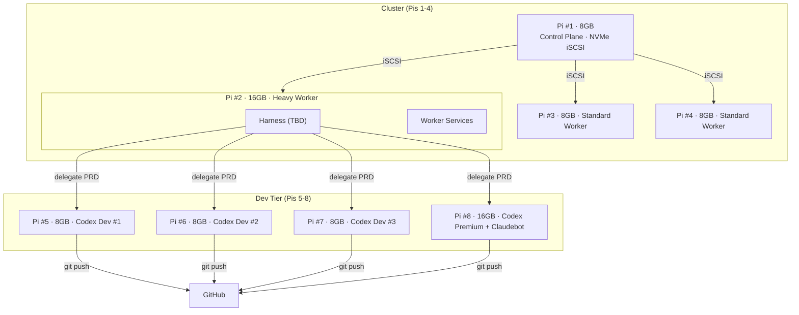

# Dev-House: Cluster Reference Pattern (Raspberry Pi)

**Date**: 2026-02-28
**Pattern**: Pi cluster — 1x8GB Control Plane + 3x Workers + 4x Codex/Dev

---

## About This Document

### Dev vs Production

**This cluster is a development system only.** Production deployments are a separate concern — when a customer PRD is validated, Dev-House generates Terraform components that provision cloud infrastructure for the customer. The Pi cluster never touches production.

```
Dev-House Pi Cluster:
└── Runs jobs overnight → generates code → pushes to GitHub

Separate production pipeline:
└── Terraform components → customer cloud infrastructure (AWS/GCP/Azure)
```

### Purpose of the Pi Cluster

Run **8–12 concurrent overnight jobs** working through large PRDs — no human in the loop, no interactive sessions. By morning, results are ready for review.

This changes the risk calculus: the cluster does not need production SLAs. It needs to be reliable enough to run unattended for 6–8 hours without falling over.

### Other Hardware Patterns Under Consideration

- **Mac Mini cluster** — higher single-core performance, unified memory, more expensive
- **Cloud** — variable cost, no hardware, spin up/down as needed
- **Hybrid** — local cluster for dev throughput, cloud burst for GPU or scale

This Pi pattern is a **cost-optimised, portable reference**. Validate it before committing.

---

## Empirical Basis: Real Pi 5 Operational Data

Before designing this cluster, a production Pi 5 (4GB) running **16 services** was observed in normal operation (not under stress):

```
Load average:  0.01 – 0.03  (effectively idle)
CPU peak:      ~25% on a single core (transient burst, not sustained)
Per container: <0.11% CPU average
Memory:        comfortable within 4GB
```

**Interpretation for this cluster**:

- The Pi 5 has substantial headroom even while hosting many services — it was not being pushed
- A Pi 5 is not the bottleneck. Claude API round-trips (10–20 sec each) dominate latency — the Pi sits idle between calls
- A single 8GB Pi can sustain 1–2 concurrent Claude+Codex pairs comfortably; swap pressure begins at 3+
- The constraint is **RAM, not CPU** — this is why node sizing targets memory headroom, not core count
- ARM architecture is not a concern for this workload — no native compilation, no GPU inference, just API calls and file I/O

Full analysis: [docs/research/20260228_OPUS_Pi5-Real-Data-Analysis.md](../research/20260228_OPUS_Pi5-Real-Data-Analysis.md)

---

## Cluster Architecture



---

## Node Inventory & Cost

| # | Hostname | RAM | Role | Storage | Cost (CHF) |
|---|----------|-----|------|---------|-----------|
| **1** | harness-control-01 | 8 GB | Control Plane + iSCSI | 32GB SD (9) + NVMe HAT (30) + 2TB M.2 (210) | **249** |
| **2** | worker-heavy-01 | 16 GB | Heavy Worker + Harness (TBD) | 32GB SD (9) + iSCSI mount | **TBD** (16GB Pi price unknown) |
| **3** | worker-std-01 | 8 GB | Standard Worker | 32GB SD (9) + iSCSI mount | **199** |
| **4** | worker-std-02 | 8 GB | Standard Worker | 32GB SD (9) | **199** |
| **5** | codex-dev-01 | 8 GB | Codex Dev | 32GB SD (9) + 128GB USB (16) | **215** |
| **6** | codex-dev-02 | 8 GB | Codex Dev | 32GB SD (9) + 128GB USB (16) | **215** |
| **7** | codex-dev-03 | 8 GB | Codex Dev | 32GB SD (9) + 128GB USB (16) | **215** |
| **8** | codex-premium | 16 GB | Codex Premium + Claudebot | 32GB SD (9) + 128GB USB (16) | **TBD** (16GB Pi price unknown) |
| | | | **Switch** | 2.5G 8-port PoE | **73** |
| | | | **Patch cables** | ×9 @ 0.85 | **8** |
| | | | **PoE HATs** | ×7 (Pis 2-8) | **TBD** |
| | | | **Known subtotal** | excl. 16GB Pis + PoE HATs | **~1,373 + TBD** |

---

## Role Assignment & Capacity

### Tier 1: Control Plane (8GB)

**Node**: Pi #1 (cluster-control-01)

**Workload**:
```
8GB RAM Budget:
├── OS + kernel:               -300 MB
├── k3s control plane:         -500 MB (API server, scheduler, etcd)
├── Docker registry service:   -100 MB (image serving, light)
├── iSCSI target daemon:       -100 MB (tgt, serves Pis 2-4)
├── GitHub Actions runner:     -300 MB idle / -2,000-4,000 MB during docker build
├── Monitoring agent:          -100 MB (Prometheus scraper)
├── Logging collector:         -50 MB (Fluent-bit)
├── Available (idle):          ~6,550 MB
└── Available (during build):  ~2,550-4,550 MB  ⚠️ watch during CI builds
```

**What it does**:
- Runs k3s control plane — schedules pods across all 8 nodes
- Maintains cluster state (etcd)
- Hosts Docker registry (images stored on NVMe)
- Hosts GitHub Actions self-hosted runner (CI/CD builds)
- Serves NVMe storage via iSCSI to Pis 2-4
- No code generation, no Harness orchestration

**Failure mode**: If this node dies, cluster is leaderless and CI/CD stops. Mitigation: accept the risk on a small cluster — Pi #1 is the only node with this role.

---

### Tier 2: General Workers (16GB + 8GB + 8GB)

**Nodes**: Pi #2 (16GB heavy) + Pi #3 (8GB standard) + Pi #4 (8GB standard)

**Purpose**: Infrastructure workloads and overflow/burst capacity

**Typical workloads**:
- Harness service (TBD — likely Pi #2)
- Build cache layer
- Monitoring database (Prometheus time-series)
- Log aggregation (Loki or similar)
- Load balancer (Nginx reverse proxy for API endpoint)
- Codex overflow (burst capacity when dev nodes are full)

**Memory budget** (16GB node):
```
16GB Worker (heavy):
├── Infrastructure workloads: -4-6 GB
├── Codex overflow (if all Dev nodes full): -6-8 GB
├── Cache/buffer: -2-3 GB
└── Guaranteed available: ~2-4 GB safety margin
```

**Memory budget** (8GB node):
```
8GB Worker (standard):
├── Infrastructure workloads: -2-3 GB
├── Light service deployment: -2-3 GB
└── Guaranteed available: ~2-3 GB safety margin
```

**Use case**: If all 4 Codex nodes are maxed out, overflow Codex processes spill to the 16GB worker. The two standard 8GB workers handle infrastructure, monitoring, and optional service deployments.

---

### Tier 3: Codex/Claude Dev Nodes (3x8GB + 1x16GB Premium)

**Nodes**: Pi #5-7 (8GB) + Pi #8 (16GB Premium)

**Primary workload**: Code generation and Claude API processing

#### Per-node capacity (8GB Codex Dev)

```
8GB RAM Budget:
├── OS + kernel:           -400 MB
├── Docker daemon:         -150 MB
├── Base services:         -300 MB
├── Codex process #1:      -1,500 MB (code generation)
├── Codex process #2:      -1,500 MB (code generation, if concurrent)
├── Claude client:         -300 MB
├── File cache:            -500 MB
└── Safety margin:         ~2,350 MB
```

**Realistic sustained**: 1-2 concurrent Claude+Codex pairs per 8GB node
- 1 pair: Comfortable (3.3 GB used, 4.7 GB buffer)
- 2 pairs: Tight, watch swap (6.6 GB used, 1.4 GB buffer)
- 3 pairs: Swap thrashing (8+ GB → major page faults)

**Across 3x8GB nodes** (Pis 5-7): 3-6 concurrent pairs = good headroom
**With 1x16GB premium** (Pi #8): +2-3 additional pairs = 5-9 concurrent pairs maximum

#### 16GB Premium Codex Node (Pi #8)

```
16GB RAM Budget:
├── OS + kernel:           -400 MB
├── Codex process #1:      -1,500 MB
├── Codex process #2:      -1,500 MB
├── Codex process #3:      -1,500 MB
├── Claude client:         -300 MB
├── Claudebot (fallback LLM): -2,000 MB (small model, ~1-3B Q4 quantized)
├── File cache:            -500 MB
└── Safety margin:         ~8,300 MB
```

**What is Claudebot?** (Clarify if needed)
- Local fallback LLM for when Claude API is rate-limited or down
- Probably llama.cpp running Phi-3 Mini or TinyLlama (1-3B parameters)
- 2GB resident memory, 5-15 tokens/sec throughput
- For "security guard" classification (safe/unsafe prompt), not generative
- Runs on the 16GB premium node without impacting Codex workloads

---

## Concurrent Workload Capacity

### Staging Strategy: Start with 6, Expand to 8

A full 8-Pi build is not required on day one. A 6-Pi cluster already covers the immediate need:

```
Phase 1 — 6 Pis (4-6 overnight jobs):
├── Pi #1: Control plane + NVMe iSCSI
├── Pi #2: Heavy worker + Harness (TBD)
├── Pi #3: Standard worker
├── Pi #4: Standard worker
├── Pi #5: Codex Dev #1
└── Pi #6: Codex Dev #2

Phase 2 — Add Pis #7 and #8 (+~CHF 450):
├── Pi #7: Codex Dev #3      → +2 overnight jobs
└── Pi #8: Codex Premium     → +3 jobs + Claudebot experiments
```

**Why go to 8 anyway**: the marginal cost (~CHF 450 for 2× Pi 8GB + storage + PoE HAT) is not exorbitant and buys:
- Failover headroom — if a node dies mid-batch, jobs migrate rather than fail
- Experimentation lane — run Claudebot, alternative models, or tooling tests on Pi #8 while standard overnight jobs run on Pis 5-7
- Target capacity — 8-12 jobs overnight without relying on worker overflow

### Target: 8–12 Overnight Jobs

The cluster is designed to run a batch of jobs unattended — queue them before bed, results ready by morning.

```
Dev tier capacity (Pis 5-8):
├── Pi #5 (8GB):   2 concurrent pairs
├── Pi #6 (8GB):   2 concurrent pairs
├── Pi #7 (8GB):   2 concurrent pairs
├── Pi #8 (16GB):  3 concurrent pairs
└── Dev tier total: 9 pairs

Overflow to worker tier (Pi #2, 16GB):
└── +3 pairs if dev tier full
    Total with overflow: 12 pairs
```

**8-12 jobs overnight is the design target.** Jobs are API-bound (10-20 sec per Claude call) so nodes spend most of their time idle between calls — 9-12 concurrent jobs don't stress the hardware, they just queue API calls.

### Scenario: Thermal Throttling or Node Failure

```
If Codex-dev-01 (8GB) becomes unavailable:
├── Its queued PRDs → Migrate to available nodes
├── Codex-dev-02, -03, premium absorb the load
├── Cluster continues, degraded capacity (6 → 5 concurrent)

If worker-heavy-01 (16GB) fails:
├── Overflow queue backs up (no burst capacity)
├── Harness (TBD) may need manual restart on another node
└── Primary Codex tier (Pis 5-8) continues unaffected
```

---

## Memory Tier Distribution

| Tier | Nodes | Per-node RAM | Total RAM | Primary Use | Swap Pressure |
|------|-------|--------------|-----------|-------------|---------------|
| **Control** | Pi #1 | 8 GB | 8 GB | Orchestration, iSCSI storage | Never |
| **Workers** | Pi #2-4 | 16GB + 8GB + 8GB | 32 GB | Infrastructure, overflow | Rare |
| **Codex/Dev** | Pi #5-8 | 8GB + 8GB + 8GB + 16GB | 40 GB | Code generation | Only at >6 concurrent |
| **TOTAL** | **8** | — | **80 GB** | — | — |

**Cost note**: Mixed tiers (8GB + 16GB) optimize RAM per workload. Codex nodes need headroom; control plane and standard workers don't.

---

## Storage Architecture: Hybrid (Cluster NVMe iSCSI + Dev SD/USB)

**All Pis**: 32GB SD card (boot + OS only).
**Pi #1 only**: + 2TB NVMe via HAT (CHF 30), served as iSCSI target to Pis 2-4.
**Pis 5-8 only**: + 128GB USB flash drive (SanDisk Ultra Dual, CHF 16) for code work.

```
All Pis (1-8):
└── 32GB SD card → / (boot + OS only, no sustained writes)

Pi #1 (Control Plane):
└── 2TB NVMe via HAT → iSCSI Target
    └── /mnt/cluster-shared/ (served to Pis 2-4)
        ├── deployments/     (Helm charts, K8s manifests)
        ├── registry/        (Docker images)
        └── logs/            (cluster logs)

Pis 2-4 (Workers):
└── iSCSI client → /mnt/cluster-shared/ (from Pi #1)

Pis 5-8 (Codex Dev):
└── 128GB USB flash drive → /mnt/work/
    ├── Generated code files
    ├── Branch checkout (git clone)
    └── Dev node logs
```

**Data Flows**:

1. **Docker Image Build** (GitHub Actions on Pi #1)
   ```
   GitHub Actions runner (Pi #1):
   ├── docker build → image
   ├── docker push → /mnt/cluster-shared/registry/ (NVMe)
   └── helm upgrade → deploy to cluster (Pis 1-4)
   ```

2. **Code Generation** (Codex on Pis 5-8)
   ```
   Codex Dev Pi #5:
   ├── Generate code → /mnt/work/ (USB flash drive, 150 MB/s)
   ├── git clone --branch feature-pi5 → /mnt/work/
   ├── git push → GitHub
   └── SD card untouched during normal work
   ```

3. **Cluster Service Deployment**
   ```
   Pis 1-4 (cluster):
   ├── Pull images from Pi #1 NVMe registry (via iSCSI for Pis 2-4)
   ├── Deploy via Helm
   └── Pod-to-pod communication (local switch)
   ```

**Advantages**:
- ✅ SD card protected on all Pis — OS/boot only, no sustained writes
- ✅ USB flash absorbs all code gen writes (Pis 5-8)
- ✅ Code gen traffic stays local — doesn't touch cluster NVMe
- ✅ Each dev Pi isolated — separate branch, separate USB drive
- ✅ Cluster NVMe dedicated to registry + deployments only
- ✅ Storage cost: NVMe HAT (30) + 2TB M.2 (210) + 4x USB (4×16=64) = **CHF 304**

---

## Network & I/O Considerations

### Inter-node Communication

**Harness → Codex workers**: Small JSON payloads (1-10 KB)
- PRD spec, API response, next instruction
- Latency: <1ms (local switch)
- Throughput: <1 Mbps

**Codex → USB flash (local)**: Generated code artifacts
- Output: 1-50 MB per generation (code files, test scaffolds)
- Throughput: ~150 MB/s (USB flash read, ~80 MB/s write)
- No network traffic — writes stay on local USB drive

**iSCSI (Pis 2-4 → Pi #1 NVMe)**: Cluster state, registry, deployments
- Throughput: up to 125 MB/s (Gigabit)
- Load: registry pulls during deploys only — not sustained

**Load per dev node over 1 hour**:
```
Codex-dev-01 (Pi #5) generating 6 codebases:
├── Inbound (PRDs): 6 × 5 KB = 30 KB (network, minimal)
├── Code writes: 6 × 20 MB = 120 MB → /mnt/work/ (local USB, no network)
├── git push: 6 × 20 MB = 120 MB → GitHub (internet)
└── Network to cluster: <1 Mbps (just PRD coordination)

Network saturation: None. Code gen is local; cluster traffic is coordination only.
```

---

## Cluster Scaling Scenarios

### Scenario A: Customer Demand Doubles (8→16 concurrent)

Current capacity: 4-8 concurrent pairs
Demand: 16 pairs

**Options**:
1. **Add Codex nodes** (Pis 9-10, 8GB each) — ~CHF 215/node, +4 pairs capacity
2. **Cloud burst** — ~CHF 0.10-0.15/hr on-demand, no hardware commitment
3. **Hybrid** — cluster handles baseline, cloud handles spikes

### Scenario B: GPU Workloads Become Common

Pi 5 VideoCore VII handles video encode/decode only — not LLM or general GPU compute.

**Options**:
1. **Desktop via Tailscale** (current design) — no cost, works now
2. **Add NUC to cluster** — CHF 500-800, integrated GPU, less portable
3. **Cloud GPU** — CHF 50-100/month when used, scales up/down

### Scenario C: Claudebot Needs More RAM

Current: 1-3B model on Pi #8 (16GB), ~2GB resident

1. **Larger model (3-7B)** — +2-4GB RAM, still fits on Pi #8 with headroom
2. **Replicate to Pi #2** — redundancy + load-balanced classification

---

## Hardware Specification Per Node

**Pi 5 GPU note**: VideoCore VII provides hardware H.264/H.265 video encode/decode — useful for video processing workloads. ⚠️ It is NOT a general-purpose GPU and cannot accelerate LLM inference (which requires matrix multiplication). For LLM work, Pi 5 is CPU-only. GPU testing for customer workloads requires a desktop or cloud instance.

All nodes share base configuration; storage varies by tier:

```
Base (all 8 Pis):
├── 32GB SD card (boot + OS)
├── PoE HAT (~CHF 35) — Gigabit PoE to USB-C power
├── Active cooler (~CHF 20) — maintains <75°C under load
└── Gigabit Ethernet (power + data in one cable)

Pi #1 only (Orchestrator):
└── Waveshare PoE+NVMe HAT (CHF 45.90) + 256GB M.2 NVMe (~CHF 40)
    └── Replaces standard PoE HAT — adds NVMe slot

Pis 5-8 only (Codex Dev):
└── 128GB USB flash drive (SanDisk Ultra Dual, CHF 19.60) → /mnt/work/
```

**Per-node cost** (CHF, actual prices):
```
Pi 5 (4GB):       116
Pi 5 (8GB):       190
Pi 5 (16GB):      TBD
32GB SD card:     9    (all nodes)
NVMe HAT:         30   (Pi #1 only)
2TB M.2 NVMe:     210  (Pi #1 only)
128GB USB flash:  16   (Pis 5-8 only)
PoE HAT:          TBD  (Pis 2-8)
Patch cable:      0.85 (per cable)
──────────────────────────────────
Pi #1 (8GB):      249  (+ PoE HAT TBD)
Pi #2 (16GB):     TBD
Pi #3-4 (8GB):    199 each (+ PoE HAT TBD)
Pi #5-7 (8GB):    215 each (+ PoE HAT TBD)
Pi #8 (16GB):     TBD
Switch (2.5G PoE 8-port): 73
```

---

## Network Switch & Power Distribution

**Switch**: 2.5G 8-port PoE — CHF 73
- 8 PoE ports (1 per Pi) + uplink
- ⚠️ Pi 5 Ethernet is 1 Gbps — 2.5G ports negotiate down, speed not wasted just unused
- PoE budget: TBD — confirm spec before purchase (need >80W for all 8 nodes under load)

**Per-node PoE draw** (each Pi needs a PoE HAT to accept power):
```
Pi 5 idle:        ~6-7W
Pi 5 under load:  ~10-13W
8 nodes idle:     ~50W
8 nodes loaded:   ~80-104W  ← confirm switch budget covers this
```

**Uplink**: All 8 Pis → switch → Gigabit uplink to router. Tailscale handles encrypted remote access — no port forwarding needed.

---


## Deployment Order

1. **Pi #1 first** — install OS, mount NVMe, configure iSCSI target, initialize k3s
2. **Pis 2-4** — join k3s, mount iSCSI from Pi #1, infrastructure services up
3. **Pis 5-8** — join k3s, mount USB to /mnt/work/, Codex + Claudebot ready

Minimum viable cluster: Pi #1 + one dev Pi. Don't need all 8 before starting.

---

## Summary: 8-Pi Configuration

| Aspect | Spec |
|--------|------|
| **Total nodes** | 8 (1 orchestrator + 3 workers + 4 codex/dev) |
| **Total RAM** | 80 GB (8+16+8+8+8+8+8+16 GB) |
| **Boot storage** | 32GB SD card — all 8 Pis |
| **Cluster shared storage** | 2TB NVMe on Pi #1 (HAT CHF 30 + M.2 CHF 210), iSCSI → Pis 2-4 |
| **Dev work storage** | 128GB USB flash (SanDisk Ultra Dual, CHF 16) — Pis 5-8 only |
| **Git strategy** | Each dev Pi: own branch per USB drive (feature-pi5 … feature-pi8) |
| **Total hardware cost** | TBD (pending 16GB Pi price + PoE HAT price) |
| **Storage cost** | CHF 304 (NVMe HAT 30 + M.2 210 + 4×USB 64) |
| **Power distribution** | 2.5G 8-port PoE switch (CHF 73, budget TBD) + PoE HAT per node |
| **Target workload** | 8–12 overnight batch jobs (dev only, no production SLA) |
| **Network** | Tailscale VPN + Gigabit Ethernet (PoE) + iSCSI |
| **GPU testing** | Desktop via Tailscale or cloud burst |
| **Portability** | Entire rack fits in ~12L carry case |

This pattern is a **reference implementation** — validate it before committing. Key properties:
- **Portable**: entire rack fits in ~12L, runs anywhere with a power socket
- **Cost-bounded**: known upfront hardware cost, no monthly fees
- **API-bound**: bottleneck is Claude API latency, not hardware
- **Swappable**: if Mac Mini or cloud proves better for a tier, swap that tier out

