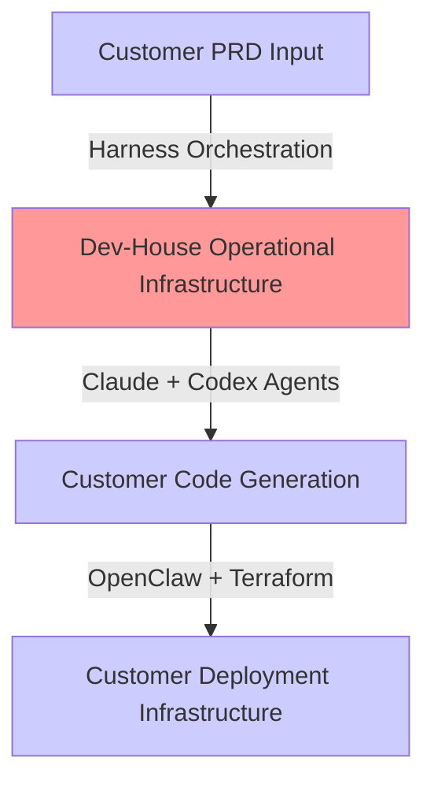
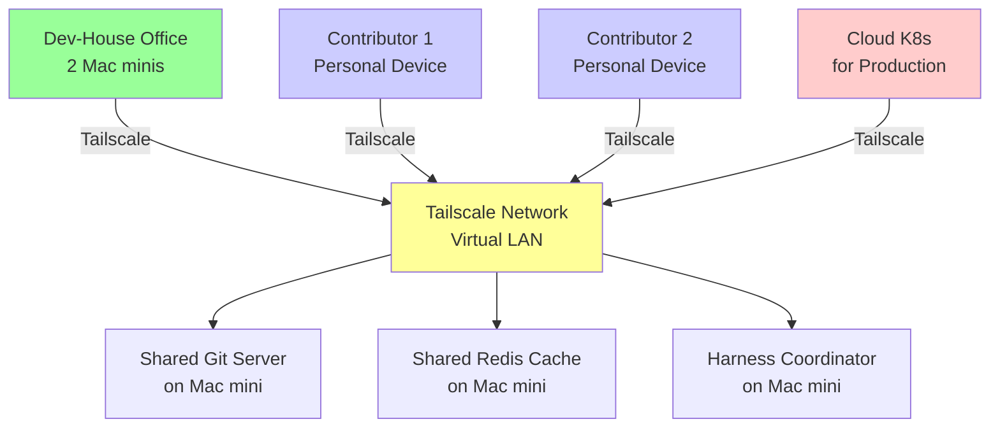

# Dev-House Operational Infrastructure

**The infrastructure that runs Dev-House itself** — separate from customer deployment patterns.

This document addresses: Where do our Claude + Codex agents execute? What's the cost? How do we optimize?

---

## The Three-Layer Model



**Layer 1** (CUSTOMER INPUT): PRD specifications

**Layer 2** (DEV-HOUSE OPERATIONS):
- Our orchestration harness
- Claude API calls for architecture decisions
- Codex API calls for code generation
- Terraform module generation
- OpenClaw infrastructure automation
- **COST**: This is OUR operational overhead per customer

**Layer 3** (CUSTOMER DEPLOYMENT):
- Tier 1-4 infrastructure patterns
- Customer's running application
- **COST**: Customer pays directly or we bill

---

## Problem: Where Do We Execute Layer 2?

Currently assumed: Cloud VMs or K8s clusters running Layer 2.

**Question**: Is cloud optimal for AI orchestration workloads?

- **AI agent execution is bursty**: Harness runs, calls Claude, waits, processes, sleeps
- **Development is iterative**: Multiple attempts, re-runs, debugging
- **Cost accumulates**: Every customer's PRD evaluation costs us (API calls + compute + storage)

---

## Option 1: Cloud-Based Execution (Current Assumption)

### Azure Container Apps (Our current model)

**Cost per customer PRD evaluation:**
- Claude API calls: ~100K tokens avg × $0.003/1K tokens = $0.30
- Codex API calls: ~50K tokens avg × $0.006/1K tokens = $0.30
- Container Apps compute: ~5 minutes × 2 vCPU = ~$0.02
- Storage + logging: ~$0.05
- **Total per PRD**: ~$0.67

**Monthly operational cost (100 customer PRD evals/month):**
- API calls: $60
- Compute: $30
- Storage/logging: $50
- **Total**: ~$140/month

**Annual**: ~$1,680

**Breakdown by provider:**

| Provider | VM Type | Cost | Parallel Agents | Scaling | Data Egress |
|----------|---------|------|-----------------|---------|------------|
| **AWS EC2** | t3.large (2 vCPU, 8GB RAM) | $0.08/hour ($60/mo) | 1-10 (ECS) | Auto-scaling groups | $0.02/GB |
| **Azure Container Apps** | 2 vCPU, 4GB RAM | $0.11/hour ($79/mo) | 1-10 | Built-in scaling | Included |
| **Google Cloud Run** | 2 vCPU (256MB memory) | $0.00002/second ($0.08/1K requests) | 1-1000s | Fully auto-scaling | $0.01/GB |
| **Kubernetes (self-managed)** | 2 vCPU nodes | $0.05/hour per node ($40/mo per node) | Depends on cluster | Manual + custom logic | Network cost |

---

## Option 2: Self-Hosted Execution (Your Proposal)

**Hardware**: 5 Mac minis + distributed network via Tailscale

### Cost Analysis

**Capital cost (one-time):**
- Mac mini M4 (8GB RAM): $600 × 5 = $3,000
- Network switch + cables: $500
- UPS/power backup: $500
- Tailscale pro accounts: $10/user × 5 = $50/month
- **Amortized over 3 years**: $1,000 + $1,800 = $2,800/year = $233/month

**Operating cost:**
- Electricity: Mac mini ~50W × 5 = 250W total
  - At $0.12/kWh: 250W × 24h × 365d / 1000 = ~$219/year = $18/month
- Network: Tailscale $50/month + ISP $50/month = $100/month
- Maintenance: ~$100/year = $8/month
- **Operating total**: ~$126/month

**TOTAL (capital + operating)**: ~$359/month ($4,308/year)

**Scaling approach:**
- Each additional Mac mini: +$600 + $18/month electricity
- Capacity: 5 devices × 2 vCPU = 10 parallel agents
- Cost per parallel agent: $3,000 capital / 10 = $300 per agent

---

## Option 3: Hybrid Model (Cloud + Self-Hosted)

**Idea**: Use self-hosted for development/iteration, cloud for production deployments

**Setup:**
- Mac minis (in-house or contributor devices): Development workloads
- Cloud K8s cluster: Customer production deployments
- Tailscale: Bridge self-hosted + cloud for unified management

**Cost:**
- Self-hosted: $126/month operating
- Cloud (production only): $400-500/month K8s cluster
- Tailscale: $50/month
- **Total**: ~$576-626/month

**Benefit**: Separate dev and prod cost profiles; scale dev cheaply

---

## Cost Comparison Matrix

| Scenario | Year 1 Cost | Year 3 Cost | Parallel Agents | Scaling | Notes |
|----------|------------|-----------|-----------------|---------|-------|
| **Cloud-Only (AWS t3.large)** | $720 | $2,160 | 1-10 | Good | Pay-as-you-go; no capital |
| **Cloud-Only (Azure CAE)** | $948 | $2,844 | 1-10 | Good | Slightly higher than AWS |
| **Cloud-Only (Google Run)** | $500 | $1,500 | 1-1000s | Excellent | Cheapest option; fully serverless |
| **Self-Hosted (5 Mac minis)** | $4,308 | $2,808 | 10 | Limited | High year 1; amortizes after |
| **Self-Hosted (10 Mac minis)** | $6,600 | $3,900 | 20 | Limited | Can add devices, not cloud-like |
| **Hybrid (Self-Dev + Cloud-Prod)** | $4,608 | $3,108 | 10 dev, 10 prod | Good | Best of both; dev cheap, prod scalable |

---

## Recommendation: Start Hybrid, Scale by Pattern

### Phase 1 (Months 1-3): Self-Hosted Development
- **Setup**: 2-3 Mac minis in office + Tailscale
- **Cost**: ~$200/month
- **Purpose**: Build Harness, Codex integration, refine patterns
- **Agents**: Codex (code gen), Claude (orchestration)
- **Parallelism**: 4-6 concurrent PRD evaluations

### Phase 2 (Months 4-9): Add Community Devices
- **Setup**: Contributors add personal devices to Tailscale network (overnight/underutilized)
- **Cost**: Still ~$200/month (electricity shared)
- **Parallelism**: 8-12 concurrent PRD evaluations
- **Token management**: Each contributor gets own Claude + Codex OAuth

### Phase 3 (Months 10+): Add Cloud for Spikes
- **Setup**: Cloud K8s cluster for customer production workloads
- **Cost**: ~$400-500/month cloud + $200/month self-hosted
- **Parallelism**: 10 self-hosted (dev) + 20+ cloud (prod)
- **Decision point**: If >50% cloud usage, migrate dev to cloud too

---

## Network Architecture: Self-Hosted + Tailscale



**Key principles:**
- All devices join **single Tailscale network** (no VPN complexity)
- **Unified Git server** (can be self-hosted Gitea or delegated to GitHub)
- **Shared orchestration** (Harness coordinator on central device)
- **Device discovery**: Agents find each other via Tailscale DNS
- **Token isolation**: Each device has own Claude + Codex OAuth credentials

---

## Operational Considerations

### Device Capacity Management

**Problem**: Don't waste money on idle devices, don't overload them

**Solution:**
- Each device publishes: `{device_id, cpu_cores, available_memory, current_load}`
- Harness coordinator schedules agents to least-loaded device
- If all devices > 80% load, queue job or alert for scaling

```yaml
# Each device's status (published to shared Redis)
device:
  id: mac-mini-1
  cores: 8
  memory_gb: 16
  current_agents: 2
  available_capacity: 6
  cpu_load: 45%
  can_accept_new_agent: true
```

### Preventing Cost Abuse

**Tier 3 pattern (isolated per-customer)** costs $100-300/month. We can't afford to waste compute.

- **Set timeouts**: Harness max 30 minutes per PRD evaluation
- **Monitor token usage**: Log every Claude API call (quota tracking)
- **Implement rate limiting**: Max 10 PRD evaluations per customer/day
- **Schedule expensive ops**: Large code generations during off-peak (e.g., 11pm-6am for cloud)

### Scaling Strategy

**If self-hosted + contributor devices:**
1. Start with 2 office devices
2. Scale to ~5 contributor devices (if available)
3. Cap at ~10 devices (coordination complexity grows)
4. Beyond 10 devices: Switch to cloud K8s cluster

**If hybrid (self-hosted + cloud):**
1. Self-hosted: Development (always-on Harness coordinator + agents)
2. Cloud: Customer production deployments (customer pays, auto-scaling)
3. Bridge with Tailscale: Unified job scheduling

---

## Decision Framework: Which Option for Dev-House?

| Question | Answer | Implication |
|----------|--------|-------------|
| Do we have access to 5+ Mac minis? | Yes (office + contributors) | Self-hosted is viable |
| Is upfront $3K capital acceptable? | Yes | Amortizes in 8 months vs cloud |
| Do we need >10 parallel agents immediately? | No | Self-hosted sufficient for MVP |
| Will we scale to 100+ customers? | TBD; assume yes for design | Plan cloud migration path |
| Can we maintain self-hosted infrastructure? | Yes (small team) | Hybrid is feasible |
| Do we want geographic distribution? | Maybe (24/7 pattern) | Cloud K8s better suited |

**Recommendation for Dev-House MVP**: **Hybrid Model**
- **Self-hosted**: 3 Mac minis in office + Tailscale
- **Cloud**: Minimal cloud K8s (1 small node) for customer deployments
- **Cost**: ~$300-400/month
- **Scalability**: Easy to add devices or scale cloud cluster
- **Path**: If >50% utilization → migrate dev to cloud; keep pattern proven

---

## Impact on Pattern Selection

When PRD arrives, operational infrastructure cost becomes part of pattern evaluation:

```yaml
# Evaluation must include:
pattern_evaluation:
  customer_deployment_cost: "$150/month"  # Tier 3 pattern
  dev_house_operational_overhead: "$1.50"  # Share of our infra cost
  total_customer_cost: "$151.50/month"
```

If we run on $400/month cloud infrastructure + $200/month self-hosted = $600/month total:
- Per customer operational cost (amortized): $600 / 100 customers = $6/customer/month

This becomes a **cost input to pricing**, not just a technical decision.

---

## See Also

- **[pattern-selection-workbook.md](pattern-selection-workbook.md)** — Include operational cost in pattern selection
- **[dev-house-cost-analysis.md](dev-house-cost-analysis.md)** — Detailed cost breakdown by provider and pattern
- **[local-development-environment.md](../harness/local-development-environment.md)** — Docker Compose setup for parity with production
- **[tailscale-network-setup.md](../deployment/tailscale-network-setup.md)** — Guide to setting up distributed device network
