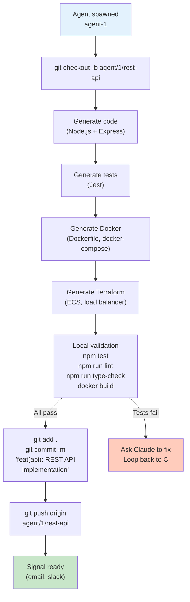
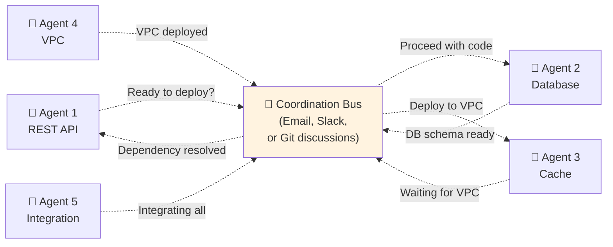
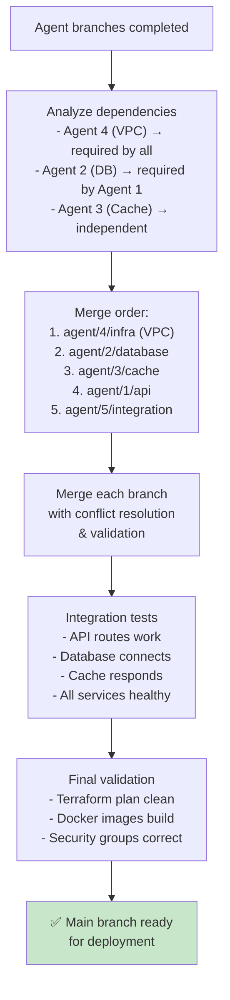

# Distributed Agent Deployment Architecture

## Vision

Transform Dev-House from **single-process orchestration** to **multi-agent distributed execution**:

```
Customer PRD
    ↓
Architecture Analysis (Harness)
    ↓
Spawn N "AI Employees" (Agents)
    ↓
Each Agent:
  - Generates code/infrastructure for its component
  - Works on isolated git branch
  - Commits clean code
  - Coordinates via messaging
    ↓
Final Assembly
    ↓
Running Production System
```

**Benefit**: Parallel work, clean separation of concerns, scalable to 10+ components.

---

## Problem Space

### Current Limitations
- Single harness = sequential processing
- No parallelization of code generation
- Monolithic git commits (hard to review)
- No agent coordination/communication

### Opportunity
- Analyze PRD → identify components
- Spawn agent per component (parallel)
- Each agent: code gen + infrastructure + tests
- Agents communicate progress, dependencies, issues
- Final merge = integration

---

## Architecture: Multi-Agent Deployment

### Overview

```mermaid
graph TD
    A["📋 Customer PRD<br/>(e.g., 'REST API + PostgreSQL + Cache')<br/>Requirements analysis<br/>Component extraction"]

    B["🧠 Architecture Analyzer<br/>(Harness)"]

    C["📊 Deployment Plan<br/>- Components: [API, DB, Cache]<br/>- Topology: [AWS, security groups]<br/>- Network: [subnets, VPN]<br/>- Execution: [5 agents needed]"]

    D["🚀 Spawn Agents<br/>Agent 1: REST API<br/>Agent 2: Database<br/>Agent 3: Cache Layer<br/>Agent 4: Infrastructure<br/>Agent 5: Integration"]

    E1["👤 Agent 1<br/>REST API Code"]
    E2["👤 Agent 2<br/>PostgreSQL Terraform"]
    E3["👤 Agent 3<br/>Redis Infrastructure"]
    E4["👤 Agent 4<br/>VPC + Security"]
    E5["👤 Agent 5<br/>Docker + K8s"]

    F["📧 Coordination Channel<br/>(Email, Slack, Telegram)<br/>Share progress, dependencies,<br/>ask for clarification"]

    G["🌳 Git Branches<br/>agent/1/rest-api<br/>agent/2/database<br/>agent/3/cache<br/>agent/4/infra<br/>agent/5/integration"]

    H["✅ Merge & Validate<br/>All branches → main<br/>Run integration tests<br/>Verify deployment plan"]

    I["🎯 Deploy<br/>Production system"]

    A --> B --> C --> D
    D --> E1 & E2 & E3 & E4 & E5
    E1 & E2 & E3 & E4 & E5 --> F
    F -.->|"Feedback loops"| E1 & E2 & E3 & E4 & E5
    E1 & E2 & E3 & E4 & E5 --> G --> H --> I

    style A fill:#ffebee
    style B fill:#f3e5f5
    style C fill:#fff3e0
    style D fill:#fce4ec
    style E1 & E2 & E3 & E4 & E5 fill:#e3f2fd
    style F fill:#f0f4c3
    style G fill:#c8e6c9
    style H fill:#b2dfdb
    style I fill:#a5d6a7
```

---

## Phase 1: Architecture Analysis & Planning

### Input: Customer PRD

```markdown
# REST API for Task Management

## Components
- **Backend**: Node.js + Express
- **Database**: PostgreSQL
- **Cache**: Redis
- **Frontend**: React (optional, could be separate)
- **Deployment**: AWS with multi-AZ

## Non-Functional Requirements
- High availability (99.9% uptime)
- Auto-scaling for API
- Database backups (daily)
- Real-time monitoring

## Security
- SSL/TLS everywhere
- VPC isolation
- IAM roles per component
```

### Output: Deployment Plan

```yaml
# deployment-plan.yaml

metadata:
  customer: "acme-corp"
  prd_id: "prd_12345"
  timestamp: "2026-02-28T12:00:00Z"

# Component breakdown
components:
  - id: "api"
    name: "REST API"
    type: "service"
    technology: "node.js"
    requirements:
      - code generation (Node.js + Express)
      - Docker image
      - Kubernetes deployment
      - Load balancing
    agent_type: "backend-dev"

  - id: "database"
    name: "PostgreSQL"
    type: "data-store"
    technology: "postgresql"
    requirements:
      - Terraform (RDS or self-hosted)
      - Backup strategy
      - High availability setup
      - Security groups
    agent_type: "database-specialist"

  - id: "cache"
    name: "Redis"
    type: "cache"
    technology: "redis"
    requirements:
      - Terraform (ElastiCache or self-hosted)
      - Clustering for HA
    agent_type: "infrastructure-specialist"

  - id: "vpc-networking"
    name: "VPC Infrastructure"
    type: "foundation"
    technology: "terraform-aws"
    requirements:
      - VPC, subnets, route tables
      - Security groups
      - NAT gateways
      - VPN access (optional)
    agent_type: "network-specialist"

  - id: "integration"
    name: "Integration & Testing"
    type: "orchestration"
    technology: "terraform"
    requirements:
      - Compose all modules
      - Integration tests
      - Smoke tests
      - Deployment validation
    agent_type: "qa-specialist"

# Agents needed
agents_required: 5
execution_model: "parallel"
coordination: "messaging"  # email, slack, telegram

# Resource requirements
resources:
  - type: "compute"
    count: 5
    spec: "t3.medium"  # For agent containers
  - type: "storage"
    size: "50GB"  # For code repos, artifacts

# Topology
topology:
  cloud: "aws"
  region: "us-east-1"
  ha_setup: true
  security_groups:
    - name: "api-sg"
      rules: [...]
    - name: "db-sg"
      rules: [...]
    - name: "cache-sg"
      rules: [...]
```

---

## Phase 2: Agent Spawning & Git Setup

### Agent Specification

```yaml
agent:
  id: "agent-1"
  role: "backend-dev"
  component: "rest-api"

  # Identity for communication
  identity:
    name: "Alice"
    email: "alice@ai-employees.local"
    avatar: "👤"

  # Communication channels
  channels:
    - type: "email"
      address: "alice@ai-employees.local"
    - type: "slack"
      handle: "@alice-agent"
    - type: "git-commit"
      # Commits signed by agent identity

  # Code responsibility
  git:
    branch: "agent/1/rest-api"
    base_branch: "main"
    paths: ["src/api/", "tests/api/", "docker/api/"]

  # Capabilities
  capabilities:
    - code_generation
    - testing
    - documentation
    - docker

  # Task assignment
  task: |
    Generate production-ready Node.js REST API with Express.
    Requirements:
    - CRUD endpoints for tasks
    - JWT authentication
    - Input validation
    - Error handling
    - Unit tests (70%+ coverage)
    - Docker support
    - Type safety (TypeScript)
```

### Git Workflow Per Agent



---

## Phase 3: Agent Coordination

### The Communication Problem

**Agents work in parallel, but have dependencies:**

```
Agent 4 (VPC) must finish before:
  → Agent 1 (API) can deploy to subnets
  → Agent 2 (DB) can use security groups
  → Agent 3 (Cache) can use VPC endpoints

Agent 2 (DB) creates schema before:
  → Agent 1 (API) can write code that references schema
```

### Solution: Agent Messaging System



### Pattern 1: Email-Based Coordination (Simple)

**Advantage**: No external service needed, asynchronous, threaded context

```python
class AgentCoordinator:
    def __init__(self):
        self.agents = {}
        self.message_log = []

    def register_agent(self, agent_id: str, email: str):
        self.agents[agent_id] = {'email': email, 'status': 'pending'}

    def send_update(self, agent_id: str, message: str):
        """Agent sends update to all others via email."""
        msg = {
            'from': self.agents[agent_id]['email'],
            'to': [a['email'] for a in self.agents.values()],
            'subject': f"[Agent Update] {agent_id}",
            'body': message,
            'timestamp': now()
        }
        send_email(msg)
        self.message_log.append(msg)

    def wait_for_dependency(self, agent_id: str, dep_agent: str, condition: str):
        """Agent waits for another agent to reach condition."""
        # Poll email inbox for condition
        while not self.check_condition(dep_agent, condition):
            time.sleep(5)  # Check every 5 seconds
        return True

    def check_condition(self, agent_id: str, condition: str) -> bool:
        """Check if agent has reported condition met."""
        relevant = [m for m in self.message_log if m['from'] == self.agents[agent_id]['email']]
        return any(condition in m['body'] for m in relevant)
```

**Agent workflow with email**:
```python
# Agent 2 (Database)
coordinator.send_update("agent-2", """
Subject: PostgreSQL schema ready

Generated schema:
- tables.sql (created)
- migrations/ (applied)
- constraints (validated)

Ready for API integration.
Status: READY_FOR_API_CODEGEN
""")

# Agent 1 (API) waits for database
coordinator.wait_for_dependency("agent-1", "agent-2", "READY_FOR_API_CODEGEN")
# Now safe to generate API code that references schema
```

### Pattern 2: Slack-Based Coordination (Real-time)

**Advantage**: Real-time, threaded conversations, rich formatting

```python
class SlackCoordinator:
    def __init__(self, slack_webhook_url: str):
        self.slack = Slack(webhook_url=slack_webhook_url)
        self.thread_cache = {}

    def send_update(self, agent_id: str, message: str, status: str):
        """Post update to Slack thread."""
        payload = {
            'channel': '#ai-agents',
            'username': f'Agent {agent_id}',
            'icon_emoji': ':robot_face:',
            'blocks': [
                {
                    'type': 'section',
                    'text': {'type': 'mrkdwn', 'text': f"*{agent_id}*: {status}"}
                },
                {
                    'type': 'section',
                    'text': {'type': 'mrkdwn', 'text': message}
                }
            ]
        }
        response = self.slack.post(payload)
        self.thread_cache[agent_id] = response['ts']

    def wait_for_status(self, agent_id: str, dep_agent: str, target_status: str):
        """Wait for dependency to reach status."""
        while True:
            messages = self.slack.get_thread(self.thread_cache[dep_agent])
            if any(target_status in msg['text'] for msg in messages):
                return True
            time.sleep(5)
```

### Pattern 3: Git-Based Coordination (Most Transparent)

**Advantage**: Everything in version control, auditable, works offline

```python
class GitCoordinator:
    def __init__(self, repo_path: str):
        self.repo = Repo(repo_path)

    def send_update(self, agent_id: str, status: str, details: dict):
        """Commit status file."""
        status_file = f"agent-status/{agent_id}.json"
        content = {
            'agent': agent_id,
            'status': status,
            'timestamp': now_iso(),
            'details': details
        }
        write_json(status_file, content)

        self.repo.index.add([status_file])
        self.repo.index.commit(
            f"chore(agent-{agent_id}): {status}",
            author=Actor(agent_id, f"{agent_id}@ai-employees.local")
        )

    def wait_for_status(self, agent_id: str, dep_agent: str, target_status: str, timeout: int = 3600):
        """Poll for status in git."""
        start = time.time()
        while time.time() - start < timeout:
            self.repo.remotes.origin.pull()  # Fetch latest
            status_file = f"agent-status/{dep_agent}.json"
            try:
                data = read_json(status_file)
                if data['status'] == target_status:
                    return True
            except:
                pass
            time.sleep(10)
        raise TimeoutError(f"Agent {dep_agent} didn't reach {target_status}")
```

**Agent workflow with git**:
```python
# Agent 4 (VPC) completes
coordinator.send_update("agent-4", "READY", {
    'vpc_id': 'vpc-12345',
    'subnets': ['subnet-1', 'subnet-2'],
    'security_groups': ['sg-api', 'sg-db']
})

# Agent 1 (API) waits
coordinator.wait_for_status("agent-1", "agent-4", "READY")
# Safe to reference VPC infrastructure in code generation
```

---

## Phase 4: Agent Execution Model

### Container Strategy

```mermaid
graph TD
    A["Deployment Plan<br/>(5 agents needed)"]
    --> B["Launch Agent Containers<br/>(pre-built images)"]

    B --> B1["Container: agent-1-rest-api<br/>- Claude API client<br/>- Git client<br/>- Node.js toolchain<br/>- Docker CLI"]

    B --> B2["Container: agent-2-database<br/>- Claude API client<br/>- Git client<br/>- Terraform<br/>- PostgreSQL tools"]

    B --> B3["Container: agent-3-cache<br/>- Claude API client<br/>- Git client<br/>- Terraform<br/>- Redis tools"]

    B --> B4["Container: agent-4-infra<br/>- Claude API client<br/>- Git client<br/>- Terraform<br/>- AWS CLI"]

    B --> B5["Container: agent-5-integration<br/>- Claude API client<br/>- Git client<br/>- Python (pytest)<br/>- Terraform validate"]

    B1 & B2 & B3 & B4 & B5 --> C["Mount:<br/>- /workspace (code repo)<br/>- /artifacts (outputs)<br/>- /coordination (messages)"]

    C --> D["Execute Agent Work"]

    style B1 & B2 & B3 & B4 & B5 fill:#e3f2fd
```

### Pre-built Agent Images

```dockerfile
# Dockerfile.agent-backend
FROM python:3.11-slim

# Core dependencies
RUN apt-get update && apt-get install -y git curl jq

# Claude SDK
RUN pip install anthropic

# Backend tooling
RUN apt-get install -y nodejs npm
RUN npm install -g typescript eslint jest

# Docker (for building container images)
RUN apt-get install -y docker.io

# Git config
RUN git config --global user.email "agent@ai-employees.local"
RUN git config --global user.name "AI Agent"

# Workspace
WORKDIR /workspace
COPY entrypoint.sh /entrypoint.sh
RUN chmod +x /entrypoint.sh

ENTRYPOINT ["/entrypoint.sh"]
```

### Agent Entrypoint Script

```bash
#!/bin/bash
# entrypoint.sh

set -eu

AGENT_ID=${AGENT_ID:-"unknown"}
COMPONENT=${COMPONENT:-"unknown"}
ROLE=${ROLE:-"developer"}

echo "[Agent $AGENT_ID] Starting work on $COMPONENT"

# Step 1: Clone repo
git clone $GIT_REPO /workspace
cd /workspace
git checkout -b agent/$AGENT_ID/$COMPONENT

# Step 2: Get task from Harness
curl -s http://harness:8000/api/tasks/$AGENT_ID | jq . > /tmp/task.json
TASK=$(cat /tmp/task.json | jq -r '.task_description')

# Step 3: Execute Claude generation
python3 -c "
from anthropic import Anthropic
import json

client = Anthropic()

task = '''$TASK'''

response = client.messages.create(
    model='claude-3-opus-20240229',
    max_tokens=4096,
    messages=[{'role': 'user', 'content': task}]
)

print(response.content[0].text)
" > /tmp/generation.md

# Step 4: Process output (parse code blocks, etc.)
python3 /scripts/extract_artifacts.py /tmp/generation.md

# Step 5: Validate locally
npm test 2>&1 | tee /tmp/test_results.txt || true
npm run lint 2>&1 | tee /tmp/lint_results.txt || true

# Step 6: Commit work
git add .
git commit -m "feat($COMPONENT): Generated by $AGENT_ID" \
    -m "Agent: $AGENT_ID" \
    -m "Role: $ROLE" \
    -m "Component: $COMPONENT" \
    -m "Timestamp: $(date -Iseconds)"

# Step 7: Push branch
git push origin agent/$AGENT_ID/$COMPONENT

# Step 8: Send status update
curl -X POST http://harness:8000/api/status \
    -H "Content-Type: application/json" \
    -d "{
        'agent_id': '$AGENT_ID',
        'status': 'completed',
        'branch': 'agent/$AGENT_ID/$COMPONENT',
        'test_results': $(cat /tmp/test_results.txt | base64),
        'timestamp': '$(date -Iseconds)'
    }"

echo "[Agent $AGENT_ID] Work complete. Results pushed to agent/$AGENT_ID/$COMPONENT"
```

---

## Phase 5: Merge & Integration

### Dependency Resolution



### Merge Strategy

```python
class DeploymentMerger:
    def __init__(self, repo: Repo):
        self.repo = repo

    def get_merge_order(self, agent_branches: List[str]) -> List[str]:
        """Determine safe merge order based on dependencies."""
        dependencies = {
            'agent/4/infra': [],  # No deps
            'agent/2/database': ['agent/4/infra'],
            'agent/3/cache': ['agent/4/infra'],
            'agent/1/api': ['agent/2/database', 'agent/4/infra'],
            'agent/5/integration': ['agent/1/api', 'agent/2/database', 'agent/3/cache'],
        }

        # Topological sort
        return self.topological_sort(dependencies)

    def merge_branch(self, branch_name: str, validate: bool = True):
        """Merge branch with validation."""
        # Fetch latest
        self.repo.remotes.origin.fetch()

        # Create merge commit
        self.repo.heads.main.checkout()
        base = self.repo.merge_base(self.repo.heads.main, self.repo.refs[branch_name])
        self.repo.git.merge(branch_name, '--no-ff',
                           m=f"Merge {branch_name}")

        # Validate
        if validate:
            self.validate_merge()

    def validate_merge(self):
        """Run integration tests."""
        # Terraform validate
        subprocess.run(['terraform', 'validate'], cwd='/workspace')

        # Run integration tests
        subprocess.run(['pytest', 'tests/integration/', '-v'])

        # Security scanning
        subprocess.run(['tfsec', 'terraform/'])
```

---

## Phase 6: Terraform Module Patterns

### Self-Contained Module Structure (Provider-Specific)

```
terraform/
├── modules/
│   ├── vpc-network/
│   │   ├── aws/
│   │   │   ├── main.tf (aws_vpc, aws_subnet)
│   │   │   ├── variables.tf
│   │   │   └── outputs.tf
│   │   ├── azure/
│   │   │   ├── main.tf (azurerm_virtual_network)
│   │   │   ├── variables.tf
│   │   │   └── outputs.tf
│   │   ├── gcp/
│   │   │   ├── main.tf (google_compute_network)
│   │   │   ├── variables.tf
│   │   │   └── outputs.tf
│   │   └── README.md (abstract interface)
│   │
│   ├── postgresql-database/
│   │   ├── aws/
│   │   │   ├── main.tf (aws_db_instance)
│   │   │   ├── variables.tf
│   │   │   └── outputs.tf
│   │   ├── azure/
│   │   │   ├── main.tf (azurerm_postgresql_server)
│   │   │   ├── variables.tf
│   │   │   └── outputs.tf
│   │   ├── gcp/
│   │   │   ├── main.tf (google_sql_database_instance)
│   │   │   ├── variables.tf
│   │   │   └── outputs.tf
│   │   └── README.md (abstract interface)
│   │
│   ├── redis-cache/
│   │   ├── aws/
│   │   │   ├── main.tf (aws_elasticache_cluster)
│   │   │   ├── variables.tf
│   │   │   └── outputs.tf
│   │   ├── azure/
│   │   │   ├── main.tf (azurerm_redis_cache)
│   │   │   ├── variables.tf
│   │   │   └── outputs.tf
│   │   ├── gcp/
│   │   │   ├── main.tf (google_redis_instance)
│   │   │   ├── variables.tf
│   │   │   └── outputs.tf
│   │   └── README.md (abstract interface)
│   │
│   └── container-service/
│       ├── aws/
│       │   ├── main.tf (aws_ecs_task_definition)
│       │   ├── variables.tf
│       │   └── outputs.tf
│       ├── azure/
│       │   ├── main.tf (azurerm_container_group)
│       │   ├── variables.tf
│       │   └── outputs.tf
│       ├── gcp/
│       │   ├── main.tf (google_cloud_run_service)
│       │   ├── variables.tf
│       │   └── outputs.tf
│       └── README.md (abstract interface)
│
├── deployments/
│   └── acme-corp-prod/
│       ├── terraform.tfvars
│       ├── main.tf (uses modules)
│       ├── backend.tf
│       └── outputs.tf
│
└── templates/
    ├── rest-api-postgres-redis/
    │   ├── main.tf
    │   ├── variables.tf
    │   └── README.md
    │
    └── microservices-mesh/
        ├── main.tf
        ├── variables.tf
        └── README.md
```

### Module Design Principles

Each module is **self-contained and provider-specific**:
- ✅ Has own state (can be imported/exported)
- ✅ Minimal external dependencies
- ✅ **Unified logical interface** across providers (small/medium/large instance sizes)
- ✅ **Consistent output contract** (endpoint, port, username, password_secret_name)
- ✅ Includes examples
- ✅ Includes validation (pre-conditions, post-conditions)
- ✅ **Provider-specific variants** (AWS/Azure/GCP) — See [Multi-Provider Strategy](../terraform/multi-provider-strategy.md)

**Example: PostgreSQL Module Abstract Interface**

All three providers (AWS, Azure, GCP) implement this contract:

```hcl
# modules/postgresql-database/{aws,azure,gcp}/variables.tf

variable "cluster_name" {
  description = "Database cluster identifier"
  type        = string
  validation {
    condition     = length(var.cluster_name) <= 63
    error_message = "Cluster name must be <= 63 characters."
  }
}

variable "instance_size" {
  description = "Compute size: small, medium, large"
  type        = string
  default     = "small"
  validation {
    condition     = contains(["small", "medium", "large"], var.instance_size)
    error_message = "Must be small, medium, or large."
  }
}

variable "engine_version" {
  description = "PostgreSQL version (e.g., 14.0)"
  type        = string
  default     = "14.0"
}

# Outputs are identical across providers
output "endpoint" {
  description = "Database connection endpoint"
  value       = "..."  # Provider-specific value
}

output "port" {
  description = "Database port"
  value       = 5432   # Standardized
}

output "username" {
  description = "Admin username"
  value       = "..."  # Provider-specific
}

output "password_secret_name" {
  description = "Secrets manager key for password"
  value       = "..."  # Provider-specific
}
```

**Provider-Specific Implementation (AWS Example)**

```hcl
# modules/postgresql-database/aws/main.tf

locals {
  instance_class_map = {
    small   = "db.t3.micro"
    medium  = "db.t3.small"
    large   = "db.t3.medium"
  }
}

resource "aws_db_instance" "postgres" {
  identifier        = var.cluster_name
  engine            = "postgres"
  engine_version    = var.engine_version
  instance_class    = local.instance_class_map[var.instance_size]
  allocated_storage = 20

  username = "admin"
  # ... other config
}

output "endpoint" {
  value = aws_db_instance.postgres.endpoint
}

output "password_secret_name" {
  value = aws_secretsmanager_secret.postgres_password.name
}
```

**Key Insight**: Variables are **logical** (small/medium/large), outputs are **universal** (endpoint, port, username), internal resources are **provider-specific** (aws_db_instance vs azurerm_postgresql_server vs google_sql_database_instance).

---

## Key Design Decisions

### Decision D1: Container vs. VM for Agents

| Option | Pros | Cons |
|--------|------|------|
| **Container (Recommended)** | Fast startup, resource-efficient, easy to scale | Requires orchestration |
| **VM** | Isolation, familiar model | Slower startup, heavier resource use |
| **Serverless (Lambda)** | No management, auto-scaling | Cold starts, limited execution time |

**Decision**: Containers (Docker) + optional Kubernetes orchestration

### Decision D2: Synchronous vs. Asynchronous Coordination

| Model | Pros | Cons |
|-------|------|------|
| **Synchronous (blocking wait)** | Simple, deterministic | Slow (agents wait) |
| **Asynchronous (event-driven)** | Fast, parallel | Complex (callbacks, state) |
| **Polling (hybrid)** | Simple + async-like | Slightly wasteful |

**Decision**: Polling (simple + effective) with optional event-driven for critical paths

### Decision D3: Communication Channel

| Channel | Pros | Cons |
|---------|------|------|
| **Email** | No service dependencies, threaded, auditable | Slow (polling) |
| **Slack** | Real-time, rich UI, notifications | Requires Slack workspace |
| **Git** | Version-controlled, persistent, offline-capable | Verbose, polling-heavy |
| **Message Queue (RabbitMQ)** | Fast, reliable, scalable | Operational overhead |

**Decision**: Start with Git (simple + transparent), graduate to Slack for real-time (optional)

### Decision D4: Agent Lifespan

| Model | Pros | Cons |
|--------|------|------|
| **Long-lived (keep containers running)** | Can monitor progress, interactive | Resource cost |
| **Ephemeral (spawn for task, exit)** | Clean isolation, cost-efficient | No interactivity |

**Decision**: Ephemeral (spawn → work → commit → exit) for cost + isolation

---

## Implementation Roadmap

### MVP (Phase 1-2)
- ✅ PRD → Deployment Plan analysis
- ✅ Single agent execution (sequential)
- ✅ Git branch + commit workflow
- ✅ Basic Docker containerization

### Phase 1 (Phase 3)
- Add 2-3 agents in parallel
- Git-based coordination (polling)
- Merge + integration testing
- Terraform module organization

### Phase 2 (Phase 4-5)
- Scale to 5+ agents
- Slack coordination (real-time)
- Full dependency resolution
- Pre-built agent images, templates

### Phase 3 (Phase 6+)
- Kubernetes orchestration
- Message queue (async coordination)
- Fine-grained parallelization
- Custom agent types per domain

---

## Open Questions for Exploration

### Architecture
1. How to decompose PRD into optimal agent assignments?
2. When should agents be separate vs. combined?
3. How to handle cross-cutting concerns (logging, monitoring)?

### Coordination
4. What's the right polling interval? (5s, 30s, 1m?)
5. How to handle agent failures mid-way?
6. Should agents have timeouts? If so, what values?

### Git Workflow
7. Should agents create pull requests instead of direct commits?
8. How to handle merge conflicts between agents?
9. Should `main` always be deployable, or just validated?

### Resource Management
10. How to size agent containers (CPU, memory)?
11. Should agents share workspace or have isolated clones?
12. How to limit resource usage per agent?

### Monitoring & Observability
13. How to track agent progress in real-time?
14. What metrics matter (completion time, cost, quality)?
15. How to debug agent failures post-mortem?

---

## Next Steps

1. **Define PRD analysis rules** — How to extract components from PRD?
2. **Build agent templates** — Reusable agent configurations per role
3. **Implement coordination protocol** — Git or Slack-based status tracking
4. **Create Terraform module library** — Reusable, production-ready modules
5. **Build agent container images** — Pre-built images with all tooling
6. **Design orchestration** — How to spawn/manage agents, aggregate results

