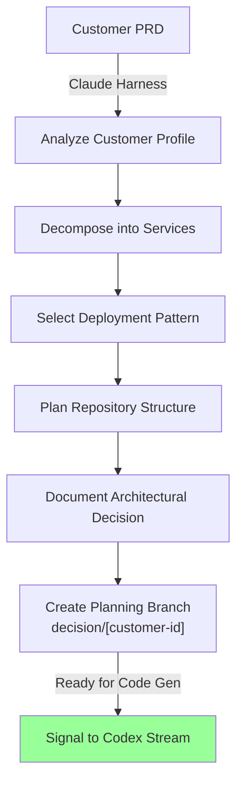
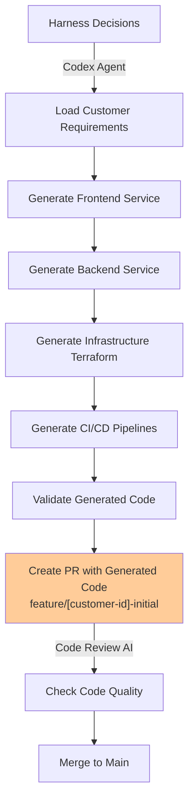

# Two Execution Streams: Codex vs Harness

**Critical separation**: Product creation (Codex) vs orchestration (Harness) must use separate worktrees to avoid conflation.

---

## The Problem: Why Separate Streams Matter

When Dev-House receives a PRD:

```
Customer PRD
    ↓
Harness Orchestration (Claude)
    ├→ Architecture analysis
    ├→ Repo structure decisions
    ├→ Component requirements
    └→ Deployment pattern selection
        ↓
    Codex Code Generation (separate process)
        ├→ Generate service repos
        ├→ Generate infrastructure code
        └→ Generate CI/CD pipelines
            ↓
        Customer Running System
```

**Problem**: If Harness and Codex share the same working directory:
- Risk of Codex overwriting Harness analysis files
- Risk of Harness orchestration logic bleeding into generated code
- Difficult to run them in parallel (file lock conflicts)
- Hard to debug which stream produced which code

**Solution**: Separate worktrees, separate checkouts, separate concerns.

---

## Stream 1: Harness Orchestration (Claude)

**Purpose**: Analyze PRD, make architectural decisions, plan infrastructure

**Input**: Customer PRD specification

**Output**:
- Architectural decision document
- Repository structure plan
- Service decomposition
- Deployment pattern selection
- Infrastructure component list

**Execution model**:
- Runs locally on dev device via Claude Harness
- Orchestrates via Git branches (decision tracking)
- No code generation; only analysis and planning

**Example flow**:



**Worktree location**: `/path/to/dev-house/harness/[customer-id]`

**Output artifacts**:
```
harness/[customer-id]/
├── ARCHITECTURAL_DECISION.md
├── SERVICE_DECOMPOSITION.yaml
├── REPO_STRUCTURE.yaml
├── DEPLOYMENT_PATTERN.yaml
└── COMPONENT_REQUIREMENTS.yaml
```

---

## Stream 2: Codex Code Generation (Codex Agent)

**Purpose**: Generate code and infrastructure for the customer

**Input**:
- Harness architectural decisions (from Stream 1)
- Dev-House code templates
- Customer service requirements

**Output**:
- Customer service repositories (frontend, backend, infra, etc.)
- Terraform infrastructure code
- CI/CD pipeline configurations
- Docker Compose for local development

**Execution model**:
- Runs locally on dev device via Codex Agent
- Generates code via Codex API
- Uses Git branching for all changes (PR-based workflow)
- Validates code via automated checks

**Example flow**:



**Worktree location**: `/path/to/customer-repos/[customer-id]/[service-name]`

**Output artifacts** (separate repos):
```
customer-repos/[customer-id]-frontend/
├── src/
├── Dockerfile
├── compose.yaml
├── README.md

customer-repos/[customer-id]-backend/
├── src/
├── Dockerfile
├── compose.yaml
├── README.md

customer-repos/[customer-id]-infrastructure/
├── terraform/
│   ├── main.tf
│   ├── variables.tf
│   └── outputs.tf
├── compose.yaml
└── README.md
```

---

## Separate Worktrees: Implementation

### Setup

```bash
# Stream 1: Harness orchestration workspace
git worktree add harness/acme-corp \
    -b harness/acme-corp/main \
    origin/main

# Stream 2: Codex code generation workspace
git worktree add codex/acme-corp \
    -b codex/acme-corp/main \
    origin/main

# Customer service repositories (separate checkouts)
git clone https://github.com/acme-corp/frontend.git
git clone https://github.com/acme-corp/backend.git
git clone https://github.com/acme-corp/infrastructure.git
```

### Worktree Layout

```
dev-house/
├── harness/
│   └── acme-corp/                    # Stream 1: Orchestration
│       ├── ARCHITECTURAL_DECISION.md
│       ├── SERVICE_DECOMPOSITION.yaml
│       └── ...analysis files...
│
├── codex/
│   └── acme-corp/                    # Stream 2: Code generation coordination
│       ├── CODEX_GENERATION_LOG.md
│       ├── SERVICE_SPECS.yaml
│       └── ...generation tracking...
│
└── ...main checkout...
```

**Customer repositories** (external):
```
~/customers/
├── acme-corp-frontend/               # Generated frontend
├── acme-corp-backend/                # Generated backend
└── acme-corp-infrastructure/         # Generated infrastructure code
```

---

## Integration Point: GitHub

Both streams use **GitHub as the integration mechanism**.

### Harness Stream Output → GitHub
```yaml
# Harness creates a planning branch
branch: planning/acme-corp

commit_message: |
  [Harness] Architectural decision for ACME Corp

  Service decomposition:
  - Frontend: React web app
  - Backend: Python FastAPI
  - Infra: Terraform (Azure Tier 3)

  Pattern: Tier 3 (Isolated Infrastructure)
  Cost: $180/month
```

### Codex Stream Reads Planning → Generates Code
```yaml
# Codex reads the planning branch
# Generates services from specs in ARCHITECTURAL_DECISION.md

# Creates PRs to customer repos
pr_to_frontend: feat/acme-corp-init
pr_to_backend: feat/acme-corp-init
pr_to_infrastructure: feat/acme-corp-init

# All PRs link back to Harness planning branch
```

### PR Review Process (AI-Assisted)
```
PR created by Codex
    ↓
Automated review checks:
    ├→ Code quality (linting, formatting)
    ├→ Security scanning (SAST, dependency check)
    ├→ Architecture compliance (aligns with Harness decision)
    └→ Performance baseline (Docker build, test run)
        ↓
    If all checks pass → Mergeable
    If warnings → Flag for human review
    If failures → Codex revises
```

---

## Token Isolation: Each Stream Gets Own Credentials

**Problem**: If both streams share one Claude API key, billing is conflated. Cost attribution is unclear.

**Solution**: Each development stream gets distinct OAuth tokens.

```yaml
# Dev-House OAuth Configuration

harness_stream:
  oauth_scope: "claude-harness-orchestration"
  allowed_models: ["claude-opus-4-6"]  # Architecture decisions need Opus
  monthly_budget: $2,000
  rate_limit: 100 requests/min
  purpose: "PRD analysis, architectural decisions"

codex_stream:
  oauth_scope: "claude-codex-generation"
  allowed_models: ["claude-sonnet-4-6"]  # Code generation uses Sonnet
  monthly_budget: $3,000
  rate_limit: 200 requests/min
  purpose: "Code generation, validation"
```

**Per-device credentials** (if using Tailscale distributed network):
```yaml
device: mac-mini-1
assigned_roles:
  - harness_orchestrator (owns Stream 1 for [customer-ids])
  - codex_agent (owns Stream 2 for [customer-ids])

tokens:
  harness: oauth_token_[mac-mini-1_harness]
  codex: oauth_token_[mac-mini-1_codex]
```

---

## Execution Timeline

### Day 1-2: Harness Stream (Claude)

```
Mon 9am: Customer PRD arrives
    ↓
Harness agent spawned
    ├→ Analyze PRD (2 hours)
    ├→ Decompose services (1 hour)
    ├→ Select pattern (30 min)
    └→ Commit to planning branch (30 min)
        ↓
Tue 9am: Architectural decision ready
```

### Day 3-7: Codex Stream (Codex)

```
Wed 9am: Codex reads Harness decisions
    ↓
For each service:
    ├→ Generate boilerplate (30 min)
    ├→ Generate backend API spec (1 hour)
    ├→ Generate frontend component spec (1 hour)
    ├→ Create Docker containers (30 min)
    ├→ Create CI/CD pipelines (1 hour)
    └→ Run security checks (15 min)
        ↓
Fri 9am: Customer repositories populated with PRs
    ├→ frontend PR (waiting review)
    ├→ backend PR (waiting review)
    └→ infrastructure PR (waiting review)
        ↓
Fri 5pm: Manual review + merge
    ↓
Customer can pull and `docker compose up`
```

---

## No Conflation: Guarantees

**By separating streams, we guarantee:**

1. **Harness logic stays clean** — No code generation logic mixed in
2. **Codex generation is reproducible** — Same input → same output
3. **Parallel execution** — Run Stream 1 for customer A while Stream 2 runs for customer B
4. **Cost tracking** — Know exactly how much we spend on analysis vs generation
5. **Debugging** — Easy to say "Stream 1 failed" vs "Stream 2 failed"
6. **Versioning** — Can use Harness v1.0 with Codex v2.1 for different customers

---

## PR Review AI: The Third Agent

**Additional concern**: Generated code needs review before merging.

**AI-assisted PR review**:
```yaml
workflow:
  - Codex generates code → creates PR
  - GitHub Actions runs automated checks
  - PR Review AI (Claude Sonnet) reviews code:
      ├→ Check for security issues
      ├→ Verify matches Harness architecture
      ├→ Suggest improvements
      └→ Approve if safe, request changes if issues
  - Human developer reviews final
  - Merge to main
```

This is a **third distinct agent** (PR Reviewer) that validates the output of Stream 2 before it reaches the customer.

---

## See Also

- **[dev-house-operational-infrastructure.md](dev-house-operational-infrastructure.md)** — Where these streams execute
- **[customer-repository-structure.md](customer-repository-structure.md)** — How customer code is organized
- **[local-development-environment.md](../harness/local-development-environment.md)** — Docker Compose for parity
