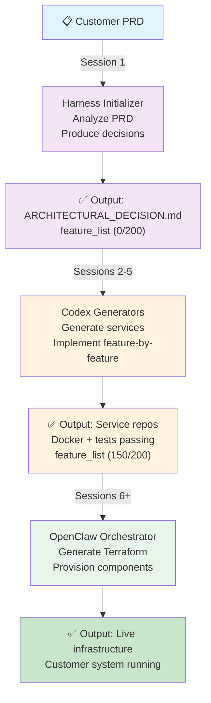

# Getting Started: The Complete Dev-House Story

**Read this first to understand how all pieces fit together.**

---

## The 30-Second Version

Customer sends PRD → Dev-House analyzes it (Harness) → Generates code (Codex) → Deploys infrastructure (OpenClaw) → Customer has running system.

All three phases use Anthropic's proven "Initializer + Coding Agent" pattern.

---

## The Real Story (30 Minutes)

### Problem We Solve

Traditional approach to building customer infrastructure:
1. Customer requests feature
2. Developer manually designs architecture
3. Developer writes code
4. DevOps writes infrastructure
5. Process takes weeks; error-prone

**Dev-House approach:**
1. Customer writes PRD (business spec)
2. AI analyzes PRD → architectural decisions (Harness)
3. AI generates code (Codex)
4. AI generates infrastructure (OpenClaw)
5. Process takes hours; reproducible

### Three Critical Separations

Before we start, understand what we are NOT conflating:

**Separation 1: Productionization ≠ Product**
- **Productionization**: Where our AI agents run (Dev-House's operational cost)
  - Cost: $200-600/month (self-hosted + Tailscale or cloud K8s)
  - Ownership: Dev-House manages
  - Scaling: With customer volume
- **Product**: Where customer's app runs (what we deliver)
  - Cost: $25-500+/month per customer (they pay or we bill)
  - Ownership: Customer or we manage
  - Scaling: One per customer

**Separation 2: Two Execution Streams (Not One)**
- **Stream 1 (Harness)**: Analyze PRD → architectural decisions → task dispatch
  - The Harness is an orchestration engine, not an AI subscription
  - May call Claude or OpenAI for reasoning; primary role is coordination
  - Separate worktree: `harness/[customer-id]/`
  - Outputs decision files, not code
- **Stream 2 (Codex)**: Generate code → services, tests, CI/CD
  - Two concurrent code generation agents per node: Claude Code (Anthropic) + OpenAI Codex
  - Both are interchangeable; if one is unavailable the other continues
  - Separate worktree: `codex/[customer-id]/`
  - Outputs running code, ready to test

**Separation 3: Local Dev = Cloud Production**
- Every service has `docker-compose.yaml` (local)
- Every service has equivalent cloud deployment (Terraform)
- Same Dockerfile runs everywhere
- Developer finds bugs locally, not in production

See: [CRITICAL-SEPARATIONS.md](CRITICAL-SEPARATIONS.md)

---

## The Anthropic Harness Pattern: Our Foundation

Anthropic published research on how to make AI agents make reproducible progress:

**The problem they solved:**
```
Bad: Agent tries to build entire app in one context window
→ Hallucinations about side effects
→ Incomplete work
→ Can't continue next session (what did I do?)

Good: Initializer agent sets up structure
     Coding agents work feature-by-feature
→ Clear progress tracking
→ Resumable after context window
→ Testable increments
```

**Their pattern:**
1. **Initializer Agent** (first session): Create `init.sh`, `claude-progress.txt`, feature list
2. **Coding Agents** (subsequent sessions): Pick one feature → implement → test → commit → mark done

**We extend this to three levels:**
- Level 1 (Harness): Analyze PRD → produce architectural decisions
- Level 2 (Codex): Generate services → implement feature-by-feature
- Level 3 (OpenClaw): Generate Terraform → provision component-by-component

See: [Anthropic Harness Pattern Extended](anthropic-harness-pattern-extended.md)

---

## How It Actually Works: Customer Timeline

### Day 1: Customer Sends PRD

```
Customer: Here's our PRD (business requirements)
↓
Dev-House: Triggers Harness Orchestration
```

### Session 1 (Harness Initializer): ~2 hours

```
Harness Orchestration Engine reads PRD:
├── Analyzes customer profile (budget, team, compliance)
├── Decomposes into services (frontend, backend, etc.)
├── Selects deployment pattern (Tier 1-4)
├── Plans repository structure (separate repos vs monorepo)
└── Produces:
    ├── ARCHITECTURAL_DECISION.md  (detailed decisions + rationale)
    ├── SERVICE_DECOMPOSITION.yaml (which services, which tech)
    ├── feature_list.json          (200 features, 0/200 done)
    ├── REPO_STRUCTURE.yaml        (how customer code is organized)
    └── Git commit: "feat: initial architecture for [customer]"

Status: Tasks written to queue → code generation agents claim them
```

### Sessions 2-5 (Code Generation): 4 hours each (parallel)

```
For each service (frontend, backend, infrastructure):
├── Claude Code agent claims task from queue
├── OpenAI Codex agent claims next task from queue
├── Both run concurrently — provider-agnostic, interchangeable
├── Generate baseline code (scaffold, tests, etc.)
├── Feature loop (repeated per session):
│   ├── Read feature_list.json ("implement login form")
│   ├── Implement in code
│   ├── Run docker compose up && tests
│   ├── Git commit: "feat: implement login form"
│   └── Update feature_list.json ("1/200 done")
└── Result: Service repo with running code

Status: All services have code, tests pass locally
```

### Session 6+ (OpenClaw Orchestrator): 1 hour per component

```
OpenClaw reads service repos + Harness decisions:
├── Generate Terraform skeleton (infrastructure/)
├── For each component (database, cache, networking):
│   ├── Generate terraform/component.tf
│   ├── Run terraform validate
│   ├── Run terraform plan (cost estimate)
│   ├── Run terraform apply (provision in cloud)
│   └── Update progress (database done, cache pending...)
└── Result: Customer infrastructure live in cloud

Status: Customer has running system
```

---

## The Architectural Model

### Where Everything Runs

```
Dev-House Operational Infrastructure
├── Harness coordinator (Mac mini in office)
├── Codex agents (contributors' devices via Tailscale)
├── Cache/coordination (Redis)
└── Git coordination (GitHub + local Git server)
```

**Connected via Tailscale** (virtual network, not cloud)
- All devices join single virtual LAN
- Harness coordinator schedules jobs to least-loaded device
- Each agent has own Claude/Codex API tokens

**Cost**: ~$200/month (self-hosted) vs $950/month (cloud)

See: [Dev-House Operational Infrastructure](dev-house-operational-infrastructure.md)

### Where Customer Apps Run

Deployment patterns (Tier 1-4) determine:
- Tier 1: Fully shared ($25-100/mo)
- Tier 2: K8s namespace per customer ($50-200/mo)
- Tier 3: Isolated infrastructure per customer ($100-300/mo) ← recommended MVP
- Tier 4: Enterprise isolation ($300-500+/mo)

Selected based on PRD analysis (compliance, budget, scale)

See: [Deployment Patterns](../deployment/deployment-patterns.md)

---

## The Workflow: How Pieces Coordinate



**Key**:
- Each phase hands off via **progress files** (not API calls)
- Each phase uses **git commits** for traceability
- Each phase is **resumable** (error recovery)
- Phases happen in **sequence** (Harness→Codex→OpenClaw)
- Within each phase, **subagents work in parallel**

---

## Practical Tools for Teams

Once you understand the architecture, use these tools:

### For New PRD Evaluation
→ [Pattern Selection Workbook](../deployment/pattern-selection-workbook.md)
- 10-minute checklist to assess customer requirements
- Decision tree to select Tier 1-4
- Weakness checking guide
- Template instantiation guide

### For Local Development
→ [Local Development Environment](../harness/local-development-environment.md)
- Docker Compose for every service
- Database, cache, monitoring all local
- Matches production exactly

### For Repository Structure
→ [Customer Repository Structure](../deployment/customer-repository-structure.md)
- Decide: separate repos vs monorepo
- Default: 3 repos (frontend, backend, infrastructure)
- Decision tree when adding new services

### For Workflow Automation
→ [Execution Streams: Codex vs Harness](../architecture/execution-streams-codex-vs-harness.md)
- How to run Harness and Codex without conflation
- Separate worktrees, separate tokens
- Integration via GitHub PRs

---

## Reading Path (In Order)

1. **This document** — The story (you are here)
2. **[CRITICAL-SEPARATIONS.md](CRITICAL-SEPARATIONS.md)** — Why we separate things
3. **[Anthropic Harness Pattern Extended](anthropic-harness-pattern-extended.md)** — How Anthropic's pattern fits
4. **[Dev-House Operational Infrastructure](dev-house-operational-infrastructure.md)** — Where we run
5. **[Execution Streams](../architecture/execution-streams-codex-vs-harness.md)** — How we avoid conflation
6. **[Deployment Patterns](../deployment/deployment-patterns.md)** — What customers get
7. **[Pattern Selection Workbook](../deployment/pattern-selection-workbook.md)** — How to evaluate new PRDs
8. **[Local Development Environment](../harness/local-development-environment.md)** — How teams work

---

## Quick Reference: The Three Separations

| Concern | Layer 1 | Layer 2 | Layer 3 |
|---------|--------|--------|--------|
| **Purpose** | Productionization | Product Creation | Product Deployment |
| **What runs** | Harness agents (ours) | Codex agents (ours) | Customer infrastructure |
| **Where** | Self-hosted + Tailscale | Self-hosted + Tailscale | Cloud (Tier 1-4) |
| **Cost** | $200-600/mo total | Included in Harness | $25-500+/mo per customer |
| **Model** | Harness engine (small AI calls for reasoning) | Claude Code + OpenAI Codex (concurrent per node) | Terraform / cloud provider |
| **Output** | Architecture decisions | Running code | Deployed system |
| **Workflow** | Initializer + analyzers | Initializer + generators | Initializer + provisioners |

---

## The Big Picture

```
Dev-House = Anthropic's Harness Pattern + Codex + OpenClaw + Tailscale network

Harness = PRD analysis engine (answering "what should we build?")
Codex = Code generation engine (answering "how should we build it?")
OpenClaw = Infrastructure orchestration (answering "where/how to deploy?")
Tailscale = Device coordination (answering "where do we run?")

All together = AI-driven infrastructure development at scale
```

---

## Next Steps

- **To understand the pattern**: Read [Anthropic's engineering post](https://www.anthropic.com/engineering/effective-harnesses-for-long-running-agents)
- **To evaluate a new PRD**: Use [Pattern Selection Workbook](../deployment/pattern-selection-workbook.md)
- **To implement Harness**: Refer to [Anthropic Harness Pattern Extended](anthropic-harness-pattern-extended.md)
- **To understand operations**: Read [Dev-House Operational Infrastructure](dev-house-operational-infrastructure.md)

**Questions?** Check [docs/README.md](../README.md) for the index of all documentation.
