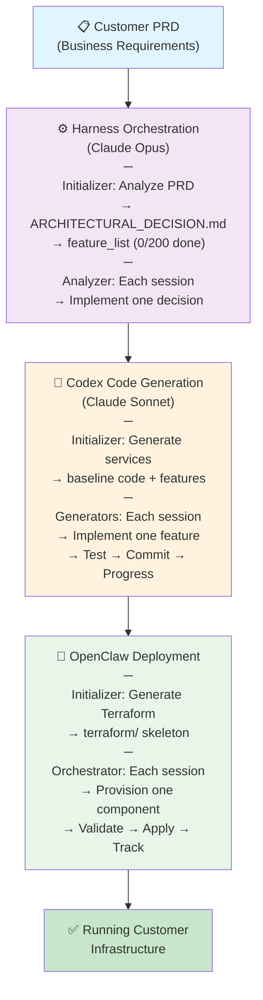
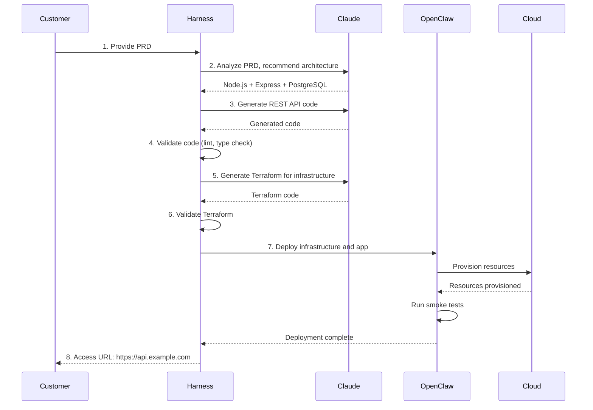

# Dev-House System Architecture Overview

## Purpose

Enable customers to build AI-assisted infrastructure and applications through **PRD-based development** using Anthropic's proven Harness pattern.

Customers provide business specifications (PRD) → Dev-House analyzes → Codex generates → OpenClaw deploys → Customer has running system.

---

## Core Pattern: Anthropic's Harness Extended

We apply [Anthropic's Harness pattern](https://www.anthropic.com/engineering/effective-harnesses-for-long-running-agents) at three levels:

**Key insight**: All three layers use **Initializer → Progress files → Incremental work** pattern.

See: [Anthropic Harness Pattern Extended](anthropic-harness-pattern-extended.md)

---

## Key Components

### 1. Harness (Orchestration Engine)
- **Input**: PRD document (business requirements)
- **Output**: Workflow of tasks for Claude + OpenClaw
- **Responsibility**:
  - Parse PRD into structured requirements
  - Decompose into Claude API calls
  - State tracking (what's done, what's next, what failed)
  - Error recovery
  - Customer feedback loops

### 2. Claude Integration (Code & Architecture)
- **Claude 3.5 Sonnet**: Code generation from requirements (cost-efficient)
- **Claude 3 Opus**: Architecture analysis and recommendations (high-capability)
- **Claude 3 Haiku**: Validation, formatting, quick tasks (fast, cheap)
- **Codex**: Code patterns and templates
- **Patterns**: Reusable prompts for common scenarios (REST API, database, auth, etc.)

### 3. OpenClaw (Infrastructure Orchestration)

> **Naming note**: "OpenClaw" here is Dev-House's internal infrastructure orchestration layer — Terraform execution, deployment automation, policy enforcement. This is not related to Clawdbot (the consumer messaging product that had the Anthropic TOS incident, Feb 2026). See CURRENT_REVIEW.md Section 8.
- **Workflow Orchestration**: Execute multi-step deployments, coordinate provisioning
- **Infrastructure Provisioning**: Terraform, CloudFormation, Ansible, cloud provider CLIs
- **State Management**: Track infrastructure state, enable rollback
- **Policy & Compliance**: Enforce tagging, security, cost limits
- **Cost Optimization**: Track spending, recommend rightsizing

### 4. Deployment Engine
- **Docker**: Container image builds
- **Infrastructure**: Cloud provisioning via OpenClaw
- **Application Deployment**: Service configuration, orchestration
- **Validation**: Automated testing, security scanning, health checks

### 5. State Management
- PRD analysis cache (don't re-analyze unchanged parts)
- Generated code artifacts
- Deployment history
- Infrastructure state (via OpenClaw)
- User feedback / refinements

---

## Data Flow Example

**Scenario**: Customer provides PRD for "REST API with PostgreSQL"

---

## Design Constraints

- **Productionizable**: Not just a prototype. Customers run this themselves.
- **Cost-aware**: Minimize Claude API calls through caching and batching
- **Debuggable**: Clear logs, error messages, recovery options
- **Extensible**: New code generators, deployment targets added without harness rewrite

---

## Deployment Models

### Model 1: SaaS (Cloud)
- Harness runs on cloud infrastructure (customer-managed VPC)
- Claude API calls go to Anthropic
- Deployment targets: customer's cloud (AWS, Azure, GCP)

### Model 2: Customer Self-Hosted
- Harness container runs in customer's infrastructure
- Customer manages secrets, API keys
- Deployment targets: customer's on-prem or cloud

---

## Key Design Decisions

*See [decisions.md](decisions.md) for detailed rationale.*

1. **Harness-first approach** — Orchestration before code generation
2. **State-based workflow** — Track progress, enable recovery
3. **Modular deployment** — Different generators for different targets
4. **Caching strategy** — Avoid re-analyzing unchanged PRDs

---

## Next: Detailed Components

- [Harness Orchestration Engine](../harness/orchestration.md)
- [Claude Codex Integration](../codex/generation.md)
- [Deployment Architecture](../deployment/customer-deployment.md)

