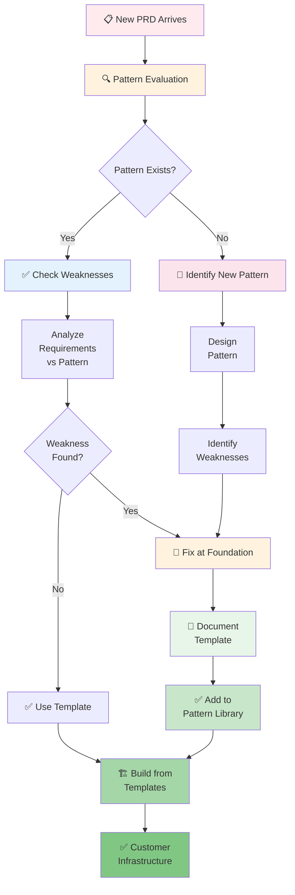
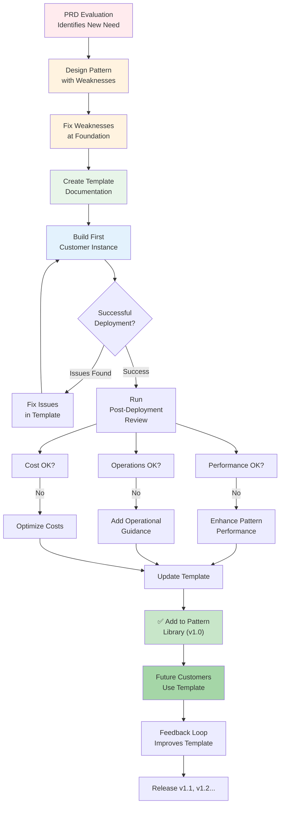

# Pattern Evolution Framework

**Purpose**: Systematically evaluate, strengthen, and grow the reference architecture based on real customer requirements.

**Philosophy**: Each new PRD is an opportunity to either:
1. Apply existing patterns (proven, reusable)
2. Identify pattern weaknesses and fix them
3. Add new patterns to the library (once validated)

**Status**: Foundational Framework

---

## Overview: Pattern-Driven Architecture



---

## Step 1: Pattern Evaluation Framework

### Intake: Analyze New PRD

When a new PRD arrives, evaluate it against these dimensions:

```python
class PRDAnalysis:
    """Analyze PRD to determine applicable patterns"""

    def analyze(self, prd: Dict) -> Dict:
        return {
            'customer_profile': self.profile(prd),
            'technical_requirements': self.requirements(prd),
            'deployment_patterns': self.patterns(prd),
            'data_patterns': self.data(prd),
            'network_topology': self.topology(prd),
            'scale_requirements': self.scale(prd),
            'compliance_requirements': self.compliance(prd),
        }

    def profile(self, prd: Dict) -> Dict:
        """Analyze customer profile"""
        return {
            'company_size': prd.get('company_size'),  # startup/smb/enterprise
            'industry': prd.get('industry'),  # healthcare/finance/saas/etc
            'budget_tier': prd.get('budget'),  # minimal/standard/enterprise
            'maturity': prd.get('maturity'),  # mvp/growth/scale
            'geography': prd.get('regions'),  # regions customer operates in
        }

    def requirements(self, prd: Dict) -> Dict:
        """Extract technical requirements"""
        return {
            'backend_frameworks': self.extract_frameworks(prd),  # Node, Python, Go, etc
            'database_needs': self.extract_databases(prd),  # SQL, NoSQL, cache
            'integration_needs': self.extract_integrations(prd),  # APIs, webhooks, etc
            'real_time_features': prd.get('real_time_required', False),  # WebSockets, etc
            'file_handling': prd.get('file_handling'),  # S3, CDN, etc
            'computation_intensive': prd.get('heavy_compute', False),  # ML, background jobs
        }

    def patterns(self, prd: Dict) -> Dict:
        """Determine deployment patterns needed"""
        # Evaluate against Tier 1-4 + Single-Tenant
        return {
            'primary_pattern': self.select_primary_pattern(prd),
            'alternative_patterns': self.rank_alternatives(prd),
            'mixed_patterns': self.identify_mixed_patterns(prd),  # Some customers mix tiers
        }

    def data(self, prd: Dict) -> Dict:
        """Analyze data architecture needs"""
        return {
            'isolation_required': prd.get('data_isolation_required'),
            'backup_requirements': prd.get('backup_requirements'),  # RPO/RTO
            'gdpr_compliance': 'gdpr' in prd.get('compliance', []).lower(),
            'data_residency': prd.get('data_residency'),  # geo constraints
            'encryption_required': prd.get('encryption_required'),
        }

    def topology(self, prd: Dict) -> Dict:
        """Determine network topology"""
        return {
            'multi_region': len(prd.get('regions', [])) > 1,
            'vpn_required': prd.get('vpn_integration_required'),
            'on_premises_connectivity': prd.get('hybrid_required'),
            'custom_domain_required': prd.get('custom_domain_required'),
            'internal_only': prd.get('internal_only'),  # No public internet access
        }

    def compliance(self, prd: Dict) -> Dict:
        """Extract compliance requirements"""
        return {
            'frameworks': prd.get('compliance_frameworks', []),  # HIPAA, PCI-DSS, SOC2, etc
            'audit_required': 'audit' in str(prd).lower(),
            'data_sovereignty': prd.get('data_sovereignty'),
            'encryption_at_rest': prd.get('encryption_at_rest'),
            'encryption_in_transit': prd.get('encryption_in_transit'),
        }
```

### Mapping to Patterns

```python
class PatternSelector:
    """Select applicable patterns from PRD analysis"""

    def select(self, analysis: Dict) -> List[Pattern]:
        """Return list of applicable patterns in priority order"""

        patterns = []

        # 1. Deployment Pattern (Tier 1-4)
        deployment = self.select_deployment_pattern(analysis)
        patterns.append(deployment)

        # 2. Data Pattern
        data = self.select_data_pattern(analysis)
        patterns.append(data)

        # 3. Network Topology Pattern
        topology = self.select_topology_pattern(analysis)
        patterns.append(topology)

        # 4. Integration Pattern(s)
        integrations = self.select_integration_patterns(analysis)
        patterns.extend(integrations)

        # 5. Scaling Pattern
        scaling = self.select_scaling_pattern(analysis)
        patterns.append(scaling)

        return patterns

    def select_deployment_pattern(self, analysis: Dict) -> Pattern:
        """Choose Tier 1-4 or Single-Tenant based on profile"""

        compliance = analysis['compliance_requirements']['frameworks']
        budget = analysis['customer_profile']['budget_tier']
        scale = analysis['scale_requirements']['peak_users']

        # HIPAA/PCI requires Tier 4 or Single-Tenant
        if any(f in compliance for f in ['HIPAA', 'PCI-DSS']):
            return Pattern('Tier 4 Enterprise Isolated')

        # Enterprise budget + scaling needs → Tier 3
        if budget == 'enterprise' and scale > 10000:
            return Pattern('Tier 3 Isolated Infrastructure')

        # SMB → Tier 2 or Tier 3
        if budget in ['standard', 'premium']:
            return Pattern('Tier 3 Isolated Infrastructure')  # Safe default

        # Startup → Tier 1 or Tier 2
        return Pattern('Tier 1 Fully Shared')

    def select_data_pattern(self, analysis: Dict) -> Pattern:
        """Choose database isolation pattern"""

        if analysis['data_patterns']['isolation_required']:
            return Pattern('Database per Customer (Tier 3/4)')

        if analysis['data_patterns']['multi_region']:
            return Pattern('Cross-Region Replication')

        return Pattern('Shared Database with Schema Isolation')
```

---

## Step 2: Weakness Analysis (Before Building)

### Pattern Strength Matrix

For each selected pattern, systematically identify weaknesses:

```python
class PatternWeaknessAnalyzer:
    """Identify pattern weaknesses before implementation"""

    def analyze(self, pattern: Pattern, prd_requirements: Dict) -> WeaknessReport:
        """Return list of potential issues with this pattern for these requirements"""

        issues = []

        # Check each weakness category
        issues.extend(self.check_scalability(pattern, prd_requirements))
        issues.extend(self.check_isolation(pattern, prd_requirements))
        issues.extend(self.check_compliance(pattern, prd_requirements))
        issues.extend(self.check_operational(pattern, prd_requirements))
        issues.extend(self.check_cost(pattern, prd_requirements))
        issues.extend(self.check_reliability(pattern, prd_requirements))

        return WeaknessReport(
            pattern=pattern,
            issues=issues,
            go_no_go=len([i for i in issues if i.severity == 'critical']) == 0
        )

    def check_scalability(self, pattern: Pattern, req: Dict) -> List[Issue]:
        """Identify scalability weaknesses"""

        issues = []
        peak_users = req.get('scale_requirements', {}).get('peak_users', 0)
        concurrent_conns = req.get('scale_requirements', {}).get('concurrent_connections', 0)

        if pattern.name == 'Tier 1 Fully Shared':
            if peak_users > 10000:
                issues.append(Issue(
                    severity='critical',
                    weakness='Tier 1 not suitable for 10K+ concurrent users',
                    recommendation='Upgrade to Tier 2 (namespace isolation) or Tier 3'
                ))

            if concurrent_conns > 5000:
                issues.append(Issue(
                    severity='warning',
                    weakness='Shared resources may cause noisy neighbor (one customer spike affects others)',
                    recommendation='Consider adding circuit breakers, rate limiting per customer'
                ))

        if pattern.name == 'Tier 2 K8s Namespace':
            if peak_users > 100000:
                issues.append(Issue(
                    severity='warning',
                    weakness='Single cluster scales to ~100K, multi-cluster coordination needed for larger scale',
                    recommendation='Plan for cluster federation or service mesh (Istio)'
                ))

        return issues

    def check_isolation(self, pattern: Pattern, req: Dict) -> List[Issue]:
        """Identify data/network isolation weaknesses"""

        issues = []

        if req.get('compliance_frameworks', []):
            if pattern.name in ['Tier 1', 'Tier 2']:
                issues.append(Issue(
                    severity='critical',
                    weakness='Compliance-required but pattern has shared resources',
                    recommendation='Upgrade to Tier 3 (isolated infrastructure) or Tier 4 (dedicated data layer)'
                ))

        if req.get('data_isolation_required') and pattern.name == 'Tier 1':
            issues.append(Issue(
                severity='critical',
                weakness='Data isolation required but Tier 1 shares database schema',
                recommendation='Use database-per-customer isolation (Tier 3) or dedicated database (Tier 4)'
            ))

        return issues

    def check_compliance(self, pattern: Pattern, req: Dict) -> List[Issue]:
        """Identify compliance/audit weaknesses"""

        issues = []
        frameworks = req.get('compliance_frameworks', [])

        for framework in frameworks:
            # HIPAA: Requires audit trail, encryption, access controls
            if framework == 'HIPAA':
                if pattern.name in ['Tier 1', 'Tier 2']:
                    issues.append(Issue(
                        severity='critical',
                        weakness=f'{framework} requires dedicated infrastructure (HIPAA audit trail complex in shared)',
                        recommendation='Use Tier 3 (isolated) or Tier 4 (fully dedicated)'
                    ))

            # PCI-DSS: Requires network segmentation
            if framework == 'PCI-DSS':
                if 'network_segmentation' not in pattern.capabilities:
                    issues.append(Issue(
                        severity='critical',
                        weakness=f'{framework} requires network segmentation',
                        recommendation='Ensure pattern includes VPC/VNet isolation'
                    ))

        return issues

    def check_operational(self, pattern: Pattern, req: Dict) -> List[Issue]:
        """Identify operational/maintenance weaknesses"""

        issues = []

        # Tier 3 requires provisioning tool for per-customer resource creation
        if pattern.name == 'Tier 3' and not req.get('has_provisioning_tool'):
            issues.append(Issue(
                severity='high',
                weakness='Tier 3 requires provisioning tool to create customer infrastructure',
                recommendation='Build/deploy provisioning orchestrator (Python + Terraform)'
            ))

        # Multi-region requires cross-region replication setup
        if req.get('multi_region_required') and 'replication' not in pattern.capabilities:
            issues.append(Issue(
                severity='high',
                weakness='Multi-region required but pattern has no replication strategy',
                recommendation='Add cross-region replication for database, cache, storage'
            ))

        return issues

    def check_cost(self, pattern: Pattern, req: Dict) -> List[Issue]:
        """Identify cost/efficiency weaknesses"""

        issues = []
        budget_tier = req.get('customer_profile', {}).get('budget_tier')

        if pattern.name == 'Tier 4' and budget_tier == 'minimal':
            issues.append(Issue(
                severity='warning',
                weakness='Tier 4 ($300-500/mo) incompatible with minimal budget',
                recommendation='Discuss cost with customer or propose Tier 3 instead'
            ))

        # Scale-to-zero capability missing
        if req.get('cost_optimization_required') and 'scale_to_zero' not in pattern.capabilities:
            issues.append(Issue(
                severity='medium',
                weakness='Scale-to-zero not supported (always running = higher cost)',
                recommendation='Ensure pattern uses serverless (Container Apps, Lambda) not long-lived VMs'
            ))

        return issues

    def check_reliability(self, pattern: Pattern, req: Dict) -> List[Issue]:
        """Identify reliability/resilience weaknesses"""

        issues = []
        uptime_sla = req.get('uptime_sla', '99%')

        if uptime_sla == '99.99%' and pattern.name == 'Tier 1':
            issues.append(Issue(
                severity='high',
                weakness='Tier 1 shared resources make 99.99% SLA difficult (one customer issue affects all)',
                recommendation='Upgrade to Tier 3 or ensure pattern includes redundancy + failover'
            ))

        if not req.get('database_backup_required'):
            issues.append(Issue(
                severity='medium',
                weakness='No backup strategy specified',
                recommendation='Add automated daily backups + quarterly recovery drills'
            ))

        return issues
```

### Weakness Resolution Process

Once weaknesses are identified, fix them at the **foundation** before building:

```python
class PatternFoundationBuilder:
    """Build strong foundations by fixing weaknesses"""

    def resolve_weaknesses(self, pattern: Pattern, issues: List[Issue]) -> Pattern:
        """Modify pattern to address all critical issues"""

        strengthened_pattern = pattern.copy()

        for issue in issues:
            if issue.severity == 'critical':
                # Must fix before deployment
                self.apply_fix(strengthened_pattern, issue)
            elif issue.severity == 'high' and customer_has_budget():
                # Should fix if affordable
                self.apply_fix(strengthened_pattern, issue)

        return strengthened_pattern

    def apply_fix(self, pattern: Pattern, issue: Issue):
        """Apply recommended fix to pattern"""

        if 'isolation' in issue.weakness.lower():
            # Add network isolation
            pattern.add_component('VNet per Customer')
            pattern.add_component('Network Security Groups')
            pattern.add_component('Private Endpoints')

        if 'compliance' in issue.weakness.lower():
            # Add audit/compliance
            pattern.add_component('Audit Logging')
            pattern.add_component('Encryption at Rest')
            pattern.add_component('Encryption in Transit')
            pattern.add_component('Access Control Logging')

        if 'replication' in issue.weakness.lower():
            # Add cross-region support
            pattern.add_component('Cross-Region Database Replication')
            pattern.add_component('Cross-Region Cache Replication')
            pattern.add_component('Failover Mechanism')

        if 'backup' in issue.weakness.lower():
            # Add backup strategy
            pattern.add_component('Automated Daily Backups')
            pattern.add_component('Point-in-Time Recovery')
            pattern.add_component('Backup Retention Policy')
```

---

## Step 3: Pattern Template Specification

Once a pattern is evaluated and strengthened, document it as a reusable template:

```yaml
# Pattern Template: Tier 3 Isolated Infrastructure

metadata:
  name: "Tier 3 Isolated Infrastructure"
  version: "1.0.0"
  created_date: "2026-02-28"
  last_updated: "2026-02-28"
  status: "stable"
  authors: ["Architecture Team"]

description: |
  Each customer gets dedicated infrastructure (Container Apps + VNet) while sharing
  Foundation layer (database, cache, identity provider). Suitable for SMB SaaS
  companies requiring isolation without enterprise overhead.

applicable_to:
  customer_scale: ["smb", "mid-market"]
  industries: ["all"]
  budget_tiers: ["standard", "premium"]
  compliance_frameworks: ["SOC2", "HIPAA*"]  # * requires audit enhancements

not_applicable_to:
  - startup (too expensive)
  - fully_shared_requirements (need Tier 1)
  - single_region_only (prefer Tier 2 for cost)

components:
  foundation:
    - postgresql-database-shared
    - redis-cache-shared
    - keycloak-identity-provider
    - container-registry
    - key-vault
    - foundation-vnet
    - monitoring

  per_customer:
    - customer-resource-group
    - customer-vnet
    - customer-vnet-peering
    - customer-container-apps-env
    - customer-container-apps
    - customer-storage-account
    - customer-backup-vault

terraform_modules:
  - "modules/postgresql-database/{aws,azure,gcp}/"
  - "modules/redis-cache/{aws,azure,gcp}/"
  - "modules/container-apps-env/{aws,azure,gcp}/"
  - "modules/customer-vnet/{aws,azure,gcp}/"
  - "modules/keycloak/{aws,azure,gcp}/"

strengths:
  - Complete network isolation (per-customer VNet)
  - Independent scaling per customer
  - Scale-to-zero cost optimization
  - Custom domains supported
  - Audit trail per customer
  - Good compliance story (with audit enhancements)

weaknesses:
  - Higher per-customer cost ($50-200/mo)
  - More complex provisioning (requires orchestration tool)
  - Operational overhead (N VNets to manage)
  - Still shared data layer (database/cache)

edge_cases:
  - Azure async operations (5-15 min certificate provisioning)
  - Pending-delete windows (5 min wait before re-creating resources)
  - VNet peering limits (500 peerings per VNet)
  - Database connection pool limits (shared PostgreSQL)

mitigations:
  - Use state validator to prevent resource conflicts
  - Non-blocking timeout for async operations
  - Circuit breakers for database connection pools
  - Connection pooling middleware (PgBouncer)

deployment_runbook: "docs/deployment/tier3-deployment-guide.md"
operational_runbook: "docs/operations/tier3-operational-runbook.md"

examples:
  - customer_id: "example-acme"
    size: "100-1000 users"
    cost_per_month: "$150"
    deployment_time: "20 minutes"
```

---

## Step 4: Pattern Evolution Process

### Workflow: New Pattern Addition



### Post-Deployment Review Template

```yaml
# Post-Deployment Review: Pattern Validation

customer: "acme-corp"
pattern: "Tier 3 Isolated Infrastructure"
deployment_date: "2026-03-15"
go_live_date: "2026-03-20"

performance:
  database_performance: "✅ Meets SLA (p99 < 100ms)"
  api_latency: "✅ Meets SLA (p99 < 200ms)"
  container_cold_starts: "⚠️ 3-5s, document in runbook"
  network_peering_latency: "✅ <1ms"

operations:
  provisioning_time: "✅ 25 min (target: 30 min)"
  incident_response: "✅ Clear runbook, team trained"
  scaling_behavior: "✅ Auto-scaling works as expected"
  alerting: "⚠️ Add alert for VNet peering failures"

cost:
  estimated: "$180/month"
  actual: "$165/month"
  variance: "✅ 8% under budget"
  breakdown:
    - container_apps_env: "$45/month"
    - database_share: "$30/month"
    - storage: "$8/month"
    - bandwidth: "$5/month"
    - monitoring: "$12/month"
    - other: "$65/month (foundation amortized)"

issues_found:
  - severity: "medium"
    issue: "Certificate provisioning timeout (15 min) exceeded customer expectations"
    resolution: "Document async nature in runbook, set customer expectations"
    template_update: "Add note about Let's Encrypt provisioning delays"

  - severity: "low"
    issue: "Database backup took longer than expected (3 hours)"
    resolution: "Adjust backup window to off-peak (2-4 AM)"
    template_update: "Add backup window configuration"

improvements_for_next_customer:
  - Add Tailscale VPN for team access (used by customer)
  - Document PgBouncer setup (customer needed connection pooling)
  - Pre-create Keycloak realm template (customer customization took 2 hours)

template_version_updates:
  - v1.0 → v1.1
  - Added: "Backup Window Configuration"
  - Added: "Certificate Provisioning Expectations"
  - Added: "Connection Pooling Guidance"
  - Added: "Tailscale Integration (Optional)"

sign_off:
  architecture_review: "approved"
  ops_review: "approved"
  customer_satisfaction: "9/10"
```

---

## Pattern Library Evolution

### Version Control for Patterns

Each pattern gets semantic versioning:

```
Pattern: Tier 3 Isolated Infrastructure

v1.0.0 (2026-02-28) - Initial release
  Components: VNet, Container Apps, RDS, Redis, Keycloak
  Capabilities: Network isolation, scale-to-zero, custom domains
  Known issues: Azure async cert provisioning delays

v1.1.0 (2026-03-25) - Post-deployment improvements
  + Connection pooling guidance (PgBouncer)
  + Tailscale VPN integration (optional)
  + Certificate provisioning expectation setting
  - Removed: Manual backup procedures (now automated)

v1.2.0 (2026-04-10) - Enhanced compliance
  + Audit logging for HIPAA
  + Encryption at rest (all storage)
  + Access control logging
  Now suitable for: HIPAA, PCI-DSS (with audit enhancements)

v2.0.0 (TBD) - Architecture redesign
  Planned: Multi-region replication, Kubernetes instead of Container Apps
```

### Pattern Dependency Graph

Track which patterns depend on each other:

```
Tier 3 Isolated Infrastructure
  ├─ requires: Foundation Layer
  │   ├─ PostgreSQL Database (Shared)
  │   ├─ Redis Cache (Shared)
  │   ├─ Keycloak (Identity Provider)
  │   └─ Container Registry
  │
  ├─ optionally uses: Custom Domain Provisioning
  │   ├─ DNS Zone (Azure/AWS/GCP)
  │   ├─ Let's Encrypt Certificate Manager
  │   └─ Keycloak Realm per Customer
  │
  ├─ optionally uses: Cross-Region Replication
  │   ├─ Database Replication
  │   ├─ Cache Replication
  │   └─ Failover Coordination
  │
  └─ optionally uses: VPN/Hybrid Connectivity
      ├─ Tailscale (recommended)
      ├─ ExpressRoute (Azure)
      └─ VPC Peering (AWS)
```

---

## Step 5: Pattern Evaluation on Each PRD

### Quick Reference: Pattern Selection

```python
def select_patterns(prd: Dict) -> List[Pattern]:
    """
    Fast pattern selection for every new PRD.

    Run in < 30 minutes to decide architecture.
    """

    analysis = PRDAnalysis().analyze(prd)

    # 1. Deployment Pattern
    if analysis['compliance_frameworks']:
        if 'HIPAA' in analysis['compliance_frameworks']:
            deployment = 'Tier 4'
        elif 'PCI-DSS' in analysis['compliance_frameworks']:
            deployment = 'Tier 3 (with audit enhancements)'
        else:
            deployment = 'Tier 3'
    elif analysis['scale']['peak_users'] > 50000:
        deployment = 'Tier 3 or Single-Tenant'
    elif analysis['budget'] == 'minimal':
        deployment = 'Tier 1'
    else:
        deployment = 'Tier 3'  # Safe default

    # 2. Data Pattern
    if analysis['data_isolation_required']:
        data_pattern = 'Database per Customer'
    elif analysis['multi_region']:
        data_pattern = 'Cross-Region Replication'
    else:
        data_pattern = 'Schema per Customer'

    # 3. Topology
    if analysis['multi_region']:
        topology = 'Multi-Region'
    elif analysis['vpn_required']:
        topology = 'Hybrid (on-premises connectivity)'
    else:
        topology = 'Cloud-native'

    # 4. Weaknesses
    weaknesses = PatternWeaknessAnalyzer().analyze(deployment, analysis)
    if weaknesses.critical_issues:
        weaknesses.fix_at_foundation()

    return [deployment, data_pattern, topology, ...]
```

---

## Benefits of Pattern-Driven Architecture

| Aspect | Benefit |
|--------|---------|
| **Speed** | Future customers: use proven templates instead of redesigning |
| **Quality** | Each pattern tested, refined, documented with edge cases |
| **Cost** | Reusable components reduce engineering time |
| **Reliability** | Known weaknesses = known mitigations |
| **Learning** | New patterns add to institutional knowledge |
| **Scaling** | Patterns scale from 1 to 1000 customers |
| **Compliance** | Patterns can be certified (HIPAA, PCI, SOC2) |

---

## Next Steps

1. **Evaluate Existing Patterns**: Tier 1-4 + Single-Tenant against real customer needs
2. **Identify Weaknesses**: Use checklist above for each pattern
3. **Strengthen Foundations**: Fix critical issues before using pattern
4. **Document Templates**: Create pattern templates with versions
5. **Evolution Loop**: Each new customer → feedback → pattern improvement

---

## References

- [AWS Well-Architected Framework](https://aws.amazon.com/architecture/well-architected/) - Pattern library at cloud scale
- [Domain-Driven Design](https://domaindriven design.org/) - Patterns as ubiquitous language
- [Architecture Decision Records (ADRs)](https://adr.github.io/) - Documenting architectural decisions
- [Netflix Microservices Patterns](https://www.nginx.com/blog/microservices-at-netflix-scale/) - Pattern evolution at scale

