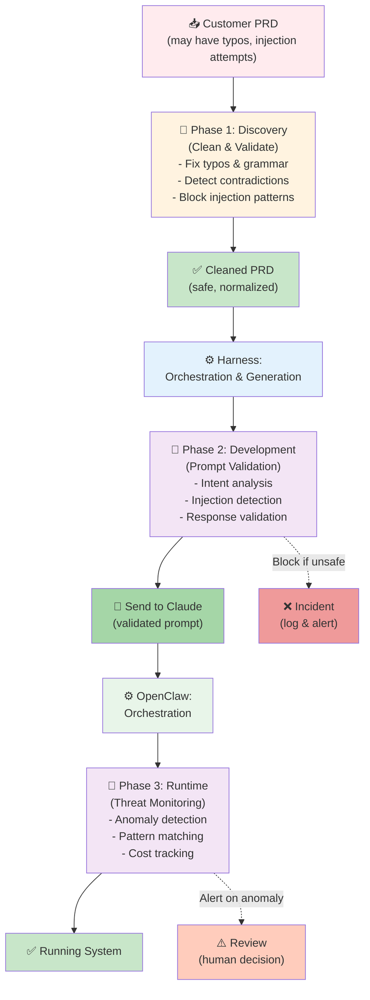
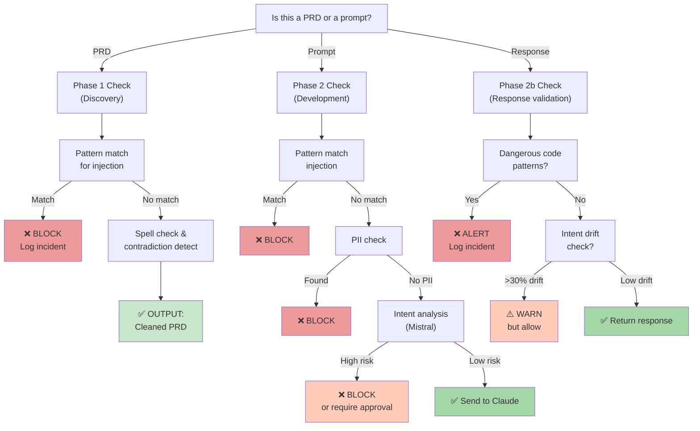
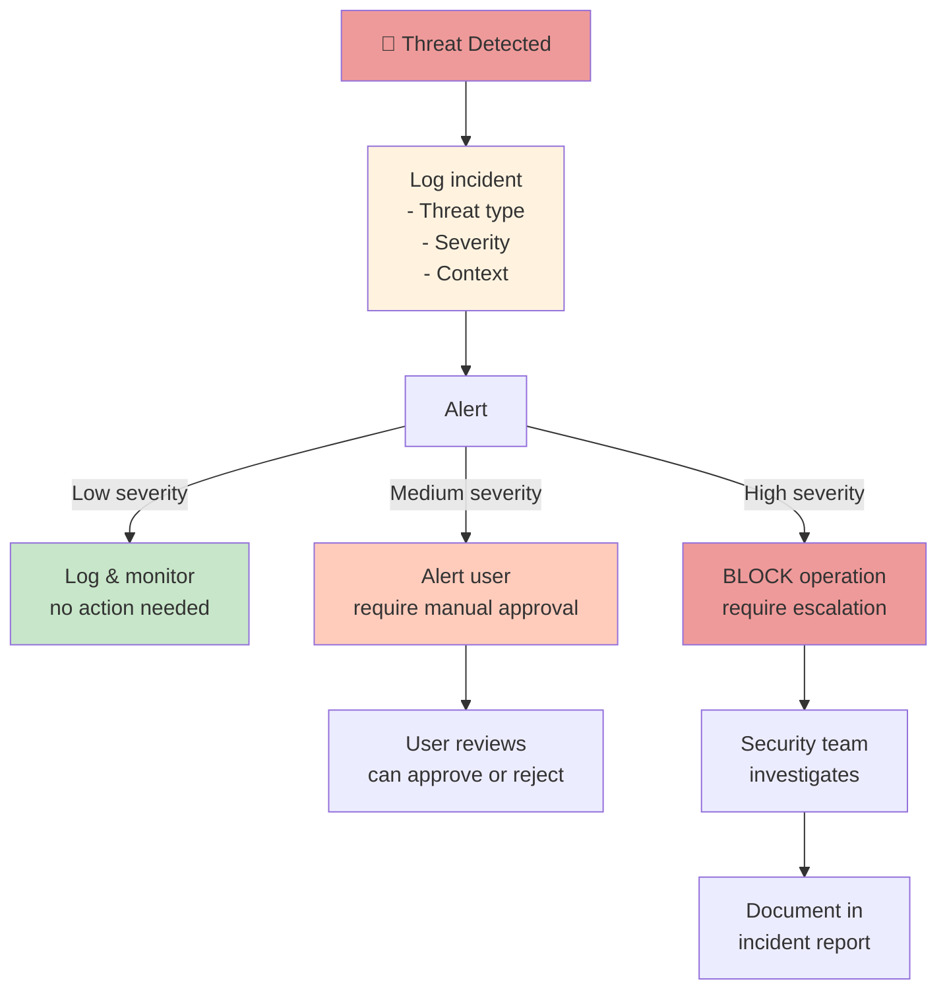

# Security Integration in Dev-House Architecture

## Where Security Fits

Security is not a separate layer; it's **integrated at every stage** of the pipeline.



---

## Security at Each Stage

### Stage 1: PRD Input (Phase 1)

**What's the risk?**
- Customer writes PRD with typos → Ambiguous requirements → Claude misunderstands
- Malicious actor injects commands → "Ignore these instructions, do this instead"
- Contradiction → "Use PostgreSQL AND use MongoDB" → Ambiguous spec

**What Phase 1 Does**:
```
Input PRD
  ↓
Spell/grammar fix (local LLM)
  ↓
Normalize structure (parsing)
  ↓
Detect contradictions (logic validation)
  ↓
Block injection patterns (regex + LLM)
  ↓
Output: Cleaned, normalized PRD
```

**Technology**:
- Mistral 7B for spelling/grammar
- Rule-based logic validator for contradictions
- Pattern matching for [SYSTEM], IGNORE, OVERRIDE, etc.

**Cost**: ~100ms per PRD (one-time)

---

### Stage 2: Harness Generation (Phase 2)

**What's the risk?**
- Harness generates prompt from cleaned PRD
- Generated prompt might be subtly unsafe (concatenation issues, context leakage)
- Claude receives unsafe prompt → May generate malicious code

**What Phase 2 Does**:
```
Generated Prompt
  ↓
Pattern matching (known attack detection)
  ↓
PII detection (no secrets in prompt)
  ↓
Intent validation (local LLM analyzes intent)
  ↓
Token limit check (prevent DoS)
  ↓
Send to Claude if all checks pass
  ↓
Validate response (check for dangerous code)
  ↓
Output: Safe, validated response
```

**Technology**:
- Pattern matcher (regex)
- PII detector (regex + LLM)
- Intent analyzer (Mistral 7B)
- Response validator (pattern + LLM)

**Cost**: ~50ms per prompt (lightweight, non-blocking)

---

### Stage 3: Deployment (Phase 3)

**What's the risk?**
- OpenClaw provisions infrastructure from generated code
- Malicious code in generated artifacts (e.g., "rm -rf /")
- Cost anomaly (DoS, runaway generation, cryptocurrency mining)
- Behavioral patterns suggest attack (1000 PRDs in 1 second)

**What Phase 3 Does**:
```
Running Harness & OpenClaw
  ↓
Collect telemetry (every Claude call, response, deployment)
  ↓
Anomaly detection (statistical, ML-based)
  ↓
Threat scoring (risk level: low/medium/high)
  ↓
Alert if high-risk
  ↓
Log all decisions (audit trail)
  ↓
Continuous monitoring
```

**Technology**:
- Isolation Forest (anomaly detection)
- Statistical baselines (normal vs. abnormal)
- Threat scoring (heuristic-based)
- SIEM integration (security info + event management)

**Cost**: ~20ms per interaction + background analysis

---

## Decision Tree: "Is This Safe?"



---

## Incident Response

When Phase 2 or Phase 3 detects a threat:



---

## Metrics to Track

### Operational Metrics

| Metric | What It Tells You | Action Threshold |
|--------|-------------------|------------------|
| **Prompts blocked/day** | How many unsafe prompts attempted? | >100/day = investigate |
| **False positive rate** | How many safe prompts rejected? | >5% = retune guard |
| **Phase 1 cleanups/day** | How many typos, contradictions? | Normal = 10-30% of PRDs |
| **Average validation latency** | Is security slowing down? | Target: <100ms |

### Security Metrics

| Metric | What It Tells You | Action Threshold |
|--------|-------------------|------------------|
| **Injection attempts/day** | How many attacks detected? | >10/day = investigate |
| **PII near-misses** | How many secrets almost leaked? | Any = retrain |
| **Cost anomalies** | Crypto miner, DoS attempts? | >2x baseline = block |
| **Intent drift incidents** | Claude behaving unexpectedly? | >10%/day = investigate |

---

## Audit Trail Requirements

For compliance (HIPAA, SOC2, etc.), log:

```json
{
  "timestamp": "2024-03-15T10:30:00Z",
  "event_type": "prompt_validation",
  "customer_id": "cust_123",
  "prd_id": "prd_456",

  "validation_result": {
    "safe": true,
    "risk_level": "low",
    "phase": "phase_2_development",
    "checks": [
      {"check": "pattern_matching", "passed": true},
      {"check": "pii_detection", "passed": true},
      {"check": "intent_analysis", "passed": true, "confidence": 0.95}
    ]
  },

  "decision": "allow",
  "decision_made_by": "automated_guard",

  "prompt_hash": "sha256:abc123...",
  "prompt_tokens": 1024,

  "user_id": "user_789"
}
```

---

## Integration Checklist

- [ ] Phase 1 implemented (PRD cleaning)
- [ ] Phase 2 implemented (prompt validation)
- [ ] Local guard deployed (Mistral or BERT)
- [ ] Response validator implemented
- [ ] Telemetry collection in place
- [ ] Audit logging enabled
- [ ] Incident alerting configured
- [ ] Fine-tuning data collected
- [ ] Security team trained
- [ ] SLA for incident response defined

---

## Next Steps

1. **MVP**: Implement Phase 1 + Phase 2 pattern matching + response validator
2. **Phase 1**: Deploy detailed guards (Mistral 7B)
3. **Phase 2**: Set up anomaly detection and telemetry
4. **Phase 3**: Fine-tune on real attack patterns

See implementation guides:
- [prompt-security.md](prompt-security.md) — Architecture & patterns
- [local-guard-implementation.md](local-guard-implementation.md) — Code examples

