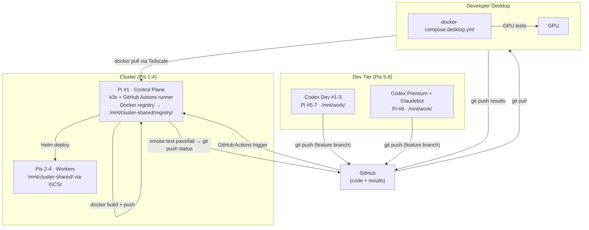
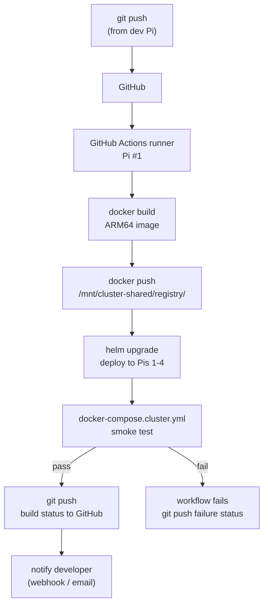
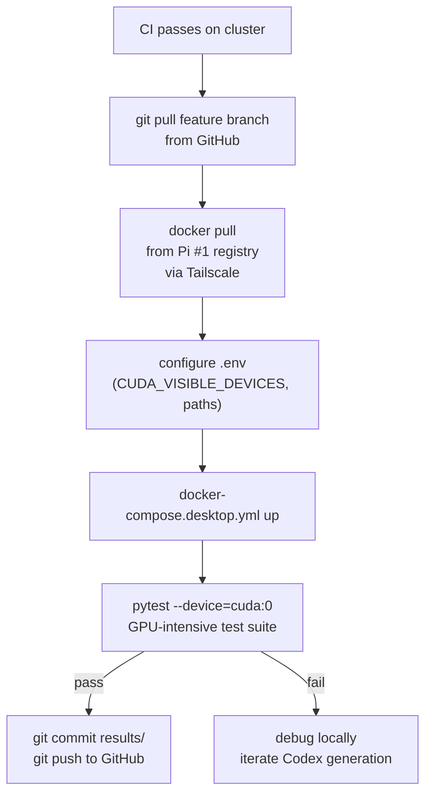

# Testing & Deployment Pattern: Cluster + Desktop GPU Architecture

**Date**: 2026-03-01
**Context**: Solution to the GPU testing paradox — cluster generates code, desktop has GPU, GitHub is the transport layer between them.
**Related**: [cluster-topology.md](cluster-topology.md), [Pi5-Real-Data-Analysis.md](../research/20260228_OPUS_Pi5-Real-Data-Analysis.md)

---

## Overview

### Dev-Only Context

This cluster is a **development system only**. There are no production SLAs. If an overnight job fails, retry tomorrow. Production is a separate concern: validated customer PRDs generate Terraform components that provision cloud infrastructure independently of this cluster.

Target workload: **8–12 overnight batch jobs** working through large PRDs, unattended, results ready for review by morning.

### The GPU Testing Paradox

The cluster has no usable GPU. The Pi 5 VideoCore VII handles video encode/decode only — it cannot accelerate LLM inference or general GPU compute (no matrix multiplication support). For all GPU workloads, the Pi 5 is CPU-only.

The developer desktop has a high-power GPU. But generated code lives on the cluster. Getting it to the desktop for GPU testing requires a transport mechanism.

**Solution: GitHub is the transport layer.**

```
Cluster generates code → git push → GitHub → desktop git pull → desktop runs GPU tests → git push results → GitHub
```

No NFS. No shared mounts. No Synology NAS. Git is the only shared state between cluster and desktop.

---

## Data Flows

Three independent flows. None of them use NFS or shared filesystem mounts.



### Flow 1: Code Generation

Dev Pis (5-8) generate code directly to their local USB flash drive (`/mnt/work/`), then push to GitHub.

```
Codex Dev Pi (e.g., Pi #5):
├── Generate code → /mnt/work/  (128GB USB, ~80 MB/s write)
├── git clone --branch feature-pi5 origin → /mnt/work/repo/
├── Write generated files into working tree
└── git push → GitHub
```

- Each dev Pi works on its own branch (`feature-pi5`, `feature-pi6`, etc.)
- SD card is never written during normal work — OS/boot only
- No cluster network traffic for code generation — all writes are local to the USB drive

### Flow 2: Image Build and Cluster Deploy

GitHub Actions runs on the self-hosted runner (Pi #1). It builds the Docker image, pushes it to the Pi #1 registry, and deploys to the cluster via Helm.

```
Pi #1 (GitHub Actions runner):
├── Trigger: git push to GitHub
├── docker build → image (ARM64)
├── docker push → /mnt/cluster-shared/registry/  (NVMe, local)
├── helm upgrade → deploy to Pis 1-4
├── smoke test → health check via HTTP
└── git push build status/logs → GitHub
```

- Registry lives at `/mnt/cluster-shared/registry/` on Pi #1's NVMe
- Pis 2-4 access the registry via iSCSI (they mount `/mnt/cluster-shared/` from Pi #1)
- No internet egress for image distribution — all registry traffic is local to the cluster switch

### Flow 3: Desktop GPU Testing

Desktop pulls code from GitHub and images from Pi #1's registry via Tailscale. GPU tests run locally. Results are pushed back to GitHub.

```
Developer Desktop:
├── git pull origin feature-pi5  (code from GitHub)
├── docker pull 100.x.x.1:5000/service:tag  (image via Tailscale → Pi #1 registry)
├── docker-compose -f docker-compose.desktop.yml up
├── pytest services/*/tests/ --device=cuda:0
└── git push results/  → GitHub
```

- Tailscale provides the encrypted tunnel to Pi #1's registry — no port forwarding needed
- Desktop accesses Pi #1 registry directly by Tailscale IP (e.g., `100.x.x.1:5000`)
- Results (test logs, benchmark output) are committed and pushed to GitHub, not written to any shared mount

---

## Three docker-compose Variants

Codex generates three compose files into the git repository. They are not exported to NAS or any shared filesystem — they live in the repo and are pulled via git.

### 1. docker-compose.yml — Portable (No GPU)

Works on any host. GPU not declared. Suitable for local development and quick iteration.

```yaml
services:
  service:
    image: ${REGISTRY_URL}/service:${VERSION}
    environment:
      LOG_LEVEL: ${LOG_LEVEL:-info}
    healthcheck:
      test: ["CMD", "curl", "-f", "http://localhost:${SERVICE_PORT}/health"]
      interval: 10s
      timeout: 5s
      retries: 3
```

**Use**: Developer laptop, quick functional checks, any environment without GPU.

### 2. docker-compose.cluster.yml — Cluster Smoke Test (ARM64, No GPU)

ARM64-explicit images, memory-constrained, no GPU declarations. Used by GitHub Actions on Pi #1 after build.

```yaml
services:
  service:
    image: ${REGISTRY_URL}/service:${VERSION}-arm64
    deploy:
      resources:
        limits:
          memory: 512M
        reservations:
          memory: 256M
    # No GPU declarations — Pi cluster has no usable GPU
```

**Use**: Automated smoke tests in GitHub Actions CI on Pi #1. Validates container starts, health endpoint responds, basic orchestration works. CPU-only — slower than desktop but catches import failures and dependency issues.

### 3. docker-compose.desktop.yml — Desktop GPU Test (x86, GPU Required)

Full GPU allocation, no memory constraints, x86 image variant. Requires NVIDIA runtime on the desktop host.

```yaml
services:
  service:
    image: ${REGISTRY_URL}/service:${VERSION}-amd64
    deploy:
      resources:
        reservations:
          devices:
            - driver: nvidia
              count: 1
              capabilities: [gpu]
          memory: 4G
    environment:
      CUDA_VISIBLE_DEVICES: ${CUDA_VISIBLE_DEVICES:-0}
```

**Use**: Full GPU validation on developer desktop. Run after cluster smoke tests pass.

---

## GitHub Actions CI/CD Workflow

Self-hosted runner on Pi #1. Triggered by git push from any dev Pi.



Key points:
- Runner is self-hosted on Pi #1 — no GitHub-hosted minutes consumed
- Images are ARM64; the Pi #1 NVMe is the registry (`/mnt/cluster-shared/registry/`)
- Smoke test uses `docker-compose.cluster.yml` — no GPU, CPU-only validation
- Build status and logs are pushed back to GitHub as commit statuses or artifacts
- No NFS mounts anywhere in this workflow

---

## Desktop GPU Testing Workflow

After the cluster CI passes, the developer pulls code and image to the desktop for full GPU validation.



Step-by-step:

```bash
# 1. Get the generated code
git pull origin feature-pi5

# 2. Pull the ARM64 image built on Pi #1
#    Tailscale IP of Pi #1 (harness-control-01)
docker pull 100.x.x.1:5000/service:${VERSION}-amd64

# 3. Configure environment
cp .env.example .env
# Set: CUDA_VISIBLE_DEVICES=0, SERVICE_PORT, etc.

# 4. Run with GPU
docker-compose -f docker-compose.desktop.yml up -d

# 5. GPU tests
pytest services/*/tests/ --device=cuda:0 --benchmark

# 6. Push results back to GitHub
git add results/
git commit -m "test: GPU test results for ${VERSION}"
git push origin feature-pi5
```

Desktop accesses Pi #1 registry via Tailscale. No NFS mount needed — the only shared state is GitHub (code, results) and the registry (images pulled on demand).

---

## Failure Modes

### Pi #1 Registry Unavailable

Pi #1 hosts the Docker registry and is the k3s control plane. If Pi #1 goes down:
- CI/CD stops — GitHub Actions runner is on Pi #1
- Cluster is leaderless — no new pod scheduling
- Desktop cannot pull images from the registry

Recovery: Pi #1 is a single point of failure by design (small cluster, acceptable risk). Restart Pi #1. Registry data survives on NVMe (`/mnt/cluster-shared/registry/`). Cluster state recovers from etcd on restart.

Mitigation: this is a dev cluster with no SLA. If Pi #1 dies overnight, retry the batch tomorrow.

### GitHub Connectivity Lost

Dev Pis cannot push generated code. Desktop cannot pull code or push results.
- Jobs in progress continue generating locally to `/mnt/work/` — no data loss
- git push retries when connectivity restores
- Cluster CI does not trigger

Recovery: wait for connectivity, then `git push`. No data is lost because generated code is on the dev Pi's local USB drive (`/mnt/work/`).

### Dev Node Dies Mid-Job

A dev Pi (5-8) goes down while generating code for a PRD.
- Work in progress on that node's `/mnt/work/` may be incomplete
- Other dev Pis are unaffected — each is independent
- Harness reassigns the failed PRD to another available dev node

Recovery: the failed node's partial work can be discarded. Harness reruns the PRD on a healthy node. No shared storage dependency — each dev Pi works in its own isolated `/mnt/work/` USB drive.

### Desktop Has No GPU

If GPU tests cannot run locally:
- Use cloud GPU burst (Vast.ai, RunPod, Lambda Labs) — provision on demand, run `docker-compose.desktop.yml`, push results
- Or defer GPU testing — cluster smoke tests provide a functional baseline even without GPU validation

---

## Storage Path Reference

All paths in this document match [cluster-topology.md](cluster-topology.md).

| Location | Path | Contents |
|----------|------|----------|
| Dev Pis 5-8 (USB) | `/mnt/work/` | Generated code, git working tree |
| Pi #1 (NVMe, cluster-shared) | `/mnt/cluster-shared/registry/` | Docker images |
| Pi #1 (NVMe, cluster-shared) | `/mnt/cluster-shared/deployments/` | Helm charts, K8s manifests |
| Pi #1 (NVMe, cluster-shared) | `/mnt/cluster-shared/logs/` | Cluster logs |
| Pis 2-4 (iSCSI) | `/mnt/cluster-shared/` | Mounted from Pi #1 via iSCSI |
| GitHub | remote | Code, results, CI status — shared state between cluster and desktop |
