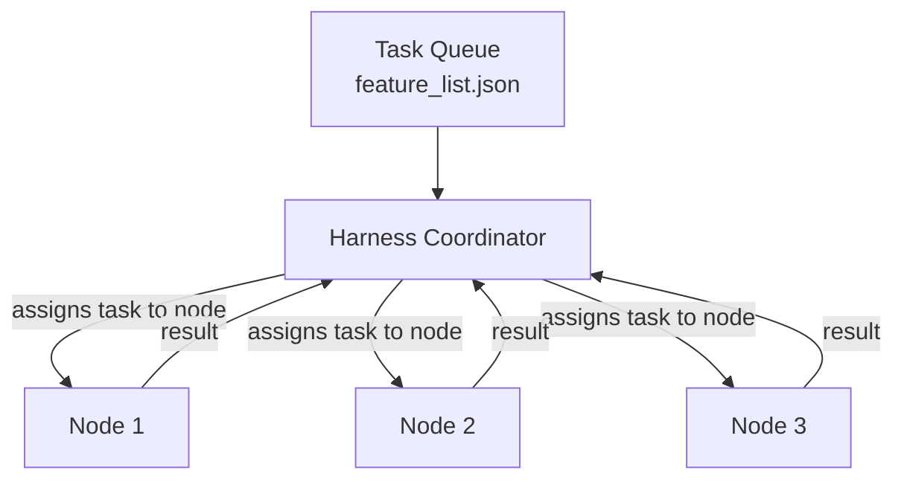
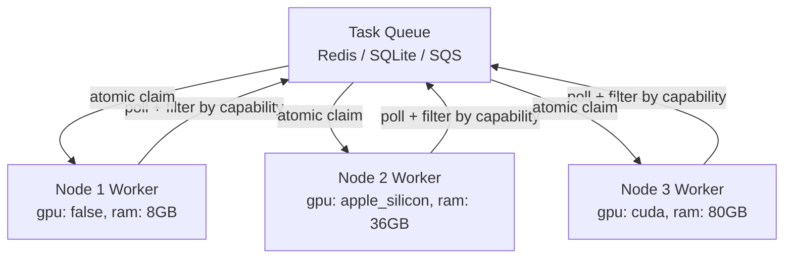
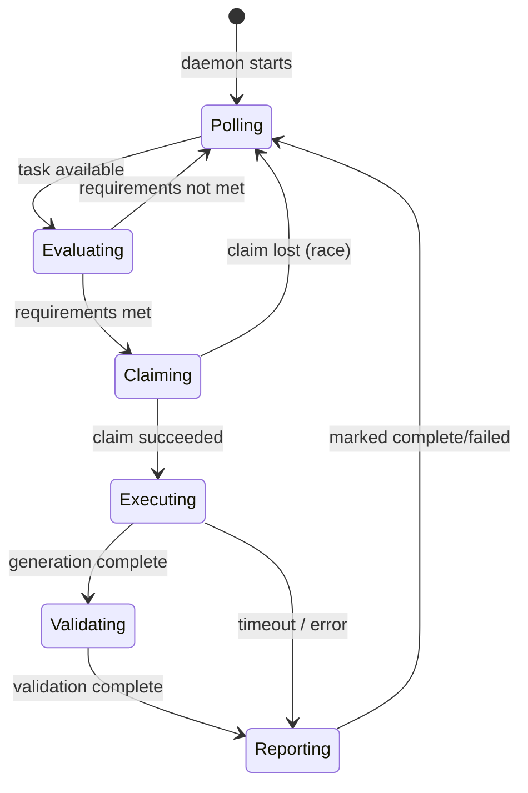

# Work Dispatch Models

Two fundamentally different models for distributing generation work across nodes. The choice affects harness implementation, queue design, node software, failure handling, and multi-customer isolation.

---

## Model A: Coordinator-Dispatch (Push)

The coordinator decides what runs where. Nodes are passive recipients.



**How it works:**
1. Coordinator reads queue (currently `feature_list.json`)
2. Coordinator reads device status (load, availability)
3. Coordinator selects task + target node
4. Coordinator starts an agent session on that node
5. Agent executes task, session ends
6. Coordinator polls for completion, picks next task

**Current implementation**: file-based queue, session-based agents, coordinator does placement logic. The coordinator is the smart component; nodes are dumb.

**Properties:**
- Coordinator knows all node capabilities → routing logic lives in one place
- Single point of failure: coordinator must be up to dispatch work
- Session-based: agents spin up and down per task (cold start per task)
- Race conditions: multiple coordinators could assign the same task (mitigated by file locking)
- Scaling: coordinator complexity grows with node diversity

---

## Model B: Worker-Daemon Pull

Each node is a persistent, self-aware worker. Nodes claim work; the queue is the only central service.



**How it works:**
1. Each node runs a persistent worker daemon (starts at boot, restarts on crash)
2. Worker knows its own capabilities from a local config file or DB
3. Worker polls the queue for tasks matching its capability profile
4. Worker atomically claims a matching task (compare-and-swap: `pending → claimed by node_id`)
5. Worker executes the task (spawns Agent SDK, runs generation/validation)
6. Worker validates the output (runs test suite, checks contract)
7. Worker marks task complete (or failed with error) in queue
8. Worker immediately polls for next task — no idle waiting, no coordinator needed

**Properties:**
- No coordinator needed for dispatch — queue is the only central dependency
- Nodes self-select: a new node type with new capabilities starts working immediately
- Continuous: no cold-start per task (daemon is always warm)
- Naturally fault-tolerant: claimed tasks have a heartbeat timeout — if node dies, task returns to `pending` after TTL
- Capability-aware routing happens at the node, not a central service

---

## Task Schema (Model B)

Each queue entry carries properties the worker uses to self-filter:

```json
{
  "task_id": "uuid",
  "status": "pending | claimed | running | validating | complete | failed",
  "claimed_by": "node_id | null",
  "claimed_at": "ISO timestamp | null",
  "heartbeat_at": "ISO timestamp | null",
  "claim_ttl_seconds": 300,

  "requirements": {
    "gpu": false,
    "gpu_type": null,
    "min_ram_gb": 4,
    "arch": "arm64 | x86 | any",
    "concurrent_slot": 1
  },

  "task": {
    "type": "codegen | validation | terraform | analysis",
    "prd_ref": "examples/customer-x.md § 3.2",
    "feature": "POST /users endpoint",
    "template": "standards/feature.md",
    "template_version": "1.0.0",
    "target_repo": "customer-x/api-service",
    "depends_on": ["task_id_a", "task_id_b"]
  },

  "priority": "high | normal | low",
  "customer_id": "customer-x",
  "created_at": "ISO timestamp",
  "timeout_minutes": 60
}
```

---

## Node Capability Config (Model B)

Each node has a local capability declaration. Worker reads this at startup:

```yaml
# /etc/dev-house/node-config.yaml
node_id: pi-worker-02
node_type: G-L1

capabilities:
  gpu: false
  gpu_type: none
  ram_gb: 8
  arch: arm64
  concurrent_jobs: 2         # max simultaneous claims

accepts:
  task_types:
    - codegen
    - analysis
    - terraform
  # not: validation (GPU required for some test suites)

queue:
  poll_interval_seconds: 5
  heartbeat_interval_seconds: 30
  claim_ttl_seconds: 300     # task returns to pending if heartbeat stops
```

A Mac Mini node (G-L3) would declare `gpu: true, gpu_type: apple_silicon, ram_gb: 36` and accept `validation` tasks requiring GPU.

---

## Worker Lifecycle (Model B)



**Heartbeat**: while `Executing` or `Validating`, worker sends heartbeat every 30s. If heartbeat stops (node crash, OOM), queue resets task to `pending` after `claim_ttl`.

---

## Pros and Cons

### Model A: Coordinator-Dispatch

**Pros:**
- Simple nodes — no daemon to install or maintain per node
- Central visibility — coordinator sees everything, easy to reason about and debug
- Easier to implement first — no queue schema design, no atomic claiming logic
- Fine for a single node or a homogeneous cluster where all nodes are identical

**Cons:**
- Coordinator is a single point of failure — if it goes down, nothing gets dispatched
- Coordinator must know the capabilities of every node type — adding a Mac Mini means updating coordinator code
- Session-based execution: each task incurs cold-start overhead (agent initialisation, context loading)
- Hard to scale to mixed hardware — coordinator routing logic grows in complexity with each new node type
- Node failures require active detection by the coordinator — no self-healing

### Model B: Worker-Daemon Pull

**Pros:**
- No dispatch SPOF — queue goes down, workers pause; queue recovers, workers resume. Coordinator failure has zero impact on in-flight tasks.
- Adding a node is trivial — install daemon, write capability config, point at queue. No coordinator changes.
- Self-healing — heartbeat TTL means a crashed node automatically returns its task to the queue. No human intervention.
- Capability-aware by design — each node declares what it can do; the queue carries what each task needs. Matching is structural, not programmed.
- Warm daemon — no cold start between tasks. Worker is always ready.
- Scales naturally to cloud burst (G-C1) — cloud workers are the same pattern: spin up, poll, claim, execute, terminate.

**Cons:**
- Queue schema is the investment — getting task requirements and capability fields right matters; a badly designed schema is hard to migrate
- Atomic claiming requires a proper queue backend — SQLite is fine for development; Redis or a managed queue needed for production multi-node
- Slightly harder to observe — work is distributed; you need a queue dashboard or query to see what's running where
- Daemon management — each node needs a process supervisor (systemd, Docker restart policy) to keep the daemon alive

### The Honest Summary

Model A wins on simplicity for a single-node setup. For anything beyond that — any scenario where nodes have different capabilities or where you want to add/remove nodes without touching central code — Model B is the correct choice. The complexity Model A saves upfront (no queue schema) comes back as coordinator complexity the moment you have two different node types. Model B front-loads the schema design once; everything after that is configuration.

---

## Comparison

| | Model A (Coordinator-Dispatch) | Model B (Worker-Daemon Pull) |
|--|-------------------------------|------------------------------|
| **Central dependency** | Coordinator + queue | Queue only |
| **Who decides routing** | Coordinator | Each worker (self-filter) |
| **Adding a new node type** | Update coordinator logic | Deploy node with new capability config |
| **Node failure** | Coordinator detects, reassigns | Heartbeat TTL auto-returns task to queue |
| **Coordinator failure** | No new work dispatched | No impact — workers keep polling |
| **Per-task cold start** | Yes (session per task) | No (daemon always warm) |
| **Capability matching** | Coordinator logic (code) | Node config + queue task properties (config) |
| **Where complexity lives** | Coordinator | Queue schema |
| **Observability** | Easy — one place to look | Requires queue dashboard |
| **Best for** | G-S1 single node, initial dev | G-L1 and above, mixed hardware |

---

## Which to Use

**G-S1 (single node)**: Model A or B — doesn't matter. Only one node, no routing decision needed. File-based queue (Model A) is simpler.

**G-L1 (homogeneous Pi cluster)**: Model B is better. All nodes are equivalent; worker daemons self-select from a shared queue. Eliminates coordinator as SPOF and handles node failures gracefully via heartbeat TTL.

**G-L2/G-L3 (mixed hardware)**: Model B is the only sensible choice. A coordinator routing GPU tasks to Mac Minis and non-GPU tasks to Pis requires the coordinator to know node capabilities and current state — this is exactly what Model B distributes to the nodes themselves.

**G-C1 (cloud burst)**: Model B maps naturally to cloud worker patterns (SQS + Lambda/Fargate workers, or Azure Service Bus + Container Apps). Each cloud worker spins up, polls queue, claims task, terminates on completion.

**Recommendation**: Implement Model B for G-L1 and above. The queue schema is the investment; the worker daemon is simple once the schema is defined. Model A (file-based) is acceptable for G-S1 during initial development.

---

## Implications for Harness Design

If adopting Model B, the Harness role changes:

**Harness does NOT:**
- Decide which node runs which task
- Monitor node load for dispatch decisions
- Start/stop agent sessions

**Harness DOES:**
- Parse PRD → generate task list with properties (`requires_gpu`, `depends_on`, etc.)
- Write tasks to the queue (with correct requirements and dependencies)
- Monitor queue for dependency unblocking (`depends_on` tasks completed → unblock dependents)
- Read completed tasks to validate end-to-end progress
- Escalate failed tasks (retry limit exceeded → human alert)

The Harness becomes a **queue writer + progress monitor**, not a dispatcher. The queue and worker daemons handle all dispatch.

---

## Queue Implementation Options

| Option | Suitable for | Notes |
|--------|--------------|-------|
| SQLite + file lock | G-S1, G-L1 development | Simple, no dependency, supports atomic claims via transactions |
| Redis | G-L1, G-L2, G-L3 production | `SET NX` for atomic claims, pub/sub for events, runs on coordinator Pi or NAS |
| PostgreSQL | G-L2, G-L3 multi-customer | Full ACID, complex queries (dependency graph), row-level locking |
| AWS SQS + DLQ | G-C1 cloud burst | Managed, native visibility timeout (heartbeat equivalent), dead letter queue |
| Azure Service Bus | G-C1 Azure | Message lock (heartbeat TTL built in), topic filters for capability routing |
