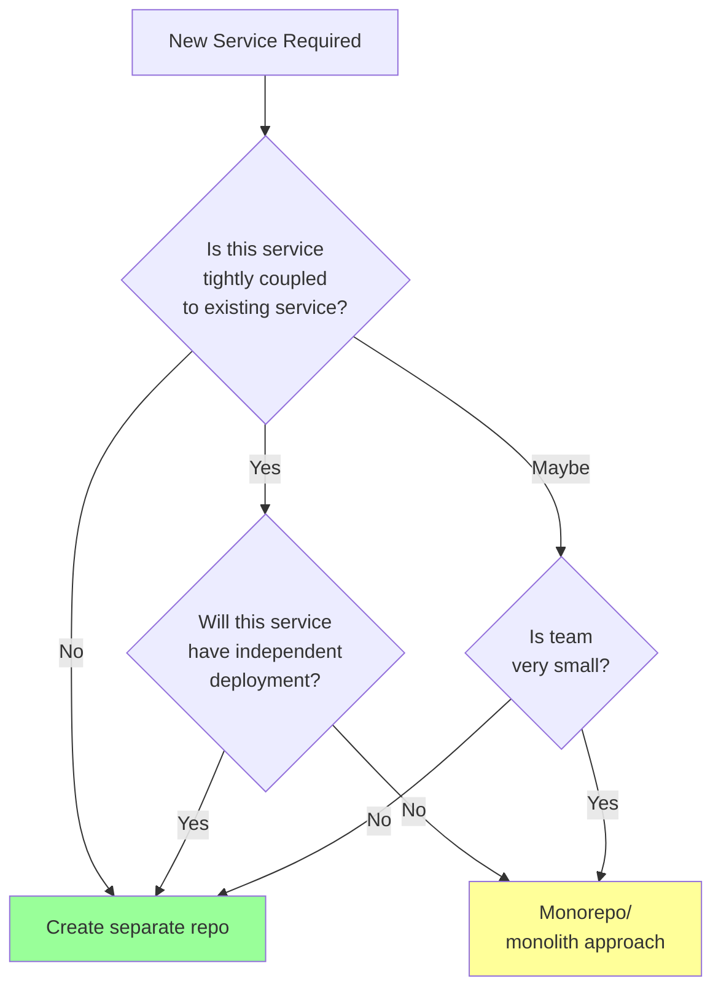
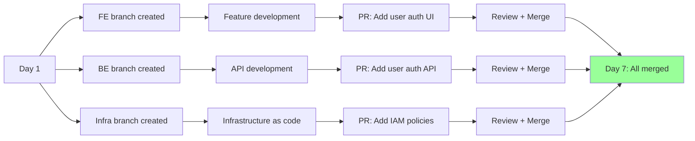

# Customer Repository Structure: PRD-Driven Design

**How PRD analysis determines whether a customer's services go in separate repositories or a monorepo.**

---

## The Question: One Repo or Many?

When analyzing a PRD, we decide:

```
Customer Application
├── Frontend service?
├── Backend service?
├── Infrastructure?
├── Analytics service?
├── Admin dashboard?
└── ...where does each go?
```

**Three options:**
1. **Separate repos** — `customer-frontend`, `customer-backend`, `customer-infrastructure`
2. **Monorepo** — `customer-app` with `/frontend`, `/backend`, `/infrastructure`
3. **Hybrid** — Some shared repo, some separate (e.g., `/infrastructure` in customer repo, frontend/backend separate)

---

## Default: Three-Repo Model

**Most customers start with three separate repositories** (proven in CompylotAI):

```
GitHub: org/customer-name/
├── frontend (React/Vue/etc. web app)
├── backend (API service)
└── infrastructure (Terraform/CloudFormation)
```

**Why default to separate?**

1. **Parallelization** — Teams can work on frontend and backend simultaneously without merge conflicts
2. **Deployment independence** — Frontend deploys without redeploying backend
3. **Language isolation** — Frontend (TypeScript), Backend (Python/Go), Infrastructure (HCL)
4. **Permission boundaries** — DevOps team manages infrastructure repo separately
5. **CI/CD simplicity** — Each repo has its own pipeline, doesn't interfere with others
6. **Technology evolution** — Can upgrade frontend framework without touching backend
7. **Developer utilization** — Distributed work prevents single-device bottlenecks (fits Tailscale model)

---

## Decision Tree: When to Use Monorepo Instead



---

## Repository Structure Decision Matrix

| Situation | Structure | Example | Rationale |
|-----------|-----------|---------|-----------|
| **Standard SaaS** | 3 repos: FE, BE, Infra | Web app + API + cloud deployment | Default; maximum parallelization |
| **Microservices** | N repos: one per service | Each service in separate repo | Independent scaling, deployment |
| **Monolithic MVP** | Monorepo or 1 BE repo | Single backend handles all logic | Simple; small team |
| **Full-stack tightly coupled** | 2 repos: monolith + infra | Backend includes web templates | Backend-heavy; frontend minimal |
| **Desktop app + backend** | 2 repos: desktop + backend | Electron client + Node API | Desktop and backend independent |
| **Multi-tenant SaaS** | 3 repos + shared utils | FE, BE, Infra, + shared lib | Shared logic in library; services separate |
| **Real-time system** | 2 repos: realtime + api | WebSocket server + REST API | Real-time and REST have different requirements |

---

## PRD Analysis: When to Recommend Monorepo

Ask these questions during Harness analysis:

### Question 1: How tightly coupled are services?

```yaml
# Example: Tight coupling → Monorepo
services:
  - name: "Payment Processing"
    depends_on: ["Database", "Order Service"]
    shared_code: "true"  # Shares validation logic with Order Service
  - name: "Order Service"
    depends_on: ["Payment Processing"]

decision: "Monorepo with /payment and /orders subdirs"
```

```yaml
# Example: Loose coupling → Separate repos
services:
  - name: "Frontend"
    depends_on: ["Backend API"]
    interface: "HTTP REST"  # Loose contract
  - name: "Backend"
    depends_on: ["Database"]

decision: "Separate repos; FE and BE coordinate via API contracts"
```

### Question 2: Will services deploy independently?

- **Yes** → Separate repo (each has own CI/CD pipeline)
- **No** → Monorepo (deploy as single unit)

### Question 3: How many developers on the team?

- **< 3** → Monorepo (easier coordination)
- **3+** → Separate repos (reduce merge conflicts)

### Question 4: Will different services scale differently?

- **Yes** → Separate repos (scale frontend and backend independently)
- **No** → Monorepo (scale as one unit)

### Question 5: Are services in different languages/frameworks?

- **Yes** → Separate repos (avoid tooling conflicts)
- **No** → Could work in monorepo

---

## Template: Three-Repo Structure

**For default case** (standard SaaS with frontend, backend, infrastructure):

### Repo 1: Frontend

```
customer-frontend/
├── src/
│   ├── components/
│   ├── pages/
│   ├── services/
│   └── App.tsx
├── tests/
├── public/
├── package.json
├── Dockerfile
├── compose.yaml
├── .github/
│   └── workflows/
│       ├── test.yml
│       ├── build.yml
│       └── deploy.yml
├── README.md
└── .gitignore
```

**Dockerfile principle**: Each service containerizes identically
```dockerfile
FROM node:20-alpine
WORKDIR /app
COPY package*.json ./
RUN npm ci --only=production
COPY src ./src
EXPOSE 3000
CMD ["npm", "start"]
```

### Repo 2: Backend

```
customer-backend/
├── src/
│   ├── api/
│   ├── models/
│   ├── services/
│   └── main.py
├── tests/
├── migrations/
├── requirements.txt
├── Dockerfile
├── compose.yaml
├── .github/
│   └── workflows/
│       ├── test.yml
│       ├── build.yml
│       └── deploy.yml
├── README.md
└── .gitignore
```

### Repo 3: Infrastructure

```
customer-infrastructure/
├── terraform/
│   ├── main.tf
│   ├── variables.tf
│   ├── outputs.tf
│   ├── [cloud-provider]/
│   │   ├── container-apps.tf     (Azure example)
│   │   ├── networking.tf
│   │   ├── storage.tf
│   │   └── database.tf
│   └── modules/
│       ├── app-deployment/
│       ├── database/
│       └── networking/
├── compose.yaml                  (Local parity)
├── .github/
│   └── workflows/
│       ├── validate.yml
│       ├── plan.yml
│       └── apply.yml
├── README.md
└── .gitignore
```

---

## Template: Monorepo Structure

**For tightly-coupled monolithic service**:

```
customer-app/
├── backend/
│   ├── src/
│   ├── tests/
│   ├── Dockerfile
│   ├── requirements.txt
│   └── main.py
│
├── frontend/
│   ├── src/
│   ├── tests/
│   ├── Dockerfile
│   ├── package.json
│   └── App.tsx
│
├── infrastructure/
│   ├── terraform/
│   ├── compose.yaml
│   └── ...
│
├── shared/                       # Shared code
│   ├── validation/
│   ├── models/
│   └── ...
│
├── docker-compose.yaml           (unified local dev)
├── Makefile
├── README.md
└── .gitignore
```

**Monorepo CI/CD strategy:**
- One pipeline that tests all services
- Only rebuild changed services (e.g., `docker build -f backend/Dockerfile`)
- Deploy all services together (monolithic release)

---

## Adding New Services: Decision Framework

**After customer launches with initial 3 repos, they need more services.**

### Analytics Service Example

**Question**: Where does it go?

```yaml
analysis:
  name: "Analytics Service"
  dependencies:
    - "Backend API" (only reads data)
  deployment: "Independent"
  technology: "Node.js + ClickHouse"

decision_tree:
  - Coupled to backend? No (only reads via API)
  - Deploy independently? Yes
  - Separate CI/CD needed? Yes
  - → "Separate repo: customer-analytics"
```

### Recommendation

```
GitHub: org/customer-name/
├── frontend              # Original
├── backend               # Original
├── infrastructure        # Original
└── analytics             # New service (separate repo)
```

**Why separate?**
- Writes to different database (ClickHouse, not Postgres)
- Deploys on different schedule (async job processor)
- Can scale independently (heavy compute)
- Different team (data science vs backend)

---

## Local Development Parity: Docker Compose

**Every service repository has `compose.yaml`:**

### Frontend Compose
```yaml
version: '3.9'
services:
  frontend:
    build: .
    ports:
      - "3000:3000"
    environment:
      - REACT_APP_API_URL=http://localhost:8000
    depends_on:
      - backend
```

### Backend Compose
```yaml
version: '3.9'
services:
  backend:
    build: .
    ports:
      - "8000:8000"
    environment:
      - DATABASE_URL=postgresql://user:pass@db:5432/app
      - REDIS_URL=redis://cache:6379
    depends_on:
      - db
      - cache

  db:
    image: postgres:15
    environment:
      - POSTGRES_USER=user
      - POSTGRES_PASSWORD=pass
      - POSTGRES_DB=app
    volumes:
      - db_data:/var/lib/postgresql/data

  cache:
    image: redis:7-alpine

volumes:
  db_data:
```

### Infrastructure Compose (for Terraform validation)
```yaml
version: '3.9'
services:
  terraform:
    image: hashicorp/terraform:latest
    working_dir: /terraform
    volumes:
      - ./terraform:/terraform
    command: "validate"
```

**Local parity principle**: `docker compose up` in any repo runs local equiv of production

---

## PR Workflow: Parallel Development

**With 3 separate repos, teams work in parallel:**



**No blocking**: Each service can develop independently

---

## Shared Dependencies: Monorepo Approach

If services need shared code (validation logic, types, etc.):

### Option 1: Shared Library Repo
```
GitHub: org/customer-name/
├── frontend
├── backend
├── infrastructure
└── shared-lib                    # New shared repo
    ├── src/
    │   ├── validation.ts
    │   ├── models.ts
    │   └── errors.ts
    ├── package.json
    └── README.md
```

FE and BE both `npm install @customer/shared-lib` (published to npm)

### Option 2: Monorepo + Workspaces
```
customer-app/
├── packages/
│   ├── shared/                   # Shared lib (local)
│   │   └── src/
│   ├── backend/
│   │   └── src/
│   └── frontend/
│       └── src/
├── package.json                  # Root workspaces config
└── pnpm-workspace.yaml
```

**Recommendation**: Shared library repo (Option 1) is cleaner for separate-repo approach

---

## Decision Output: Template

**Harness stream produces this decision document:**

```yaml
customer_id: "acme-corp"
date: "2026-02-28"

repository_structure:
  approach: "three-repo"  # or "monorepo" or "hybrid"
  repos:
    - name: "frontend"
      type: "React web application"
      language: "TypeScript"
      deployment: "Independent (CDN + S3)"

    - name: "backend"
      type: "REST API service"
      language: "Python"
      deployment: "Independent (Container App)"

    - name: "infrastructure"
      type: "Infrastructure as Code"
      language: "HCL (Terraform)"
      deployment: "Infrastructure"

future_services:
  - name: "Analytics"
    decision: "Separate repo (after MVP)"
    reason: "Independent scaling, different tech stack"

  - name: "Admin Dashboard"
    decision: "Separate repo"
    reason: "Different UI framework; separate permissions"

shared_code:
  approach: "shared-library-repo"
  location: "separate npm package"
  contents:
    - validation rules
    - type definitions
    - error constants

local_development:
  command: "docker compose up"
  directory: "each repo root"
  databases: "Postgres (shared in compose.yaml)"
  caching: "Redis (shared in compose.yaml)"

deployment_model: "parallel independent services"
ci_cd: "one pipeline per repo"
scaling: "frontend and backend scale independently"
```

---

## See Also

- **[execution-streams-codex-vs-harness.md](../architecture/execution-streams-codex-vs-harness.md)** — How Harness decides this structure
- **[local-development-environment.md](../harness/local-development-environment.md)** — Docker Compose parity
- **[deployment-patterns.md](deployment-patterns.md)** — Where these repos deploy to
