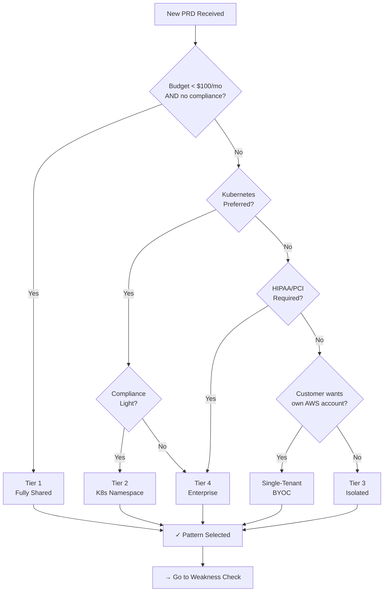

# Pattern Selection Workbook

**Practical companion to [pattern-evolution-framework.md](../architecture/pattern-evolution-framework.md)**

When a new customer PRD arrives, use this workbook to evaluate their requirements against existing deployment patterns and identify which pattern(s) best fit their profile.

---

## Quick Start: PRD Assessment Checklist

Use this checklist for every new PRD. Take 10 minutes to answer these questions:

### Customer Profile
- [ ] **Company size**: Startup? SMB (< 50 people)? Mid-market (50-500)? Enterprise (500+)?
- [ ] **Industry**: SaaS, Healthcare, Finance, Government, Other?
- [ ] **Monthly budget for infrastructure**: < $100? $100-500? $500-2K? $2K+?
- [ ] **Time to market**: MVP (< 3 months)? Growth phase (3-12 months)? Mature (> 1 year)?

### Technical Requirements
- [ ] **Workload type**: Web app? API? Batch processing? Real-time? Mixed?
- [ ] **Expected users**: < 100? 100-1K? 1K-10K? 10K-100K? 100K+?
- [ ] **Data sensitivity**: Public? Internal? PII? PHI/HIPAA? PCI? Trade secret?
- [ ] **Availability requirement**: Best effort? 99.5%? 99.9%? 99.99%?
- [ ] **Data residency needed**: US only? Multi-region? Specific country? No requirement?

### Compliance & Security
- [ ] **Compliance mandates**: None? SOC2? HIPAA? PCI-DSS? FedRAMP? Other?
- [ ] **Data residency requirement**: Yes/No
- [ ] **Audit trail required**: Yes/No
- [ ] **Multi-tenancy isolation**: Can customers share infrastructure? Must be isolated?
- [ ] **Network isolation**: Can run in shared cloud? Needs private VNet? Needs on-prem?

### Deployment & Operations
- [ ] **Deployment target**: AWS? Azure? GCP? Multi-cloud? BYOC (bring your own cloud)?
- [ ] **Kubernetes preferred?**: Yes/No/Indifferent
- [ ] **Existing infrastructure**: Greenfield? Brownfield (integrate with existing)?
- [ ] **Self-hosted option needed**: Yes/No
- [ ] **Custom domain required**: Yes/No

---

## Pattern Selection Decision Table

**Use this table after completing the checklist above.**

| Situation | Pattern | Use When | Cost | Isolation | Compliance | Notes |
|-----------|---------|----------|------|-----------|-----------|-------|
| **Startup MVP, single product** | Tier 1 (Fully Shared) | Budget < $100/mo, no compliance, all customers can share infra | $25-100/mo per customer | Logical (schema isolation) | None; schema-per-customer | Fast deploy, easy ops, but limited isolation |
| **SMB growing, moderate workload** | Tier 2 (K8s Namespace) | Budget $100-300/mo, light compliance, K8s preferred, moderate scale (100s of users) | $50-200/mo per customer | Namespace isolation + network policies | SOC2, light HIPAA possible | Good balance; proven in Kubernetes shops |
| **Mid-market SaaS, compliance light** | Tier 3 (Isolated) | Budget $100-300/mo, SOC2/light HIPAA, need customer isolation, 1K-10K users, scale-to-zero important | $100-300/mo per customer | Full (dedicated VNet, Container Apps, compute) | SOC2 ✓, light HIPAA ✓, PCI possible | **Recommended MVP**; proven in CompylotAI-terraform |
| **Enterprise, high compliance** | Tier 4 (Enterprise) | Budget $300-500+/mo, HIPAA/PCI/FedRAMP, maximum isolation, dedicated data per customer, 10K+ users | $300-500+/mo per customer | Complete (including DB, cache per customer) | HIPAA ✓, PCI ✓, most compliance | Reserved for enterprise deals |
| **Enterprise BYOC/self-hosted** | Single-Tenant | Customer wants to manage own cloud account, greenfield deployment, maximum control | Varies (T2-T4 costs) | Customer controls | Customer responsible; we audit | Provide Terraform modules; customer runs |

---

## Pattern Decision Tree

Start at the top, answer yes/no questions, follow arrows to pattern recommendation:



---

## Pattern Weakness Checking Guide

**After selecting a pattern, verify it handles all customer requirements:**

### Tier 1 (Fully Shared)

**Strengths:**
- ✓ Cheapest option ($25-100/mo)
- ✓ Fastest to deploy (hours, not days)
- ✓ Minimal ops overhead

**Must NOT use if:**
- ✗ Customer needs data isolation (multi-tenant compliance issue)
- ✗ Compliance required (SOC2+ means audit trail, isolation)
- ✗ High availability (can't isolate noisy neighbors)
- ✗ Custom domain needed (single domain per deployment)

**If selected, verify customer accepts:**
- Shared database (schema isolation only)
- Shared compute (workload interference possible)
- Shared monitoring/logs
- No custom domain

---

### Tier 2 (K8s Namespace)

**Strengths:**
- ✓ Good isolation via Kubernetes
- ✓ Network policies per namespace
- ✓ Resource quotas prevent noisy neighbors
- ✓ Moderate cost ($50-200/mo)

**Must NOT use if:**
- ✗ HIPAA/PCI compliance (Kubernetes alone isn't enough)
- ✗ Separate data residency required (namespace sharing VPC)
- ✗ Separate networking needed (CIDR overlap)
- ✗ Company wants to avoid Kubernetes

**If selected, verify customer accepts:**
- Kubernetes operations model (rolling updates, pod rescheduling)
- Shared data layer (if using shared DB)
- Shared cache (if using shared Redis)
- VPC-level blast radius (all customers in same VPC)

---

### Tier 3 (Isolated Infrastructure)

**Strengths:**
- ✓ Full isolation (per-customer VNet, compute, logs)
- ✓ Scale-to-zero (cost control)
- ✓ Custom domains per customer
- ✓ SOC2/light HIPAA compliant
- ✓ Proven in CompylotAI-terraform
- ✓ Good cost ($100-300/mo)

**Must NOT use if:**
- ✗ Enterprise PCI/HIPAA (needs dedicated DB — Tier 4)
- ✗ Customer budget < $100/mo (too expensive)
- ✗ On-prem/airgap required (Tier 3 assumes cloud)

**If selected, verify customer accepts:**
- Shared Foundation layer (DB, cache, identity)
  - **Database**: One schema per customer (same DB instance)
  - **Cache**: One Redis namespace per customer (same Redis instance)
  - **Identity**: One Keycloak realm per customer (same Keycloak instance)
- Shared outbound egress (cost control)
- Standard monitoring/logging (shared instance)

---

### Tier 4 (Enterprise Isolated)

**Strengths:**
- ✓ Complete isolation (including DB, cache, logging)
- ✓ Enterprise compliance (HIPAA, PCI-DSS, FedRAMP possible)
- ✓ Dedicated ops (on-call support)

**Must NOT use if:**
- ✗ Budget < $300/mo (too expensive)
- ✗ Customer doesn't need compliance
- ✗ High-frequency deployments (Terraform complexity)

**If selected, verify customer accepts:**
- Higher cost ($300-500+/mo)
- Longer provisioning (dedicated infrastructure)
- Dedicated ops/support overhead

---

### Single-Tenant (BYOC)

**Strengths:**
- ✓ Maximum customer control
- ✓ Existing AWS/Azure account integration
- ✓ HIPAA/PCI/FedRAMP possible (customer manages)

**Must NOT use if:**
- ✗ Customer wants managed ops (BYOC means they manage)
- ✗ Customer has no cloud account yet (greenfield)
- ✗ Budget tight (Terraform support overhead)

**If selected, verify customer accepts:**
- They manage the cloud account
- They provide credentials/VPC
- We audit but don't manage ops
- Longer deployment (their pace)
- Support complexity (debugging their account issues)

---

## Template Instantiation Checklist

**Once pattern is selected, instantiate the template:**

### Step 1: Gather Required Inputs
- [ ] Customer name and ID
- [ ] Cloud provider (AWS/Azure/GCP or BYOC)
- [ ] Region/availability zone
- [ ] Budget cap
- [ ] Compliance requirements (if any)
- [ ] Custom domain (if needed)

### Step 2: Prepare Pattern Template

**For Tier 1 (Fully Shared):**
```yaml
deployment_pattern: tier1-shared
customer_id: [customer_id]
infrastructure:
  database:
    type: shared-postgres
    schema: customer_[customer_id]
  compute: shared-container-apps
  cache: shared-redis
cost_estimate: $75/month
```

**For Tier 3 (Isolated):**
```yaml
deployment_pattern: tier3-isolated
customer_id: [customer_id]
cloud_provider: azure  # or aws, gcp
region: eastus
infrastructure:
  vnet:
    name: vnet-[customer_id]
    cidr: 10.100.[2N].0/24  # See CompylotAI pattern
  container_apps:
    name: app-[customer_id]
    scale: zero-to-10  # example
  database:
    type: shared-postgres (Foundation)
    schema: customer_[customer_id]
  cache:
    type: shared-redis (Foundation)
    namespace: [customer_id]
  identity:
    keycloak_realm: [customer_id]
    auth_domain: auth-[customer_id].dev-house.io
  custom_domain:
    enabled: true/false
    fqdn: [if needed]
cost_estimate: $150-200/month
```

### Step 3: Validate Against Weaknesses

- [ ] Does selected pattern match all "must NOT use if" criteria? (If any are true, go back and reselect)
- [ ] Does customer accept all "if selected, verify customer accepts" items?
- [ ] Document any exceptions or mitigations

### Step 4: Generate Terraform Modules

- [ ] Identify required modules (from docs/terraform/multi-provider-strategy.md)
- [ ] Use provider-specific variants (AWS/Azure/GCP)
- [ ] Set variables from template above
- [ ] Generate Terraform code

### Step 5: Document Deployment

- [ ] Create deployment ticket with template
- [ ] Link to pattern documentation
- [ ] Note any custom requirements
- [ ] Schedule provisioning

---

## Example: Tier 3 Instantiation (CompylotAI-terraform Pattern)

**PRD:** Mid-market SaaS company, 2K users, SOC2 compliance, 6-month growth phase, Azure preferred, needs custom domain

### Checklist Results:
- Budget: $150-250/mo → Tier 3 range ✓
- Compliance: SOC2 → Tier 3 supports ✓
- Isolation: Yes, separate customers → Tier 3 ✓
- Custom domain: Yes → Tier 3 supports ✓
- Cloud: Azure → Provider-specific modules available ✓

### Pattern Selected: **Tier 3 (Isolated Infrastructure)**

### Weakness Check:
| Weakness | Status | Mitigation |
|----------|--------|-----------|
| Shared Foundation layer | **Expected** | Document in SLA; Foundation has enterprise uptime SLA |
| Database access isolation | **OK** | Schema isolation with RBAC |
| Compliance audit trail | **OK** | Tier 3 includes audit logging |
| Custom domain | **OK** | Tier 3 supports via Keycloak custom domain feature |
| Scale-to-zero | **OK** | Container Apps support scale-to-zero |

### Template Instantiation:
```yaml
deployment_pattern: tier3-isolated
customer_id: acme-corp
cloud_provider: azure
region: eastus

vnet:
  name: vnet-acme-corp
  cidr: 10.100.0.0/24  # CompylotAI pattern: 10.100 + 2*customer_seq

container_apps:
  name: app-acme-corp
  min_replicas: 0
  max_replicas: 10

database:
  type: shared-postgres
  schema: acme_corp
  backup_frequency: daily

cache:
  type: shared-redis
  namespace: acme_corp

identity:
  keycloak_realm: acme-corp
  auth_domain: auth-acme.dev-house.io

custom_domain:
  enabled: true
  fqdn: app.acme.com
  certificate_provider: letsencrypt

monitoring:
  logs_storage: shared-appinsights
  alerts: enabled

compliance:
  soc2: audit_logging_enabled
  pci: false

estimated_cost: $180/month
```

### Terraform Generation:
1. Use `modules/container-apps/azure/main.tf` (not AWS variant)
2. Use `modules/vnet/azure/main.tf` with CIDR 10.100.0.0/24
3. Use `modules/postgres-schema/shared/main.tf` (Foundation shared)
4. Use `modules/redis-namespace/shared/main.tf` (Foundation shared)
5. Use `modules/keycloak-realm/main.tf` with custom_domain binding
6. Use `modules/custom-domain-provisioning/azure/main.tf` (async cert handling)

---

## Troubleshooting Pattern Selection

### "Customer wants Tier 1 price with Tier 3 isolation"

This is a common negotiation point. Options:

1. **Tier 2 compromise** — Lower cost, better isolation than Tier 1, explain K8s benefits
2. **Timeline negotiation** — "Start with Tier 1 MVP, migrate to Tier 3 in Q2 as you grow"
3. **Volume discount** — If customer brings $5K+/month budget, negotiate Tier 3 at $150/mo instead of $200/mo
4. **Feature negotiation** — "Skip custom domain initially, reduce cost to $120/mo"

**Rule**: Never force a pattern that doesn't match requirements. Instead, renegotiate scope or timeline.

---

### "We need HIPAA but can't afford Tier 4"

Tier 4 is expensive because of per-customer DB + ops overhead. Options:

1. **Tier 3 + Detailed SOA** — Tier 3 can handle light HIPAA with proper documentation
2. **Shared Foundation with encryption** — Encrypt customer data at application layer
3. **Phase approach** — Start Tier 3, upgrade to Tier 4 when compliance tightens

**Get compliance/legal involved** before committing. Don't guess on HIPAA.

---

### "Customer wants multi-cloud (AWS + Azure + GCP)"

This is a workload distribution question, not a pattern question. Options:

1. **Multi-cloud per tier** — Deploy Tier 3 in AWS AND Azure simultaneously
2. **Provider selection per component** — DB in AWS, compute in Azure (complex)
3. **Greenfield single-cloud** — Pick best provider for workload, migrate later if needed

**Default**: Pick the best provider for their workload. Multi-cloud adds ops complexity without customer ROI in MVP phase.

---

## Post-Deployment Review (Capture Lessons)

**After customer is live for 30 days, schedule pattern review:**

1. **Did pattern selection hold?**
   - [ ] Is customer actually using resources as predicted?
   - [ ] Is cost tracking to estimate?
   - [ ] Any surprise compliance requirements?

2. **What went well?**
   - [ ] Deployment smooth?
   - [ ] Isolation working as expected?
   - [ ] Ops burden acceptable?

3. **What needs fixing?**
   - [ ] Any pattern weaknesses discovered?
   - [ ] New requirements for next version?
   - [ ] Cost optimizations available?

4. **Update pattern library** (if systematic improvement discovered)
   - [ ] Was pattern template incomplete?
   - [ ] Should we add new pattern variant?
   - [ ] Document in pattern-evolution-framework.md

5. **Archive decision** for future pattern selection
   - Link deployment issue → pattern improvement
   - Add to "post-deployment review" section of pattern docs

---

## Quick Reference: Pattern by Use Case

| Use Case | Recommended Pattern | Why |
|----------|-------------------|-----|
| VC-backed startup, aggressive growth | Tier 3 | Scale-to-zero, SOC2 ready for Series A, custom domains |
| Government contractor | Tier 4 or BYOC | FedRAMP needs enterprise isolation; BYOC gives control |
| European SMB, privacy-sensitive | Tier 3 (EU region) | GDPR/data residency via regional deployment |
| Open-source community project | Tier 1 | Budget minimal, shared infra acceptable |
| Enterprise existing AWS customer | BYOC | Integrate with existing account, no migration |
| Healthcare startup, pre-HIPAA | Tier 3 | Foundation for compliance as you grow |
| High-frequency app updates | Tier 2 or Tier 3 | K8s or dedicated infra avoid conflicts |

---

## See Also

- **[deployment-patterns.md](deployment-patterns.md)** — Full pattern specifications
- **[custom-domain-provisioning.md](custom-domain-provisioning.md)** — Custom domain setup process
- **[pattern-evolution-framework.md](../architecture/pattern-evolution-framework.md)** — How patterns evolve
- **CompylotAI-terraform** `/docs/stateful/architecture/TENANCY_ARCHITECTURE.md` — Tier 3 implementation details
