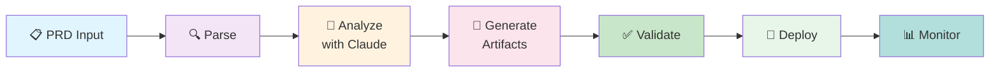

# Harness Orchestration Engine

## Purpose

The Harness is the **orchestration engine** that coordinates Claude API calls, manages state, and controls the workflow from PRD to running system.

## High-Level Flow



## Core Responsibilities

### 1. PRD Parsing
- Parse customer PRD into structured requirements
- Extract: name, type, dependencies, constraints, success criteria
- Validate completeness (does PRD have enough info to proceed?)

### 2. Task Decomposition
- Convert PRD into Claude API calls
- Determine sequence (what must happen first?)
- Identify parallelizable tasks

### 3. Claude Orchestration
- Call Claude (Codex or main API) for each task
- Batch related calls for efficiency
- Cache results to avoid duplicate calls

### 4. Validation & Feedback
- Validate generated code (lint, type check, security scan)
- Validate generated infrastructure (terraform validate, etc.)
- If invalid: ask Claude to fix, log the error pattern

### 5. State Management
- Save PRD analysis results
- Save generated artifacts
- Save deployment status
- Enable restart from checkpoints

### 6. Deployment Coordination
- Call appropriate deployment plugin (Docker, Terraform, K8s, etc.)
- Monitor progress
- Report results to user

---

## State Model

**Harness maintains state at each step:**

```
state = {
  prd_input: {
    content: "...",
    hash: "abc123",
    parsed: { name, type, requirements, ... }
  },

  analysis: {
    architecture: "Node.js + PostgreSQL + ...",
    risks: [...],
    assumptions: [...]
  },

  artifacts: {
    application_code: { source_code, validated: true },
    infrastructure: { terraform_code, validated: true },
    tests: { test_code, validated: true }
  },

  deployment: {
    status: "in_progress" | "success" | "failed",
    logs: [...],
    output_urls: [...]
  }
}
```

---

## Workflow Stages

### Stage 1: Analysis
**Input**: PRD
**Output**: Structured analysis (architecture, components, risks)
**Claude call**: "Analyze this PRD and recommend architecture"

### Stage 2: Code Generation
**Input**: Analyzed PRD + recommended architecture
**Output**: Application code
**Claude calls**:
- "Generate {language} code for this service"
- "Generate tests"
- etc.

### Stage 3: Infrastructure Generation
**Input**: Architecture + application code
**Output**: Infrastructure-as-code (Terraform, Docker, Kubernetes)
**Claude calls**:
- "Generate Terraform for {cloud_provider}"
- "Generate Dockerfile"
- etc.

### Stage 4: Validation
**Input**: Generated code + infrastructure
**Output**: Validated, or errors
**Process**:
- Lint application code
- Type check (TypeScript, Python, etc.)
- Validate Terraform syntax
- Security scanning
- Test execution

### Stage 5: Deployment
**Input**: Validated artifacts
**Output**: Running system
**Process**:
- Load deployment plugin for target
- Execute infrastructure provisioning
- Deploy application
- Run smoke tests

---

## Error Handling

**Types of errors**:
1. **Transient** (network timeout, rate limit) → Retry with backoff
2. **Validation failure** (code doesn't compile) → Ask Claude to fix, re-validate
3. **Deployment failure** (infrastructure error) → Log, alert user, offer retry
4. **Unrecoverable** (unsupported target, invalid PRD) → Report clearly to user

**Pattern**:
```
try:
    task()
except TransientError:
    retry_with_backoff()
except ValidationError:
    ask_claude_to_fix()
except DeploymentError:
    log_and_alert()
except UnrecoverableError:
    report_and_stop()
```

---

## Caching Strategy

**Cache**:
- PRD analysis (keyed by PRD content hash)
- Generated code (keyed by PRD + architecture)
- Deployment results (keyed by artifacts)

**Don't cache**:
- Real-time deployment status
- Logs
- User-facing outputs (always fresh)

**Invalidation**:
- User modifies PRD → clear related caches
- User requests regeneration → clear specific cache
- Deployment succeeds → save result

---

## API Contract with Claude

### Codex Code Generation

```
Request:
{
  "model": "claude-3-5-sonnet",
  "messages": [
    { "role": "user", "content": "Generate Node.js Express API from this spec: ..." }
  ],
  "temperature": 0,
  "max_tokens": 4000
}

Response:
{
  "content": "```typescript\n... code ...\n```",
  "stop_reason": "end_turn"
}
```

### Architecture Analysis

```
Request:
{
  "model": "claude-3-opus",
  "messages": [
    { "role": "user", "content": "Analyze this PRD and recommend architecture: ..." }
  ],
  "temperature": 0.5,
  "max_tokens": 2000
}

Response:
{
  "content": "Architecture recommendation:\n1. Component A\n2. Component B\n...",
  "stop_reason": "end_turn"
}
```

---

## Key Patterns

- **Batch calls**: Group related Claude calls (e.g., all code generation in one message)
- **Temperature tuning**: Lower for code (deterministic), higher for analysis (creative)
- **Prompt engineering**: Craft prompts for each stage type
- **Feedback loops**: If validation fails, retry with error details

---

## To Be Detailed

- Retry policy (exponential backoff, max attempts)
- Logging & observability
- User feedback loops
- Plugin interface for deployment targets

