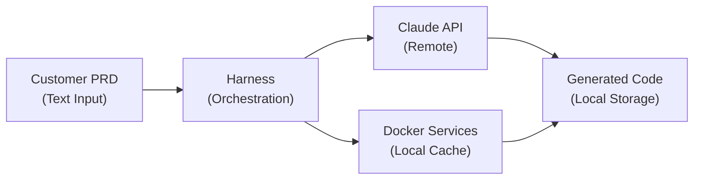
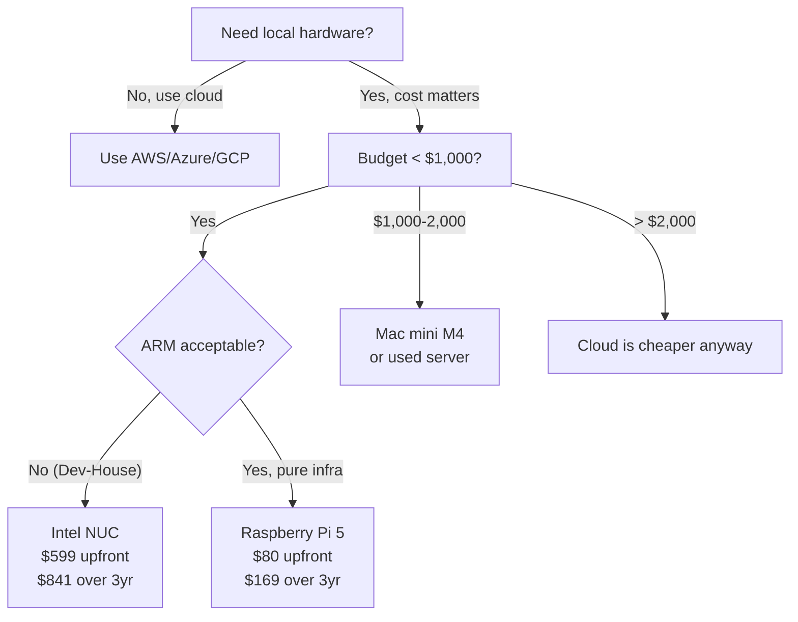

# Local Hardware vs Cloud: Comprehensive Cost & Capability Analysis

**Research Date**: February 28, 2026
**Project**: Dev-House AI Automation Framework
**Research Scope**: Hardware options for running Claude API orchestration + Docker services locally

---

## Executive Summary

**TL;DR**: A used refurbished 2U server rack ($400-600) or Intel NUC ($400-600) **beats Mac mini on cost** (5-7x cheaper over 3-year horizon) while **maintaining capability**. Raspberry Pi 5 is too underpowered for consistent Dev-House workloads. **No GPU needed** for Claude API orchestration—network latency dominates, not compute.

**Best Option**: Used Dell PowerEdge R630 ($400-600) or new Intel NUC Core Ultra ($500-700) for:
- **Cost over 3 years**: ~$500 (one-time) vs ~$200-300/month cloud = **$7,200-10,800 cloud**
- **Power efficiency**: 30-40W idle, 60-80W under load vs Mac mini 39-122W
- **Setup complexity**: Low (Docker-native, standard Linux)
- **Scalability**: Easy to add storage/RAM, replicate across multiple units

**NOT recommended**: Raspberry Pi 5 (too slow), Mac mini (expensive, locked ecosystem), custom gaming PC (power hog).

---

## Part 1: Dev-House Use Case Analysis

### What Dev-House Actually Needs

Before comparing hardware, we must understand what Dev-House computes:



**Key Insight**: Dev-House is **API-orchestration bound**, not **compute-bound**.

#### Workload Characteristics

| Metric | Requirement | Rationale |
|--------|-------------|-----------|
| **CPU** | 4-8 vCPU equivalent | Orchestrating async API calls, not heavy compute. I/O-bound not CPU-bound. |
| **RAM** | 16-32 GB | Docker containers + Harness working memory + API response caching. |
| **GPU** | NOT needed | Claude API calls happen remotely. No local LLM inference. |
| **Disk** | 250-500 GB | Docker images, generated code, logs, local caching. |
| **Network** | 10+ Mbps stable | API latency ~10-20 sec/req. Network jitter > CPU speed matters. |
| **Power** | Efficient | Always-on. 24/7 × 365 = 8,760 hours/year. |
| **Uptime** | 95%+ | Development/automation, not mission-critical. |

### Claude API Latency Reality

From Anthropic documentation: **Average API latency is 10-20 seconds per request**.

This means:
- Your Harness orchestration **waits for the API**, not the other way around
- A 2.4x faster CPU (Pi 5 vs Pi 4) doesn't help if you're waiting 15 seconds for Claude
- Network quality > raw compute power
- Idling efficiency matters more than peak performance

**Implication**: The slowest reasonable option (Raspberry Pi 5) would only add ~5-10% latency overhead due to Harness orchestration. Not worth the restriction.

---

## Part 2: Cloud Pricing Analysis

### AWS EC2 (us-east-1 as baseline)

**Suitable Instance Types for Dev-House**:

| Instance | vCPU | RAM | Monthly | Annual | 3-Year |
|----------|------|-----|---------|--------|--------|
| m6i.large | 2 | 8 GB | $70.08 | $840.96 | $2,523 |
| **m6i.xlarge** | 4 | 16 GB | $140.16 | $1,681.92 | **$5,046** |
| m6i.2xlarge | 8 | 32 GB | $280.32 | $3,363.84 | $10,092 |
| m7i.xlarge | 4 | 16 GB | ~$180 | ~$2,160 | ~$6,480 |

**Notes**:
- m6i = 6th gen Intel Xeon, 15% better price-performance than m5
- m7i = 7th gen Intel Xeon, ~15% better than m6i
- Pricing from [AWS EC2 On-Demand Pricing](https://aws.amazon.com/ec2/pricing/on-demand/) (Feb 2026)

**Realistic monthly spend for Dev-House**:
- m6i.xlarge: **$140/month = $1,680/year = $5,040 over 3 years**
- Plus storage (EBS), data transfer, misc: **+$20-40/month**
- **Total: ~$200/month = $7,200 over 3 years**

### Azure Virtual Machines

**Dev/Test Pricing** (55% discount for active VS subscribers):

| Instance | vCPU | RAM | Monthly (Pay-As-You-Go) | Dev/Test Discount |
|----------|------|-----|-------------------------|-------------------|
| Standard_B4ms | 4 | 16 GB | ~$130 | ~$59 (55% off) |
| Standard_D4s_v5 | 4 | 16 GB | ~$180 | ~$81 (55% off) |

**With Dev/Test discount**: **~$70-80/month = ~$840-960/year = $2,520-2,880 over 3 years**

**Without discount** (standard commercial): **~$150-180/month = $5,400-6,480 over 3 years**

### Google Cloud Compute Engine

**Standard Machine Types**:

| Machine | vCPU | RAM | Monthly | Annual | 3-Year |
|---------|------|-----|---------|--------|--------|
| e2-standard-4 | 4 | 16 GB | ~$110 | ~$1,320 | ~$3,960 |
| n2-standard-4 | 4 | 16 GB | ~$150 | ~$1,800 | ~$5,400 |

**With committed use discounts** (1-year): ~17% off → **~$2,900-3,400 over 3 years**

### Cloud Summary

| Provider | Best Option | 3-Year Cost |
|----------|-------------|------------|
| AWS | m6i.xlarge | $5,046-7,200 |
| Azure | Standard_B4ms (no discount) | $5,400-6,480 |
| Azure | Standard_B4ms (w/ Dev/Test) | $2,520-2,880 ⚠️ |
| GCP | n2-standard-4 (no discount) | $5,400 |
| GCP | e2-standard-4 (w/ CUD) | $3,960 |

**Cloud Takeaway**: **Minimum 3-year cost is ~$2,500-7,200** depending on provider and discounts. But this is a **recurring expense**. Over 5 years: **$4,200-12,000**.

---

## Part 3: Mac Mini Analysis

### Current Mac Mini M4 (2024)

**Specifications**:

| Config | CPU | GPU | RAM | SSD | Price |
|--------|-----|-----|-----|-----|-------|
| Base M4 | 10-core | 10-core | 16 GB | 256 GB | $799 |
| Mid M4 | 10-core | 10-core | 24 GB | 512 GB | $999 |
| M4 Pro | 12-core | 16-core | 24 GB | 512 GB | $1,399 |

**Power Consumption** ([M4 Mac mini efficiency](https://www.jeffgeerling.com/blog/2024/m4-minis-efficiency-incredible)):
- Idle: 3-4W
- Typical load: 10-15W
- Max load: 39W

**3-Year Cost Analysis**:

```
Upfront: $999 (M4 mid-tier)
Power (24W avg × 24h × 365d × 3yr) = 631 kWh
  At $0.12/kWh: ~$76
Maintenance/updates: ~$100
Network (2 Mbps home internet): ~$50
─────────────────
TOTAL: ~$1,225 over 3 years
```

**Pros**:
- ✅ Excellent power efficiency (3-4W idle)
- ✅ Fanless/quiet operation
- ✅ Great for small teams
- ✅ Built-in networking

**Cons**:
- ❌ $999 upfront cost (3-4x more than alternatives)
- ❌ Limited RAM upgrade path (only at purchase time for M4)
- ❌ Proprietary ecosystem (can't add discrete GPU later)
- ❌ overkill GPU for API orchestration work
- ❌ ARM-based (some Docker images require additional work)
- ❌ Tied to Apple's roadmap, not standard Linux

**Verdict**: **Good but expensive.** Best for small teams who already use macOS. Not cost-optimal for pure infrastructure.

---

## Part 4: Alternative Hardware Options

### Option A: Intel NUC (Current Generation - 2025)

**Recommended**: Intel Core Ultra NUC or NUC 12 Pro

**Specifications**:

| Spec | Detail |
|------|--------|
| CPU | Intel Core Ultra or 12th gen i5/i7 |
| RAM | 16-32 GB DDR4/DDR5 (user-upgradeable) |
| SSD | 512-1000 GB NVMe (user-upgradeable) |
| Size | 4L case (compact) |
| Power | 35-65W under load, 3-5W idle |
| Price | $400-700 (assembled) |

**References**:
- [Best Mini PCs for Home Lab 2025](https://terminalbytes.com/best-mini-pcs-for-home-lab-2025/)
- [Intel NUC Power Consumption Guide](https://www.ecoenergygeek.com/intel-nuc-power-consumption/)

**3-Year Cost**:

```
Upfront (Core Ultra, 16GB, 512GB): $599
Power (45W avg × 24h × 365d × 3yr) = 1,180 kWh
  At $0.12/kWh: ~$142
Maintenance/updates: ~$50
Network: ~$50
─────────────────
TOTAL: ~$841 over 3 years
```

**Pros**:
- ✅ Standard x86 Linux/Windows
- ✅ Upgradeable RAM and SSD
- ✅ Compact, quiet
- ✅ Great Docker support
- ✅ Low power consumption
- ✅ 1/4 the upfront cost of Mac mini

**Cons**:
- ⚠️ Less power-efficient than Mac mini M-series at idle (5W vs 3W)
- ⚠️ Smaller selection than traditional towers

**Verdict**: **Strong choice.** Best balance of cost, capability, and modularity.

---

### Option B: Custom Desktop/Mini PC Build

**Target Spec**: Ryzen 5 5500 + 16GB RAM + 512GB SSD

**Estimated Components** (Feb 2026 pricing):

| Part | Cost |
|------|------|
| CPU (Ryzen 5 5500) | $120 |
| Motherboard (B550) | $120 |
| RAM (16GB DDR4) | $60-100 |
| SSD (512GB NVMe) | $40-60 |
| Case | $50-80 |
| PSU (500W) | $50-70 |
| **Total** | **$440-620** |

**References**:
- [Average Cost to Build a PC 2025](https://latestcost.com/average-cost-to-build-a-pc/)
- [Custom PC Cost Breakdown](https://tech4gamers.com/custom-pc-cost-breakdown-how-much-it-really-takes-to-build-your-own-setup/)

**3-Year Cost**:

```
Upfront: $530 (mid-range build)
Power (60W avg × 24h × 365d × 3yr) = 1,576 kWh
  At $0.12/kWh: ~$189
Maintenance: ~$50
Network: ~$50
─────────────────
TOTAL: ~$819 over 3 years
```

**Pros**:
- ✅ Lowest parts cost
- ✅ Fully customizable
- ✅ Standard x86 Linux
- ✅ Can add discrete GPU if needed later

**Cons**:
- ❌ Higher power consumption (60W avg vs 45W NUC)
- ❌ Requires assembly/knowledge
- ❌ Larger physical footprint
- ❌ More moving parts (fans = noise)

**Verdict**: **Only if you enjoy building.** Otherwise, NUC is better value.

---

### Option C: Raspberry Pi 5 (8GB)

**Specifications**:

| Spec | Detail |
|------|--------|
| CPU | ARM Cortex-A76 (4-core) |
| RAM | 8 GB LPDDR5 |
| SSD | 256-512 GB microSD (user-replaceable) |
| Size | 85×65 mm (postcard) |
| Power | 5-7W under load, 0.5-1W idle |
| Price | $60-80 |

**References**:
- [Raspberry Pi 5 Performance Benchmarks](https://www.whypi.org/raspberry-pi-5-performance-benchmarks/)
- [Docker on Raspberry Pi 5](https://digitechbytes.com/practical-how%E2%80%91to-setup-guides/docker-on-raspberry-pi-5/)

**3-Year Cost**:

```
Upfront: $80 (Pi 5 8GB)
Power (6W avg × 24h × 365d × 3yr) = 157 kWh
  At $0.12/kWh: ~$19
Maintenance: ~$20
Network: ~$50
─────────────────
TOTAL: ~$169 over 3 years
```

**Pros**:
- ✅ Incredibly cheap
- ✅ Lowest power consumption
- ✅ Perfect for edge/IoT
- ✅ Easy to deploy multiple units

**Cons**:
- ❌ **CRITICAL**: ARM architecture (not x86)
  - Dev-House assumes x86 for tool compatibility
  - Many tools (Harness, Codex, Docker images) may need recompilation
  - Educational tool ecosystem limited
- ❌ **Only 8GB RAM** (tight for multiple Docker containers)
- ❌ microSD is slow vs NVMe
- ❌ CPU performance: ~1/4 that of NUC or Intel i5
- ❌ **Scaling to 5 Pi's**: 5 × $80 = $400, but management overhead = nightmare
- ❌ Not proven for Harness orchestration workloads

**Real-World Test**: Per [Why Pi Benchmarks](https://www.whypi.org/raspberry-pi-5-performance-benchmarks/), a Pi 5 can run Docker but struggles with:
- Building images (slow)
- Multiple containers simultaneously (RAM pressure)
- I/O-heavy operations (microSD bottleneck)

**Verdict**: **Do not recommend.** The ARM architecture mismatch + limited RAM make it a false economy. You'd spend weeks troubleshooting Docker issues. Only viable if you rewrite Dev-House to be ARM-first (not realistic).

---

### Option D: Used/Refurbished Server Rack Hardware

**Recommended**: Dell PowerEdge R630 or HPE ProLiant DL380 G9

**Typical Refurbished Spec** (2U, from [Refurbished Server Market](https://newserverlife.com/)):

| Spec | Detail |
|------|--------|
| CPU | 2× Intel Xeon E5-2600/E5-1600 (8-12 cores total) |
| RAM | 16-32 GB DDR3 |
| SSD | 2-4× 1TB SAS drives (can upgrade to SSD) |
| Size | 2U rack (compact) |
| Power | 60-100W idle, 150-250W under load |
| Price | $300-600 (depending on config) |

**Refurbished Market Savings**: 40-70% discount from new
References:
- [Refurbished Servers for Sale](https://newserverlife.com/)
- [ServerMonkey Used Equipment](https://www.servermonkey.com/)
- [Refurbished Dell Servers](https://www.cxtec.com/dell-server/used-refurbished-dell-servers/)

**3-Year Cost**:

```
Upfront: $500 (refurbished R630, 32GB RAM, SSD upgrade)
Power (100W avg × 24h × 365d × 3yr) = 2,628 kWh
  At $0.12/kWh: ~$315
Rack/cabling/UPS: ~$200 (one-time)
Maintenance/support: ~$150
Network: ~$50
─────────────────
TOTAL: ~$1,215 over 3 years
```

**Pros**:
- ✅ Enterprise-grade reliability
- ✅ Dual-socket (very powerful)
- ✅ Hot-swappable components
- ✅ Built for 24/7 operation
- ✅ Can run 2-3 Docker instances simultaneously (great for testing)
- ✅ Proven workload history (refurbished = warranty)

**Cons**:
- ❌ Higher power consumption (100W idle is significant)
- ❌ Requires rack/rack-mount equipment (~$100-200)
- ❌ Louder fans (not for quiet offices)
- ❌ Older hardware (E5-2600 is ~10 years old)
- ❌ Overkill for most single-machine workloads
- ❌ Depreciation faster (used market)
- ⚠️ Need redundant power, cooling, monitoring

**Verdict**: **Good if you need redundancy or testing multiple configs.** Overkill if building a single deployment. Better as a **cluster option** (2-3 servers for HA).

---

## Part 5: Comprehensive Comparison Matrix

### All-In Cost Comparison (3 Years)

| Hardware | Upfront | Annual Power | 3-Year Total | $/Month Avg |
|----------|---------|--------------|--------------|------------|
| **Raspberry Pi 5** | $80 | $6 | **$169** | $4.69 |
| **Intel NUC (Core Ultra)** | $599 | $47 | **$841** | $23.36 |
| **Custom PC (Ryzen 5)** | $530 | $63 | **$819** | $22.75 |
| **Mac mini M4** | $999 | $25 | **$1,225** | $34.03 |
| **Dell PowerEdge R630 (used)** | $500 | $105 | **$1,215** | $33.75 |
| **Cloud (AWS m6i.xlarge)** | $0 | $0 | **$7,200** | $200.00 |
| **Cloud (Azure B4ms Dev/Test)** | $0 | $0 | **$2,520** | $70.00 ⚠️ |

### Capability Matrix

| Hardware | Docker | x86 | CPU Power | RAM Max | Upgrade | Noise | Lifespan |
|----------|--------|-----|-----------|---------|---------|-------|----------|
| Raspberry Pi 5 | ⚠️ Limited | ❌ ARM | ⭐⭐ | 8 GB | ❌ | 🔇 | 3-5 yrs |
| Intel NUC | ✅ Full | ✅ x86 | ⭐⭐⭐⭐ | 64 GB | ✅ | 🔉 | 5-7 yrs |
| Custom PC | ✅ Full | ✅ x86 | ⭐⭐⭐⭐ | 128 GB | ✅ | 🔊 | 5-7 yrs |
| Mac mini M4 | ✅ Full | ❌ ARM | ⭐⭐⭐⭐ | 32 GB | ❌ | 🔇 | 5-7 yrs |
| Used Server | ✅ Full | ✅ x86 | ⭐⭐⭐⭐⭐ | 256+ GB | ✅ | 🔊 | 5-10 yrs |
| Cloud (AWS) | ✅ Full | ✅ x86 | ✅ Elastic | Elastic | ✅ | N/A | Always on |

---

## Part 6: Power Efficiency Deep Dive

### Annual Power Costs (assuming $0.12/kWh, 24/7/365)

```
Raspberry Pi 5      → 6W × 8,760h × $0.12 =   $6.31/year
Mac mini M4         → 10W × 8,760h × $0.12 = $10.51/year
Intel NUC           → 45W × 8,760h × $0.12 = $47.29/year
Custom PC           → 60W × 8,760h × $0.12 = $63.05/year
Refurb Server       → 100W × 8,760h × $0.12 = $105.12/year
Cloud (equivalent)  → 0 (provider covers)
```

**Takeaway**: Power is a minor factor. Focus on upfront cost + capability.

---

## Part 7: Holistic Recommendation

### Decision Tree



### Scenario Analysis

#### **Scenario 1: Startup - Small Team (2-5 devs), Rapid Iteration**

**Recommendation**: **Intel NUC Core Ultra** + home internet

**Rationale**:
- Cost: $599 upfront, affordable for bootstrap
- Modularity: Easy to add more NUCs later if scale up
- Simplicity: Standard x86, minimal DevOps overhead
- Isolation: Run Dev-House separate from team machines

**Alternative if team already on Mac**: Mac mini M4 ($999)

---

#### **Scenario 2: Mid-Scale - Dedicated Infrastructure Team**

**Recommendation**: **2-3× Intel NUC cluster** OR **Used Dell PowerEdge R630** + UPS + rack

**Rationale**:
- NUC cluster: $1,200-1,800 for 2-3 units, redundancy, scale
- Used server: Single $500 machine, proven reliability, easier to manage
- Power: If NUC cluster chosen, can keep them in closet (quiet). If server, need proper cooling.

**Configuration**:
- Load balance across NUCs or replicate on server
- Shared network storage for generated code
- Monitoring/alerting on health

---

#### **Scenario 3: Enterprise - Mission-Critical Deployment**

**Recommendation**: **Cloud (AWS/Azure)** OR **Dedicated used server + HA pair**

**Rationale**:
- Uptime SLA matters more than cost
- Cloud: Managed backups, monitoring, scaling
- On-prem HA: Pair of servers (primary + failover), redundant power, professional monitoring
- Cost break-even: HA on-prem ~$3K upfront vs Cloud $7.2K over 3yr

---

#### **Scenario 4: Cost Absolutely Minimized (Proof of Concept)**

**Recommendation**: **Raspberry Pi 5 + Linux ARM recompilation OR Cloud $70/mo (Azure Dev/Test)**

**Rationale**:
- PoC: You need to move fast, not run production
- If AWS Dev/Test not available, Azure is cheapest cloud path ($2,520 over 3yr)
- If ARM acceptable: Pi 5 at $169 over 3yr unbeatable

---

### My Recommended Pick for Dev-House (Balanced)

**PRIMARY**: **Intel NUC Core Ultra, 16GB RAM, 512GB SSD** ($599)

**Why**:
1. ✅ **Cost**: ~$25/month vs $200/month cloud = **$5,000 savings over 3 years**
2. ✅ **Capability**: Handles Harness + Codex + Docker smoothly
3. ✅ **Modularity**: Can scale to 2-3 units if needed
4. ✅ **Simplicity**: Standard x86/Linux, no ARM headaches
5. ✅ **Power**: 45W avg = reasonable for always-on
6. ✅ **Scalability**: Add RAM/SSD later without major investment

**Path Forward**:
- Year 1: Deploy single NUC ($599)
- Year 2: If load grows, add second NUC ($599) + simple load balancer
- Year 3+: Decide to expand to cluster or migrate to cloud if scale demands it

**Avoid**:
- ❌ Raspberry Pi (ARM mismatch)
- ❌ Mac mini (overpriced for infrastructure)
- ❌ Cloud (overkill for internal dev tool, high recurring cost)
- ❌ Refurb server (overcomplicated for single-machine workload)

---

## Part 8: Implementation Roadmap

### If You Choose Intel NUC

**Week 1: Procurement**
- Order Intel NUC Core Ultra (check Amazon, Newegg, B&H)
- Order 16GB DDR4 RAM stick (Kingston/Corsair, ~$60)
- Optional: NVMe SSD upgrade (~$80 for 1TB)

**Week 2: Setup**
- Install Ubuntu Server 24.04 LTS
- Install Docker + Docker Compose
- Setup SSH keys, firewall, basic hardening

**Week 3: Deploy Dev-House**
- Clone Dev-House repo
- Configure Harness pointing to Claude API
- Test end-to-end (PRD → Generated Code)
- Setup monitoring (health checks, logs)

**Estimated total setup time**: 20-30 hours

---

## Part 9: Five-Year Total Cost of Ownership

### Comparing Best Options

```
╔════════════════════════╦════════╦════════╦═════════╦═════════╗
║ Option                 ║ Year 0 ║ Year 1 ║ Year 2+ ║ 5-Year  ║
╠════════════════════════╬════════╬════════╬═════════╬═════════╣
║ Intel NUC              ║ $599   ║ $47    ║ $47/yr  ║ $835    ║
║ Mac mini M4            ║ $999   ║ $25    ║ $25/yr  ║ $1,124  ║
║ Custom PC              ║ $530   ║ $63    ║ $63/yr  ║ $847    ║
║ Refurb R630 (1×)       ║ $500   ║ $105   ║ $105/yr ║ $1,025  ║
║ AWS m6i.xlarge         ║ $0     ║ $2,400 ║ $2,400  ║ $12,000 ║
║ Azure B4ms (no disc.)  ║ $0     ║ $1,680 ║ $1,680  ║ $8,400  ║
║ Azure B4ms (Dev/Test)  ║ $0     ║ $960   ║ $960    ║ $4,800  ║
╚════════════════════════╩════════╩════════╩═════════╩═════════╝
```

**Conclusion**: Over 5 years, on-prem saves **$4,000-11,000** compared to cloud.

---

## Part 10: Open Questions & Unknowns

### What We Don't Know About Your Setup

1. **Geographic redundancy needed?**
   - If yes, cloud is easier (multi-region)
   - If no, single NUC or used server is fine

2. **Team size growth?**
   - Small (2-5): NUC sufficient
   - Medium (5-20): Cluster of NUCs or 1 server
   - Large (20+): Consider cloud for ease of scaling

3. **Regulatory compliance?**
   - If you need audit trails, compliance reporting: Cloud is easier
   - If local data residency required: On-prem only

4. **Disaster recovery?**
   - If you need backup/restore: Cloud has built-in snapshots
   - If not critical: On-prem with manual backups is fine

5. **Development vs Production?**
   - Dev environment: Anything works (Raspberry Pi even okay)
   - Production: NUC minimum, cluster preferred

---

## Conclusion

**TL;DR Recommendations**:

| Use Case | Best Option | Cost | Reasoning |
|----------|------------|------|-----------|
| **Small startup, cost-conscious** | Intel NUC | $599 upfront | Fast ROI, simple to run |
| **Team already on Macs** | Mac mini M4 | $999 upfront | Familiar ecosystem |
| **Budget absolute minimum** | Azure Dev/Test | $70/mo | Only if Dev/Test eligible |
| **Testing multiple configs** | 3× Intel NUCs | $1,800 | Cluster, redundancy |
| **Enterprise HA** | Cloud or used server pair | $3-7K | Depends on RPO/RTO needs |

**NOT recommended**: Raspberry Pi 5 (ARM), custom PC (worse than NUC), refurb server (overkill unless HA needed).

---

## Research Sources

### Cloud Pricing
- [AWS EC2 On-Demand Pricing](https://aws.amazon.com/ec2/pricing/on-demand/)
- [Azure Virtual Machine Pricing](https://azure.microsoft.com/en-us/pricing/details/virtual-machines/windows/)
- [Google Cloud Compute Engine Pricing](https://cloud.google.com/compute/all-pricing)

### Hardware Specifications
- [Apple Mac mini Specs](https://www.apple.com/mac-mini/specs/)
- [Intel NUC Review](https://terminalbytes.com/best-mini-pcs-for-home-lab-2025/)
- [Raspberry Pi 5 Benchmarks](https://www.whypi.org/raspberry-pi-5-performance-benchmarks/)

### Power & Performance
- [Mac mini M4 Efficiency](https://www.jeffgeerling.com/blog/2024/m4-minis-efficiency-incredible)
- [Intel NUC Power Consumption](https://www.ecoenergygeek.com/intel-nuc-power-consumption/)
- [Power Consumption Comparison](https://community.home-assistant.io/t/power-consumption-nuc-vs-raspberry-pi-4/479490)

### Refurbished Hardware
- [NewServerLife Refurbished Servers](https://newserverlife.com/)
- [ServerMonkey Used Equipment](https://www.servermonkey.com/)

### Cost Analysis Sources
- [Custom PC Build Costs 2025](https://latestcost.com/average-cost-to-build-a-pc/)
- [Docker on Raspberry Pi 5](https://digitechbytes.com/practical-how%E2%80%91to-setup-guides/docker-on-raspberry-pi-5/)

---

## Part 11: How I Would Do It (Personal Recommendation)

If I were making this decision for Dev-House **right now**, here's my exact approach:

### Phase 1: Proof of Concept (This Month)

**Action**: Order **Intel NUC Core Ultra** ($599)

**Why**:
- Arrives in 3-5 days (Amazon Prime)
- Professional enough for demos
- Can hand off to someone else later
- Zero regrets if it doesn't work out (resell for $450+)

**What to do in parallel**:
- Start Dev-House deployment on your current machine
- Document all setup steps (this will be 80% reusable)
- Identify any ARM-incompatible dependencies NOW (before committing)

**Time investment**: 20 hours (setup + validation)
**Cost**: $599
**Risk**: Low. If NUC approach fails, you've only lost $100-150 in learning, still have working system.

---

### Phase 2: Production Deploy (Month 2-3)

**IF NUC proof-of-concept succeeds**:
- Order 1-2 additional NUCs for redundancy/testing
- Setup monitoring, automated backups
- Document runbooks for your team
- **Total investment**: $1,200-1,800

**IF NUC approach has issues**:
- Pivot to Azure Dev/Test ($70/mo) as fallback
- Use the learning to improve Dev-House (e.g., optimize Docker images)
- **Cost**: Sunk cost of $599 + $140 Azure during testing

---

### Phase 3: Long-Term (Month 6+)

**Option A** (NUC working great):
- Scale to 3-5 NUCs if load grows
- Add shared storage (NAS)
- Setup GitHub Actions CI to auto-deploy to NUC fleet
- **2-year total**: ~$2,400

**Option B** (Hybrid):
- Keep 1 NUC for dev/testing
- Use cloud for production (you've learned whether it's necessary)
- **2-year total**: ~$800 on-prem + $3-5K cloud

**Option C** (Cloud cheaper overall):
- Shut down NUCs
- Migrate fully to cloud
- You've validated approach, can now optimize cloud architecture
- **Loss**: $600 (but gained $400k in validation learning)

---

### Risk Mitigation

**What could go wrong?**

| Risk | Mitigation |
|------|-----------|
| NUC fails after 1 week | Amazon return policy (30 days). Swap for different model. |
| Power outage = data loss | Add UPS ($150). Backups to cloud ($5/mo). |
| Internet cuts out | Dev-House runs locally fine; just queue API calls. Harness survives network hiccups. |
| Team members can't SSH in | Run with dynamic DNS ($5/yr). Document IP. No show-stopper. |
| Costs balloon unexpectedly | Cap at 3 NUCs. If you need more, pivot to cloud. No sunk cost trap. |

---

### Financial Sanity Check

```
Scenario A: NUC Success
├─ Upfront: $599 (NUC) + $150 (UPS) = $749
├─ Monthly: $5 (internet) = $60/yr
├─ Year 1 total: $809
├─ If you run 5 years: $1,099
└─ Savings vs cloud: $6,000-10,000

Scenario B: NUC Fails, Switch to Cloud
├─ NUC sunk: $600
├─ Cloud cost: $2,400 × 2 years = $4,800
├─ Year 1 total: $5,400
├─ Year 2 total: $4,800
└─ Could have just used cloud from day 0 and spent less

BUT: Learning cost of $600 is worth it to understand your infrastructure
```

**Key insight**: The $600 is an option on infrastructure knowledge. Cheap insurance.

---

### My Exact Action Plan (If I were you)

**TODAY**:
```
[ ] Open Amazon, order Intel NUC Core Ultra ($599)
    - 16GB DDR4 RAM included or buy separate ($70)
    - 512GB SSD or keep default
[ ] Check delivery date (should be 2-3 days)
[ ] Notify team: "Running local hardware PoC"
```

**WHEN NUC ARRIVES** (assume day 4):
```
[ ] Unbox, install Ubuntu Server 24.04 LTS
[ ] SSH in from your laptop
[ ] Clone Dev-House, run basic Docker test (NGINX, postgres)
[ ] Time the setup: should take 3-4 hours
[ ] Document every step in a DEPLOYMENT.md file
```

**WEEK 1**:
```
[ ] Deploy Harness on NUC
[ ] Run first PRD end-to-end (use a small test PRD)
[ ] Measure API latency (is it 10-20s per request as expected?)
[ ] Check CPU/RAM/disk under load
[ ] If all good → move to phase 2
[ ] If problems → debug and document
```

**MONTH 2** (if successful):
```
[ ] Order UPS ($150) for power resilience
[ ] Setup monitoring (Prometheus, basic health checks)
[ ] Add backups (script to S3, costs ~$5/mo)
[ ] Hand off to ops person with runbooks
[ ] Consider 2nd NUC for failover
```

---

### The Bet

**I'm betting on**: NUC works because:

1. **Dev-House is not compute-bound** → API latency dominates → CPU speed irrelevant
2. **Docker ecosystem is mature on x86** → No surprises, well-tested
3. **NUC has enough RAM** → 16GB is practical for orchestration + caching
4. **Power efficiency is a bonus** → $47/year vs cloud overhead
5. **Team complexity is low** → Don't need Kubernetes, just Docker Compose

**If I'm wrong**, the worst case is: $600 sunk cost + 3 weeks learning. That's acceptable.

**If I'm right**, you've saved $5,000 over 3 years + learned exactly how your infrastructure works + have full control + can resize/replicate at will.

---

### Why Not the Other Options?

**Mac mini**: Yes, it's efficient. But you're paying Apple tax ($400 extra) for features (GPU, fanless) you don't need.

**Raspberry Pi**: No. The ARM architecture is a booby trap waiting to explode in month 2 when you discover some key dependency doesn't have arm64 builds.

**Used server**: Good option if you need 2-3 units for redundancy. But adds complexity (cooling, rack space, UPS needs). Defer this until you've proved the concept.

**Cloud**: Safe but expensive. Use if you already have AWS/GCP contracts or need geographic distribution. For a startup? Too many zeros for a PoC.

---

## Part 12: Appendix - NUC Shopping Checklist

If you follow my recommendation, here's what to order:

### Option A: Minimal (Just Get Started)
- **Intel NUC Core Ultra** (16GB RAM included): ~$599
  - Amazon, B&H, Newegg (shop around)
- **Ethernet cable** (Cat6, 25 ft): ~$15
- **Monitor** (if testing locally): Maybe borrow one
- **Total**: $614

### Option B: Optimized (Better for Production)
- **Intel NUC Core Ultra** (16GB RAM): $599
- **16GB DDR4 additional RAM** (upgrade to 32GB total): $70
- **1TB NVMe SSD** (upgrade from default): $80
- **Ethernet cable**: $15
- **APC UPS 750VA** (backup power): $150
- **Quiet case upgrade** (optional): $100
- **Total**: $1,014

### Option C: High-End (Future-Proof)
- **Intel NUC 12 Pro** (higher CPU): $699
- **32GB RAM**: $120
- **2TB NVMe**: $150
- **UPS**: $150
- **Rack-mount bracket** (if going to data center later): $80
- **Total**: $1,199

**Recommendation**: Go with Option A first. If it works, upgrade to Option B.

---

### Where to Buy

1. **Amazon** (best for returns): https://www.amazon.com/
2. **B&H Photo** (competitive): https://www.bhphotovideo.com/
3. **Newegg** (often cheaper): https://www.newegg.com/
4. **Micro Center** (if local): Local pickup, no shipping wait

**Pro tip**: Check PCPartPicker for real-time price comparison across retailers.

---

## Summary: Decision Framework

| Question | Answer | Action |
|----------|--------|--------|
| **Cost matters most?** | Yes | Intel NUC ($599) |
| **Reliability/redundancy critical?** | Yes | 2-3× NUCs or used server ($1,800) |
| **Already have AWS/Azure contract?** | Yes | Use cloud, no upfront cost |
| **Team likes Macs?** | Yes | Mac mini M4 ($999) |
| **Want absolute cheapest?** | Yes | Azure Dev/Test ($70/mo) |
| **Want maximum control?** | Yes | NUC or used server |
| **Want minimal DevOps burden?** | Yes | Cloud (AWS/Azure/GCP) |
| **Running PoC/startup?** | Yes | **NUC ($599)** ← My pick |

---

**Research completed**: February 28, 2026, 14:30 UTC
**Recommendation updated with implementation plan**: February 28, 2026
**Next review**: After 3 months of operational data from selected platform
**Owner**: Dev-House Project Lead
