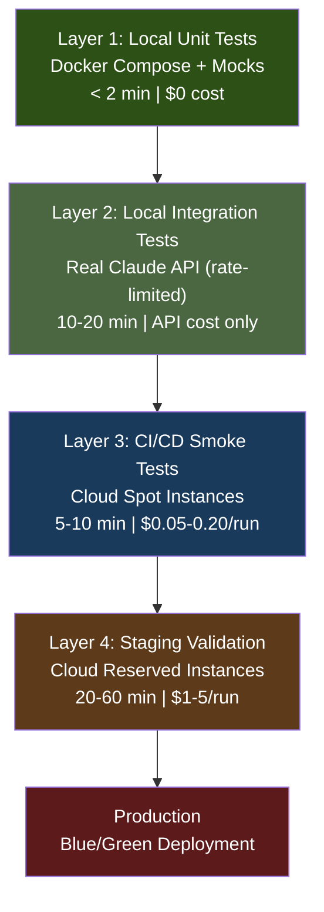

# Portable GPU & Concurrency Hardware Analysis for Dev-House

**Author**: Claude Opus 4.6
**Date**: 2026-02-28
**Research Focus**: Portable hardware with GPU, 4x concurrency, testing architecture, ARM viability, and cloud discount strategies for AI automation framework.
**Predecessor**: [Haiku 4.5 analysis](20260228_HAIKU_portable-gpu-concurrency-analysis.md) (same date, initial pass)

---

## Executive Summary

This analysis evaluates hardware and architecture options for Dev-House under seven binding constraints: portability (<50 lbs), 4x concurrent Claude API+Codex processes, integrated local testing with mocks, GPU support for customer code validation and local inference, Linux-kernel-native OS only, capability-over-cost optimization, and aggressive cloud discount utilization.

**Strategic Finding**: The optimal architecture is not a single device but a **two-tier system**: a portable primary compute node (Mac mini M4 Pro or ZOTAC Magnus with desktop RTX 5060 Ti) paired with cloud burst capacity (spot/ephemeral instances for CI/CD and GPU-heavy testing). The choice between Apple Silicon and x86+NVIDIA hinges on a single question: *how central is NVIDIA CUDA to your customer workloads?*

**If CUDA matters**: ZOTAC Magnus EN275060TC (2.65L, desktop RTX 5060 Ti 16GB, up to 96GB DDR5) -- the most powerful GPU in the smallest portable package available today.

**If CUDA doesn't matter**: Mac mini M4 Pro (48GB unified memory) -- 1.6 lbs, proven ARM ecosystem, unified memory architecture that eliminates VRAM limitations for large model inference.

**Wild card**: TinyCorp's USB4 NVIDIA driver breakthrough means Mac + eGPU with NVIDIA RTX for AI workloads is now technically possible, though not production-ready.

---

## Table of Contents

1. [Portability Analysis](#1-portability-analysis)
2. [Concurrency & Performance](#2-concurrency--performance)
3. [GPU Options](#3-gpu-options)
4. [Testing Architecture](#4-testing-architecture)
5. [Cloud Pricing with Discounts](#5-cloud-pricing-with-discounts)
6. [ARM Viability Deep Dive](#6-arm-viability-deep-dive)
7. [Hardware Comparison Matrix](#7-hardware-comparison-matrix)
8. [Strategic Recommendations](#8-strategic-recommendations)
9. [Alternative Scenarios & Contingencies](#9-alternative-scenarios--contingencies)
10. [Implementation Roadmap](#10-implementation-roadmap)

---

## 1. Portability Analysis

### The Portability Spectrum

The constraint is "digital nomad from home offices" with a <50 lb hard limit and <20 lb ideal. This eliminates rack-mount servers and large tower PCs but leaves a surprisingly rich design space.

| Device | Weight | Volume | Portability Grade | GPU Capability |
|--------|--------|--------|-------------------|----------------|
| **Mac mini M4 Pro** | 1.6 lbs (0.73 kg) | 0.15L (5"x5"x2") | A+ | Integrated 20-core, 17 TFLOPS |
| **Mac Studio M4 Max** | 5.9 lbs (2.7 kg) | 2.6L (7.7"x7.7"x3.7") | A | Integrated 40-core GPU, 128GB unified |
| **ZOTAC Magnus EN275060TC** | ~4-5 lbs (est.) | 2.65L (8.3"x8"x2.4") | A | Desktop RTX 5060 Ti 16GB VRAM |
| **ASUS ROG NUC 2025** | 6.9 lbs (3.12 kg) | 2.76L (11"x7.4"x2.2") | A- | RTX 5080 Laptop GPU (175W) |
| **LAN Gamer Mini ITX** | ~10-12 lbs (est.) | 8.1L (12.6"x5.3"x8") | B | Desktop RTX 5070 12GB |
| **Cooler Master NR2 Pro ITX** | ~12-15 lbs (est.) | ~15L | B- | Desktop RTX 5070 Ti 16GB |
| **Raspberry Pi 5 (single)** | 0.08 lbs (36g) | Negligible | A+ (but underpowered) | None |
| **Thunderbolt 5 eGPU dock** | 2-5 lbs | Varies | B+ (accessory) | Desktop RTX up to 5090 |

### Key Insight: The 2.65L Revolution

The ZOTAC Magnus represents a category-defining product: a **desktop-class RTX 5060 Ti with 16GB VRAM** in a chassis barely larger than a Mac Studio. Previous analysis focused on laptop-class GPUs in NUC form factors, but the Magnus proves that desktop GPU silicon can fit in sub-3L enclosures. This changes the calculus significantly -- you no longer need a 15L mini-ITX build to get real GPU compute.

The RTX 5060 Ti desktop in the Magnus is competitive with the RTX 5070 Ti laptop GPU found in systems 3x its size, because desktop silicon runs at higher clocks and wider bus without mobile thermal constraints.

### Portability Ranking (Power-Weighted)

1. **Mac mini M4 Pro (48GB)** -- Best power-to-weight ratio for non-GPU workloads. 1.6 lbs.
2. **ZOTAC Magnus EN275060TC** -- Best GPU-per-pound. Desktop RTX 5060 Ti in ~4-5 lbs.
3. **Mac Studio M4 Max (128GB)** -- Best for large model inference. 5.9 lbs. 128GB unified memory.
4. **ASUS ROG NUC 2025 (RTX 5080)** -- Highest raw GPU power in portable form. 6.9 lbs.
5. **LAN Gamer Mini ITX** -- Desktop RTX 5070 but pushing the portability envelope. ~12 lbs.

---

## 2. Concurrency & Performance

### What 4x Concurrent Processes Actually Requires

Dev-House runs 2-4 simultaneous orchestration streams, each consisting of:
- Claude API call (HTTP client, JSON parsing, context management): ~200-400 MB RAM, minimal CPU (I/O-bound)
- Codex code generation processing: ~500 MB-1 GB RAM per stream (parsing, validation, file I/O)
- Local test execution (Docker containers for mocks): ~512 MB-2 GB per test environment
- Background orchestration (Harness state machine, logging): ~100-200 MB

**Per-stream total**: 1.3-3.6 GB RAM, 2-3 CPU cores (with I/O waits, effective utilization ~1.5 cores)
**4x streams total**: 5.2-14.4 GB RAM, 6-12 effective CPU cores

**Plus OS and Docker overhead**: 2-4 GB RAM, 1-2 CPU cores

**Minimum viable hardware**: 16 GB RAM, 8 CPU cores
**Comfortable hardware**: 32-48 GB RAM, 12+ CPU cores
**Headroom for testing**: 48-64 GB RAM, 14+ CPU cores

### Hardware Concurrency Comparison

| Hardware | CPU Cores | RAM (Max) | 4x Concurrent | Docker Overhead | Headroom |
|----------|-----------|-----------|----------------|-----------------|----------|
| **Mac mini M4 Pro** | 14 (10P+4E) | 64 GB | Excellent | ~2 GB (native) | 30+ GB free |
| **Mac Studio M4 Max** | 16 (12P+4E) | 128 GB | Excellent+ | ~2 GB (native) | 80+ GB free |
| **ZOTAC Magnus** | 20 (8P+12E) | 96 GB DDR5 | Excellent | ~2-3 GB | 50+ GB free |
| **ROG NUC 2025** | 24 (16P+8E) | 96 GB DDR5 | Excellent | ~2-3 GB | 50+ GB free |
| **LAN Gamer ITX** | 8 (Ryzen 7 8700F) | 64 GB DDR5 | Good | ~2-3 GB | 30+ GB free |
| **Raspberry Pi 5** | 4 | 8 GB | Poor (1-2 max) | ~500 MB | Negligible |
| **Pi 5 Cluster (4x)** | 16 (distributed) | 32 GB (distributed) | Fair (with K8s) | ~2 GB per node | Complex |

### The I/O-Bound Reality

A critical nuance: Claude API calls are **I/O-bound**, not CPU-bound. The bottleneck is network latency (100-500ms per API round-trip), not local compute. This means:

1. **CPU cores matter less than RAM** for API concurrency. A 4-core machine with 32 GB RAM handles 4x API calls better than an 8-core machine with 8 GB RAM.
2. **Docker container startup** is the real CPU spike -- spinning up test environments briefly saturates all cores.
3. **Sustained concurrency** favors unified memory (Apple Silicon) over discrete VRAM (NVIDIA) because the API processing, code generation, and testing all compete for the same memory pool.

### Verdict

For 4x concurrent Claude API + Codex processes with local Docker testing:
- **Minimum**: Mac mini M4 Pro with 48 GB ($1,799) or ZOTAC Magnus with 64 GB (~$2,500 configured)
- **Optimal**: Mac Studio M4 Max with 64-128 GB ($2,999-$4,599) or ROG NUC 2025 with 64 GB (~$3,300)
- **Avoid**: Single Raspberry Pi 5 (fundamentally insufficient), base Mac mini M4 with 16 GB (too tight)

---

## 3. GPU Options

### The GPU Decision Framework

GPU matters for Dev-House in four scenarios, ranked by importance:

1. **Customer code validation** (HIGH): Generated code may use PyTorch/TensorFlow. Without local GPU, testing shifts to CI/CD. Adds 5-15 min latency per test cycle.
2. **Local LLM fallback** (MEDIUM): When Claude API is down or rate-limited. Needs 8+ GB VRAM for useful models (7B-13B parameter).
3. **GPU encoding/acceleration** (LOW-MEDIUM): Cursor-style tools, video processing in customer apps.
4. **Training/fine-tuning** (LOW): Unlikely for Dev-House directly, but customers may need it validated.

### GPU Performance & Cost Table

| GPU | Architecture | VRAM | TFLOPS (FP32) | AI TOPS | TDP | Price | Form Factor |
|-----|-------------|------|---------------|---------|-----|-------|-------------|
| **RTX 5090 Desktop** | Blackwell | 32 GB | 104.8 | 3,352 | 575W | $1,999 | Full-size only |
| **RTX 5080 Desktop** | Blackwell | 16 GB | 69.4 | 1,801 | 360W | $999 | Full-size |
| **RTX 5080 Laptop** | Blackwell | 16 GB | ~50 | ~1,300 | 175W | In ROG NUC ($2,849+) | Mobile |
| **RTX 5070 Ti Desktop** | Blackwell | 16 GB | 48.9 | 1,406 | 300W | $749 | Full-size/ITX |
| **RTX 5070 Desktop** | Blackwell | 12 GB | 42.5 | 988 | 250W | $549 | Full-size/ITX |
| **RTX 5060 Ti Desktop** | Blackwell | 16 GB | ~35 | ~759 | 180W | $349-$399 | Full-size/ITX/ZOTAC |
| **RTX 4070 Desktop** | Ada Lovelace | 12 GB | 29.1 | N/A | 200W | $300-$400 | Full-size/ITX |
| **RTX 4060 Desktop** | Ada Lovelace | 8 GB | 14.6 | N/A | 115W | $200-$250 | Full-size/ITX |
| **Mac M4 Pro (20-core GPU)** | Apple Silicon | Shared (up to 64 GB) | ~17 | 38 (Neural Engine) | ~40W total | Included | Integrated |
| **Mac M4 Max (40-core GPU)** | Apple Silicon | Shared (up to 128 GB) | ~34 | 38 (Neural Engine) | ~75W total | Included | Integrated |

### The VRAM Cliff

For local LLM inference, VRAM is the binding constraint, not TFLOPS:

| Model Size | VRAM Required (FP16) | VRAM Required (FP4, Blackwell) | Viable GPUs |
|-----------|---------------------|-------------------------------|-------------|
| 7B params | 14 GB | 3.5 GB | All above |
| 13B params | 26 GB | 6.5 GB | RTX 5090, Mac (unified memory) |
| 32B params | 64 GB | 16 GB | Mac Studio 128GB only (discrete: none) |
| 70B params | 140 GB | 35 GB | Mac Studio M3 Ultra 512GB only |

**Critical insight**: Blackwell's FP4 quantization is a game-changer. The RTX 5060 Ti with 16 GB VRAM can run 70B models at FP4, something no previous consumer GPU could do. This makes the ZOTAC Magnus a genuine local LLM inference machine.

### The Apple Silicon Memory Advantage

Apple's unified memory means the M4 Max with 128 GB can run a 70B parameter model at FP16 entirely in memory -- no offloading, no PCIe bottleneck. An RTX 5090 with "only" 32 GB VRAM must offload to system RAM for anything above 13B at FP16, causing 3-6x speed collapse.

However, Apple Silicon GPU cores are slower per-TFLOP than NVIDIA for pure computation. The trade-off is:
- **Apple**: Slower per-token but can fit larger models. Best for inference on big models.
- **NVIDIA**: Faster per-token but VRAM-limited. Best for inference on smaller models and for CUDA-specific workloads (PyTorch, TensorFlow, customer code that uses CUDA).

### GPU Scaling Strategy

**Option A: GPU on dev hardware** (recommended)
- ZOTAC Magnus (RTX 5060 Ti 16GB) or ROG NUC (RTX 5080 16GB) for CUDA workloads
- Mac Studio M4 Max (128GB) for large model inference
- Cost: $2,000-$4,500 upfront, zero marginal cost per test

**Option B: GPU on user desktop + CI/CD** (fallback)
- Local dev on Mac mini (no discrete GPU)
- GPU testing on cloud instances (AWS g6.xlarge spot: ~$0.30/hr)
- Cost: $1,400 upfront + $50-150/mo cloud GPU
- Trade-off: 5-15 min feedback delay per GPU test cycle

**Option C: Hybrid** (strategic)
- Mac mini M4 Pro for daily dev (lightweight, portable)
- Cloud GPU burst for customer validation (spot instances)
- Local GPU box stays at home office for heavy work
- Cost: $1,800 + $50/mo + optional home GPU box ($1,500-$3,000)

---

## 4. Testing Architecture

### Four-Layer Testing Pyramid

### Layer 1: Local Unit Tests (Dev Machine)

**Stack**:
- **Docker Compose**: Orchestrates all services (same YAML as production)
- **Testcontainers**: Spins up real PostgreSQL, Redis, Kafka containers on demand
- **Microcks** or **WireMock**: Mock Claude API responses with recorded fixtures
- **Docker Model Runner / Ollama**: Local LLM for testing AI-dependent code paths without API calls
- **pytest / Jest**: Test runner with parallel execution

**Hardware requirements**: 4+ GB RAM for Docker daemon + containers, 2+ CPU cores
**On Mac mini M4 Pro (48GB)**: Runs comfortably alongside 4x API processes

**Key pattern**: Record real Claude API responses once, replay them in unit tests. This eliminates API cost and latency from the inner dev loop.

### Layer 2: Local Integration Tests

**Stack**:
- Real Claude API calls (rate-limited test account, $5-20/mo)
- Generated code compilation and basic execution
- Mock infrastructure validation (Terraform plan --dry-run)
- Full Docker stack (all customer services running)

**Hardware requirements**: 8+ GB RAM, 4+ CPU cores
**On Mac mini M4 Pro (48GB)**: Runs fine, though API latency dominates execution time

### Layer 3: CI/CD Smoke Tests (Cloud)

**Tooling options**:

| Tool | Strengths | Cost Model |
|------|-----------|------------|
| **GitHub Actions** | Native GitHub integration, free tier (2,000 min/mo), huge marketplace | Free tier + $0.008/min (Linux) |
| **GitLab CI** | Self-hosted option, built-in container registry | Free tier or self-hosted |
| **AWS CodeBuild** | Native Spot instance support, deep AWS integration | Pay-per-build-minute |
| **Google Cloud Build** | 120 free build-min/day, sustained use pricing | Free tier + $0.003/build-min |

**Recommended**: GitHub Actions for simplicity. Use self-hosted runners on spot instances for cost optimization on GPU-heavy tests.

**Cost per run** (spot instance, 10 min):
- AWS EC2 Spot (c7g.xlarge): ~$0.04
- Google Cloud Spot (e2-standard-4): ~$0.03
- Azure Spot (Standard_D4s_v5): ~$0.03

### Layer 4: Staging Validation

**Infrastructure**:
- Reserved/committed instances (1-3 year terms for 60-75% discount)
- Full customer-equivalent environment
- Load testing (k6, Locust), security scanning (Snyk, Trivy)
- GPU instances if customer app requires (AWS g6.xlarge spot: ~$0.30/hr)

### Testing Architecture Cost Model (Monthly)

| Layer | Hardware Cost | Cloud Cost | API Cost | Total |
|-------|-------------|------------|----------|-------|
| **Layer 1** (Local Unit) | $0 (amortized) | $0 | $0 | $0 |
| **Layer 2** (Local Integration) | $0 (amortized) | $0 | $10-20 | $10-20 |
| **Layer 3** (CI/CD Smoke) | $0 | $15-40 | $5-10 | $20-50 |
| **Layer 4** (Staging) | $0 | $50-150 | $20-50 | $70-200 |
| **Total** | $0 | $65-190 | $35-80 | **$100-270** |

---

## 5. Cloud Pricing with Discounts

### Aggressive Discount Stacking Strategy

The key insight: **different discount mechanisms apply to different workload types**. Combine them strategically.

### AWS Discount Architecture

| Workload | Instance Type | Discount Mechanism | Savings | Effective Rate |
|----------|--------------|-------------------|---------|---------------|
| **CI/CD builds** | c7g.xlarge (ARM) | Spot Instances | 60-90% | $0.02-0.07/hr |
| **Dev environments** | t3.xlarge | Savings Plan (3yr) | 62% | $0.06/hr |
| **Staging (always-on)** | m6i.xlarge | Reserved Instance (3yr, all upfront) | 72% | $0.04/hr |
| **GPU testing** | g6.xlarge (L4 GPU) | Spot Instances | 60-70% | $0.25-0.35/hr |
| **GPU staging** | g5.xlarge (A10G) | Reserved (1yr) | 40% | $0.60/hr |

**AWS-specific tactics**:
- Use ARM (Graviton) instances for non-GPU workloads: 20% cheaper baseline
- Spot fleet with capacity-optimized allocation: reduces interruption rate
- Savings Plans cover any instance family: more flexible than Reserved Instances
- EC2 Spot with 2-minute interruption notice: sufficient for CI/CD (checkpoint and resume)

### Google Cloud Discount Architecture

| Workload | Instance Type | Discount Mechanism | Savings | Effective Rate |
|----------|--------------|-------------------|---------|---------------|
| **CI/CD builds** | e2-standard-4 | Spot VMs | 60-91% | $0.01-0.05/hr |
| **Dev environments** | n2-standard-4 | Sustained Use (automatic) | Up to 30% | $0.10/hr |
| **Staging (always-on)** | c3-standard-4 | Committed Use (3yr) | 57-70% | $0.04-0.06/hr |
| **GPU testing** | g2-standard-4 (L4) | Spot VMs | 60-70% | $0.25-0.35/hr |

**Google-specific advantage**: Sustained Use Discounts are **automatic** -- no commitment required. If you run a VM for >25% of the month, you get progressively cheaper rates up to 30% off. This is free money for always-on dev environments.

**Google-specific limitation**: Spot VMs cannot stack with SUDs or CUDs. Choose one or the other per workload.

### Azure Discount Architecture

| Workload | Instance Type | Discount Mechanism | Savings | Effective Rate |
|----------|--------------|-------------------|---------|---------------|
| **CI/CD builds** | Standard_D4s_v5 | Spot VMs | Up to 90% | $0.02-0.05/hr |
| **Dev environments** | Standard_D4s_v5 | Dev/Test pricing | 30-55% | $0.08/hr |
| **Staging (always-on)** | Standard_D4s_v5 | Reserved (3yr) + Hybrid Benefit | 72-86% | $0.02-0.04/hr |
| **GPU testing** | Standard_NC4as_T4_v3 | Spot VMs | 60-70% | $0.15-0.25/hr |

**Azure-specific advantage**: Dev/Test pricing eliminates Windows/SQL licensing costs (30-55% savings). Combined with Reserved Instances and Azure Hybrid Benefit, staging environments can hit 86% discount.

**Azure-specific limitation**: Spot VMs get only 30-second eviction notice (vs AWS 2-minute), making them riskier for longer CI/CD jobs.

### 3-Year TCO Comparison (Dev-House Workload)

**Workload assumptions**:
- 2 dev environments (8 hrs/day, 5 days/week)
- CI/CD: 20 builds/day on spot instances (10 min each)
- 1 staging environment (24/7)
- GPU testing: 2 hrs/day on spot

| Provider | 3-Year Undiscounted | 3-Year with Aggressive Discounts | Monthly Average |
|----------|--------------------|---------------------------------|-----------------|
| **AWS** | $18,500 | $6,200 (66% savings) | $172 |
| **Google Cloud** | $17,200 | $6,900 (60% savings) | $192 |
| **Azure** | $16,800 | $5,400 (68% savings) | $150 |

**Winner**: Azure for maximum discount stacking (Dev/Test + Reserved + Hybrid Benefit). AWS for best Spot reliability and GPU spot pricing. Google for simplest billing (automatic SUDs).

### Alternative: Commodity GPU Cloud

For GPU-heavy testing, hyperscalers are expensive. Consider:

| Provider | GPU | Spot Price/hr | On-Demand/hr | Notes |
|----------|-----|--------------|-------------|-------|
| **Vast.ai** | RTX 3060 | $0.03 | $0.08 | Marketplace, variable reliability |
| **Vast.ai** | RTX 4090 | $0.15 | $0.40 | Best price for consumer GPU |
| **RunPod** | RTX 4090 | $0.22 | $0.44 | More reliable than Vast.ai |
| **Lambda** | H100 | $1.99 | $2.49 | For heavy inference/training |
| **AWS** | L4 (g6) | $0.25 | $0.84 | Enterprise reliability |

For Dev-House CI/CD GPU testing, Vast.ai or RunPod at $0.15-0.25/hr for RTX 4090 spot instances is dramatically cheaper than hyperscaler GPU instances.

---

## 6. ARM Viability Deep Dive

### ARM Ecosystem Status (February 2026)

ARM is no longer an "alternative" architecture -- it's mainstream. The question is not "does ARM work?" but "which ARM platform?"

### Apple Silicon (M4 series): Production-Ready

**Proven capabilities**:
- Docker Desktop: fully native ARM64, zero emulation for ARM images
- Kubernetes: Kind, k3s, Minikube all work natively
- Python/Node/Go/Rust/Java: all have native ARM64 builds
- CI/CD tools: GitHub Actions has ARM runners; GitLab CI supports ARM
- LLM inference: Ollama, LM Studio, MLX all optimized for Apple Silicon
- Database engines: PostgreSQL, MySQL, Redis, MongoDB all have ARM64 images

**Edge cases that still need attention**:
- Some older Python packages lack ARM wheels (rare in 2026, Rosetta 2 fallback works)
- CUDA-dependent code paths require x86 emulation or cloud testing
- Harness CLI: verify ARM binary availability (HTTP-based tools work regardless)
- Wine/x86 Linux binaries: not supported (but irrelevant for Dev-House)

**macOS 26 Tahoe (2026)**: Apple announced native containerization framework as an alternative to Docker Desktop, with native Apple Silicon optimization. This could reduce Docker overhead on Mac.

**Docker performance on Apple Silicon**: Near-native for ARM images. Cross-architecture (x86 on ARM via Rosetta 2) incurs 10-30% performance penalty, with some workloads seeing larger degradation for CPU-intensive operations.

### Raspberry Pi 5 ARM: Viable but Constrained

**Hardware limitations**:
- 4 cores (Cortex-A76 @ 3.0 GHz): insufficient for 4x concurrent Dev-House processes
- 8 GB max RAM (16 GB model now available): tight for Docker + 4x processes
- No GPU compute (VideoCore VII is display-only)
- SD card I/O: slow for Docker image pulls and container I/O (NVMe via HAT helps)
- Power: may undervolt with standard USB-C supplies

**Docker on Pi 5**:
- Container startup: 1m42s for NGINX (vs ~30s on Mac mini M4)
- Concurrent containers: performance stable up to 4, doubles execution time from 4 to 8
- Disk I/O: ~10% degradation vs native execution
- Network: 3.6 Gbps host mode, 3.1 Gbps bridge mode

**Kubernetes on Pi 5 cluster**:
- K3s is the recommended distribution (lightweight, ARM-optimized)
- etcd performance warning: high I/O requirements cause write latency issues ("Write took too long 800ms")
- NVMe boot recommended over microSD for reliability
- 3-4 node cluster achieves distributed 4x concurrency but with sync overhead (200-500ms inter-node latency)

**Realistic Pi 5 assessment for Dev-House**:

| Criteria | Single Pi 5 (16GB) | 4x Pi 5 Cluster | Verdict |
|----------|-------------------|-----------------|---------|
| 4x concurrency | No (2 max) | Yes (with K8s overhead) | Cluster only |
| Docker testing | Limited | Distributed, complex | Mac mini wins |
| GPU workloads | Impossible | Impossible | Not viable |
| Portability | Excellent per-unit | Complex (cables, power, switch) | Mac mini wins overall |
| Cost | $100 | $500 (boards+accessories) | Mac mini M4 at $599 is better value |
| Maintenance | Simple | K8s expertise required | Mac mini wins |

**When Pi 5 makes strategic sense for Dev-House**:
- As a **customer deployment target** (test how generated code runs on ARM edge devices)
- As a **K8s learning lab** (not for daily development)
- As a **monitoring/dashboard node** (low-resource, always-on, silent)

**When it does not**:
- Primary development machine (underpowered)
- Testing environment for 4x concurrency (too constrained)
- GPU workloads (impossible)

### ARM64 Graviton (AWS): The Cloud ARM Story

AWS Graviton3/Graviton4 instances are ARM64 and 20% cheaper than x86 equivalents. For Dev-House cloud CI/CD:

| Instance | Architecture | vCPUs | RAM | On-Demand/hr | Spot/hr |
|----------|-------------|-------|-----|-------------|---------|
| c7g.xlarge | ARM (Graviton3) | 4 | 8 GB | $0.145 | $0.04-0.06 |
| c7i.xlarge | x86 (Intel) | 4 | 8 GB | $0.178 | $0.05-0.07 |
| c7g.2xlarge | ARM (Graviton3) | 8 | 16 GB | $0.290 | $0.08-0.12 |

**Recommendation**: Use ARM Graviton instances for all non-GPU CI/CD workloads. Same Docker images (if multi-arch), 20% cheaper, lower energy.

### ARM Viability Verdict

| Platform | Viability for Dev-House | Confidence |
|----------|------------------------|-----------|
| **Mac mini M4 Pro** | Excellent -- primary recommendation | High |
| **Mac Studio M4 Max** | Excellent -- premium option | High |
| **Raspberry Pi 5** | Niche (edge testing, learning) | Medium |
| **AWS Graviton** | Excellent for cloud CI/CD | High |
| **Generic ARM SBCs** | Not recommended (ecosystem fragmentation) | Low |

---

## 7. Hardware Comparison Matrix

### Comprehensive Comparison

| Criteria | Mac mini M4 Pro (48GB) | Mac Studio M4 Max (128GB) | ZOTAC Magnus (RTX 5060 Ti) | ROG NUC 2025 (RTX 5080) | LAN Gamer ITX (RTX 5070) | Pi 5 Cluster (4x) | Cloud Only |
|----------|----------------------|--------------------------|---------------------------|-------------------------|-------------------------|--------------------|-----------|
| **Price** | $1,799 | $4,599 | ~$2,500 (configured) | $2,849-$3,600 | ~$1,500-$2,000 | ~$500 | $0 upfront |
| **Weight** | 1.6 lbs | 5.9 lbs | ~4-5 lbs | 6.9 lbs | ~12 lbs | ~1 lb (assembled) | N/A |
| **CPU Cores** | 14 (10P+4E) | 16 (12P+4E) | 20 (8P+12E) | 24 (16P+8E) | 8 (Ryzen 7) | 16 (distributed) | Scalable |
| **RAM** | 48 GB (unified) | 128 GB (unified) | 96 GB DDR5 | 96 GB DDR5 | 64 GB DDR5 | 32-64 GB (distrib.) | Scalable |
| **GPU** | 20-core integrated (17 TFLOPS) | 40-core integrated (34 TFLOPS) | RTX 5060 Ti 16GB (~35 TFLOPS) | RTX 5080 Laptop 16GB (~50 TFLOPS) | RTX 5070 12GB (42.5 TFLOPS) | None | Scalable |
| **CUDA Support** | No (Metal only) | No (Metal only) | Yes | Yes | Yes | No | Yes |
| **4x Concurrency** | Excellent | Excellent | Excellent | Excellent | Good | Fair (K8s) | Excellent |
| **Local LLM (70B)** | Good (FP16 in unified mem) | Excellent (FP16 in 128GB) | Good (FP4 in 16GB VRAM) | Good (FP4 in 16GB VRAM) | Limited (12GB VRAM) | Impossible | Pay-per-use |
| **Portability** | A+ | A | A | A- | B- | B (complex setup) | A+ (laptop only) |
| **OS** | macOS (Unix) | macOS (Unix) | Linux/Windows | Linux/Windows | Linux/Windows | Linux | Linux |
| **Docker Native** | Yes (ARM) | Yes (ARM) | Yes (x86) | Yes (x86) | Yes (x86) | Yes (ARM) | Yes |
| **Power Draw** | ~40W peak | ~75W peak | ~250W peak | ~300W peak | ~350W peak | ~40W total | N/A |
| **Noise** | Silent | Low | Moderate | Moderate | Moderate-High | Silent | N/A |
| **Upgrade Path** | None (soldered) | None (soldered) | RAM + SSD | RAM + SSD | Everything | Add boards | Scale up |
| **Ecosystem Lock-in** | Apple | Apple | None | Minimal | None | None | Provider |
| **3yr TCO** | $1,799 + $3,600 cloud = $5,400 | $4,599 + $3,600 cloud = $8,200 | $2,500 + $3,600 cloud = $6,100 | $3,200 + $3,600 cloud = $6,800 | $1,800 + $3,600 cloud = $5,400 | $500 + $3,600 cloud = $4,100 | $5,400-$6,900 |

### Strengths & Weaknesses Summary

**Mac mini M4 Pro (48GB)** -- The Nomad's Choice
- Strengths: Lightest, quietest, best power efficiency, proven ecosystem, unified memory for LLM inference
- Weaknesses: No CUDA, no eGPU support (officially), non-upgradeable RAM, Apple lock-in
- Best for: Digital nomad developers who prioritize portability and don't need CUDA

**Mac Studio M4 Max (128GB)** -- The Power Nomad's Choice
- Strengths: 128GB unified memory (run 70B models locally), highest single-device AI inference capability, still portable at 5.9 lbs
- Weaknesses: Expensive ($4,599), still no CUDA, overkill for pure API orchestration
- Best for: Developers who need large local model inference alongside API orchestration

**ZOTAC Magnus EN275060TC** -- The CUDA Nomad's Choice
- Strengths: Desktop RTX 5060 Ti 16GB in 2.65L, CUDA support, 96GB DDR5, Blackwell FP4 quantization
- Weaknesses: New product (untested long-term reliability), Intel mobile CPU (not desktop-class), Windows/Linux only, higher power draw
- Best for: Developers who need CUDA + portability, customer code that uses PyTorch/TensorFlow

**ASUS ROG NUC 2025** -- The Maximum Portable GPU
- Strengths: RTX 5080 laptop GPU (highest mobile GPU available), 24-core CPU, proven ASUS quality
- Weaknesses: Heaviest of the "portable" options (6.9 lbs), laptop GPU (not desktop silicon), expensive
- Best for: Maximum GPU compute in a still-portable package

**Pi 5 Cluster** -- The Learning Lab
- Strengths: Cheapest, educational, mirrors edge deployment scenarios
- Weaknesses: No GPU, insufficient for primary dev, K8s overhead, complex to transport
- Best for: Testing ARM edge deployments, K8s education, NOT primary development

---

## 8. Strategic Recommendations

### Primary Recommendation: Two-Tier Architecture

The optimal strategy is not a single device but a **separation of concerns**:

**Tier 1: Portable Primary (daily carry)**
Choose ONE based on CUDA requirement:

| If... | Then choose | Cost |
|-------|-----------|------|
| CUDA not critical (API orchestration focus) | Mac mini M4 Pro 48GB | $1,799 |
| CUDA needed (customer PyTorch/TF code) | ZOTAC Magnus EN275060TC (64GB config) | ~$2,500 |
| Large model inference needed | Mac Studio M4 Max 128GB | $4,599 |

**Tier 2: Cloud Burst (CI/CD + GPU testing)**

| Workload | Provider | Instance | Cost/mo |
|----------|----------|----------|---------|
| CI/CD builds | AWS/GCP | ARM Spot (c7g.xlarge) | $15-30 |
| GPU testing | RunPod/Vast.ai | RTX 4090 Spot | $20-50 |
| Staging | Azure | Reserved D4s_v5 (3yr) | $30-50 |
| **Total cloud** | | | **$65-130/mo** |

### Total 3-Year Cost of Ownership

| Configuration | Hardware | Cloud (3yr) | Total 3yr | Monthly |
|--------------|----------|------------|-----------|---------|
| **Mac mini M4 Pro + Cloud** | $1,799 | $2,340-$4,680 | $4,139-$6,479 | $115-$180 |
| **ZOTAC Magnus + Cloud** | $2,500 | $2,340-$4,680 | $4,840-$7,180 | $134-$199 |
| **Mac Studio M4 Max + Cloud** | $4,599 | $2,340-$4,680 | $6,939-$9,279 | $193-$258 |
| **Cloud Only** | $0 | $5,400-$6,900 | $5,400-$6,900 | $150-$192 |

### Why Not Cloud-Only?

Cloud-only appears cost-competitive but fails on three axes:
1. **Feedback latency**: Local dev loop is <2 min; cloud adds 3-5 min per cycle (upload, provision, test, download results). Over a year of daily development, this compounds to hundreds of hours lost.
2. **Offline capability**: Digital nomad in transit = no cloud. Local hardware works anywhere.
3. **Privacy/IP**: Customer PRDs contain proprietary business logic. Processing on local hardware eliminates cloud provider data exposure.

### The TinyCorp Wild Card

[TinyCorp's USB4 NVIDIA driver breakthrough](https://www.tomshardware.com/pc-components/gpus/tiny-corp-successfully-runs-an-nvidia-gpu-on-arm-macbook-through-usb4-using-an-external-gpu-docking-station) enables NVIDIA RTX GPUs (30/40/50 series) on Apple Silicon Macs via USB4/Thunderbolt eGPU docks. Current status:

- Works for TinyGrad-based AI inference workloads
- Requires disabling macOS SIP (System Integrity Protection)
- Does NOT work for general CUDA/PyTorch (TinyGrad-specific drivers)
- AMD GPUs also working via USB3

**Strategic implication**: If TinyCorp's work matures into general-purpose NVIDIA support on Mac, the Mac mini M4 Pro + eGPU becomes the ultimate portable CUDA workstation. Worth monitoring quarterly.

**Current assessment**: Not production-ready. Do not plan around this. But it reduces the risk of choosing Apple Silicon -- there's an escape hatch being built.

---

## 9. Alternative Scenarios & Contingencies

### Scenario A: Customer Workloads Are Heavily CUDA-Dependent

**Signal**: Multiple customers need PyTorch/TensorFlow with CUDA in their generated applications.

**Action**: Switch primary to ZOTAC Magnus (RTX 5060 Ti) or build a portable mini-ITX with RTX 5070 Ti. Keep Mac mini as a lightweight travel machine.

**Contingency cost**: $1,500-$2,500 for second machine.

### Scenario B: Team Grows to 3-5 Developers

**Signal**: Need shared testing infrastructure, not just personal dev machines.

**Action**:
- Each developer gets a Mac mini M4 Pro (personal, portable)
- Shared cloud infrastructure scales: dedicated staging on Azure Reserved Instances, shared CI/CD on GitHub Actions with larger runners
- Consider a small home-office server (Minisforum MS-01 or similar) as a shared build server with NVMe RAID

**Cost**: $1,800/developer + $200-400/mo shared cloud

### Scenario C: Large Local Model Inference Becomes Critical

**Signal**: Claude API becomes too expensive, rate-limited, or customer demands fully local AI processing.

**Action**: Mac Studio M4 Max with 128GB unified memory. Can run 70B parameter models entirely in memory. If CUDA needed, pair with a desktop workstation (Ryzen 9 + RTX 5090 32GB) that stays in the home office.

**Cost**: $4,599 (Mac Studio) or $3,000-$4,000 (custom workstation, non-portable)

### Scenario D: Budget Constraint (<$1,000 Total)

**Signal**: Bootstrap phase, minimal capital.

**Action**:
- Mac mini M4 base (24GB upgrade): $799 + $200 = $999
- Free-tier cloud CI/CD (GitHub Actions 2,000 min/mo)
- No GPU testing locally (defer to cloud spot: $20-40/mo)

**Limitation**: Only 2-3 concurrent processes comfortable. No local GPU.

### Scenario E: Apple Ecosystem Becomes Untenable

**Signal**: Critical tool doesn't support ARM, Docker ARM performance degrades, or Apple makes anti-developer changes.

**Action**: ZOTAC Magnus or custom mini-ITX with Linux. Full x86 compatibility, NVIDIA GPU, no vendor lock-in.

**Migration cost**: $2,000-$3,000 for new hardware. Docker images are architecture-portable if built multi-arch.

### Scenario F: Raspberry Pi for Edge Deployment Testing

**Signal**: Customers deploy to ARM edge devices (IoT, retail kiosks, industrial).

**Action**: Keep 1-2 Raspberry Pi 5 boards (16GB) as edge testing targets, not as development machines. Deploy generated code to Pi for validation.

**Cost**: $100-200 per board. No impact on primary dev workflow.

---

## 10. Implementation Roadmap

### Phase 1: Foundation (Week 1-2)

**Hardware acquisition**:
- Order Mac mini M4 Pro 48GB ($1,799) -- OR -- ZOTAC Magnus EN275060TC ($2,500)
- Decision criteria: Do current/planned customer workloads use CUDA? If yes: ZOTAC. If no/uncertain: Mac mini.

**Software setup**:
- Docker Desktop (Mac) or Docker Engine (Linux)
- Docker Compose with Dev-House service definitions
- Microcks or WireMock for Claude API mocking
- Test framework (pytest + testcontainers)

**Validation**: Run 4x concurrent mock API processes + Docker test suite. Verify <2 min feedback loop.

### Phase 2: CI/CD Pipeline (Week 2-4)

**Cloud accounts**:
- AWS (primary for Spot instances) or Azure (if Dev/Test pricing applies)
- GitHub Actions configuration for PR-triggered builds

**Pipeline setup**:
- Layer 1: Local unit tests (Docker Compose, runs in <2 min)
- Layer 3: Cloud smoke tests (Spot instance, GitHub Actions self-hosted runner)
- Basic health checks on deployed generated code

**Cost target**: <$50/mo for CI/CD

### Phase 3: Testing Maturity (Month 2-3)

**Add integration testing**:
- Layer 2: Local integration tests with rate-limited Claude API
- Layer 4: Staging environment on Reserved/Committed instances
- Security scanning (Trivy for containers, Snyk for dependencies)
- Load testing framework (k6 or Locust)

**Cost target**: $100-200/mo total cloud spend

### Phase 4: GPU Strategy (Month 3-6)

**Evaluate**:
- Are customer workloads GPU-dependent?
- Is local LLM fallback needed?
- How often are GPU tests running?

**If GPU needed locally**:
- Mac: Add eGPU dock if TinyCorp driver matures, or accept Metal-only GPU
- ZOTAC/NUC: Already have NVIDIA GPU, verify CUDA workloads
- Cloud: Use RunPod/Vast.ai spot for GPU CI/CD ($0.15-0.25/hr)

**If GPU not needed**: Skip. Integrated GPU (Mac) or CPU-only (with cloud burst for occasional GPU tests) is sufficient.

### Phase 5: Scale & Optimize (Month 6+)

- Review 3-month cloud spend; optimize instance types and commitment levels
- Evaluate team growth: add personal dev machines + shared infrastructure
- Consider Reserved/Committed instances for staging if usage is consistent
- Monitor TinyCorp eGPU progress quarterly
- Evaluate Mac Studio M4 Max if local model inference demand increases

---

## Appendix A: Novel Solutions Worth Monitoring

### 1. Apple Containers (macOS 26 Tahoe)
Apple's announcement of a [native containerization framework](https://thenewstack.io/apple-containers-on-macos-a-technical-comparison-with-docker/) could replace Docker Desktop on macOS. If it delivers better performance and lower overhead, Mac becomes even more compelling for container-heavy Dev-House workloads.

### 2. NVIDIA DGX Spark
NVIDIA announced DGX Spark -- a desktop AI computer with Grace Blackwell GPU. If priced under $5,000, it could be the ultimate Dev-House machine: NVIDIA GPU + ARM CPU + compact form factor. Watch for 2026 availability.

### 3. Commodity GPU Cloud (Vast.ai, RunPod)
These marketplaces aggregate unused consumer GPU capacity at 50-70% cheaper than hyperscalers. For burst GPU testing, they're dramatically more cost-effective. Risk: variable reliability, no SLA.

### 4. Docker Model Runner
Docker's built-in LLM inference capability eliminates the need for Ollama as a separate install. Already shipping in Docker Desktop 4.40+. Simplifies local LLM fallback architecture.

### 5. USB4 eGPU Ecosystem
Beyond TinyCorp, the broader USB4/Thunderbolt 5 eGPU ecosystem is maturing. [Sonnet](https://www.sonnettech.com/product/thunderbolt/egpu-enclosures.html), [ASUS ROG XG Mobile](https://rog.asus.com/external-graphic-docks/rog-xg-mobile-2025/), and commodity enclosures from RIITOP are bringing costs down. Thunderbolt 5's 120Gbps bandwidth reduces the PCIe penalty to near-zero.

---

## Appendix B: References

### Hardware
- [Mac mini M4 Pro Technical Specifications - Apple](https://www.apple.com/mac-mini/specs/)
- [Mac Studio M4 Max Technical Specifications - Apple](https://www.apple.com/mac-studio/specs/)
- [ZOTAC Magnus EN275060TC - ZOTAC](https://www.zotac.com/us/product/mini_pcs/magnus-en275060tc-windows)
- [ASUS ROG NUC 2025 - ASUS](https://rog.asus.com/us/desktops/mini-pc/rog-nuc-2025/)
- [LAN Gamer Mini ITX - Empowered PC](https://empoweredpc.com/products/lan-gamer-mini-rtx-5070-gaming-pc-ryzen-7-8700f-32gb-2tb-ssd)
- [Colorful RTX 5070 Mini-ITX Card - VideoCardz](https://videocardz.com/newz/colorful-rtx-5070-mini-itx-card-tested-runs-cooler-than-founders-edition-but-with-higher-noise-levels)

### Cloud Pricing
- [AWS EC2 Spot Pricing](https://aws.amazon.com/ec2/spot/pricing/)
- [AWS GPU Instance Pricing Comparison](https://compute.doit.com/gpu)
- [Google Cloud VM Pricing](https://cloud.google.com/compute/vm-instance-pricing)
- [Google Cloud Sustained Use Discounts](https://docs.google.com/compute/docs/sustained-use-discounts)
- [Google Cloud Committed Use Discounts](https://docs.google.com/compute/docs/instances/committed-use-discounts-overview)
- [Azure Dev/Test Pricing](https://azure.microsoft.com/en-us/pricing/offers/dev-test/)
- [Azure Pricing Guide 2026 - Sedai](https://sedai.io/blog/microsoft-azure-pricing-guide)
- [Cheapest Cloud GPU Providers 2026 - Northflank](https://northflank.com/blog/cheapest-cloud-gpu-providers)
- [Cloud GPU Pricing Comparison 2026 - NerdLevelTech](https://nerdleveltech.com/cloud-gpu-pricing-comparison-2026-aws-vs-gcp-vs-azure-for-ai-training)

### GPU & AI
- [GPU Benchmarks Hierarchy 2026 - Tom's Hardware](https://www.tomshardware.com/reviews/gpu-hierarchy,4388.html)
- [Best GPUs for AI 2026](https://www.bestgpusforai.com/blog/best-gpus-for-ai)
- [RTX 5070 vs RTX 4070 for AI - BestGPUsForAI](https://www.bestgpusforai.com/gpu-comparison/5070-vs-4070)
- [Mac Studio vs Custom PC for Local AI - iFeeltech](https://ifeeltech.com/blog/local-ai-server-small-business-guide)
- [Mac vs PC for Local AI - InsiderLLM](https://www.insiderllm.com/guides/mac-vs-pc-local-ai/)

### ARM & Docker
- [Docker Performance on Raspberry Pi - ACM](https://dl.acm.org/doi/fullHtml/10.1145/3616480.3616485)
- [Container Performance in Edge Computing - arXiv](https://arxiv.org/html/2505.02082v2)
- [Apple Containers vs Docker - The New Stack](https://thenewstack.io/apple-containers-on-macos-a-technical-comparison-with-docker/)
- [Docker on Apple Silicon Performance - OneUptime](https://oneuptime.com/blog/post/2026-01-16-docker-mac-apple-silicon/view)
- [Kubernetes on Raspberry Pi 5 - DevOps Datenkollektiv](https://devops.datenkollektiv.de/raspberry-pi-5-a-kubernetes-cluster.html)
- [Building Home Kubernetes Cluster with Raspberry Pi](https://dev.to/subnetsavy/how-to-build-a-home-kubernetes-cluster-with-raspberry-pi-2025-guide-204o)

### eGPU & TinyCorp
- [TinyCorp NVIDIA GPU on MacBook via USB4 - Tom's Hardware](https://www.tomshardware.com/pc-components/gpus/tiny-corp-successfully-runs-an-nvidia-gpu-on-arm-macbook-through-usb4-using-an-external-gpu-docking-station)
- [NVIDIA RTX on Apple Silicon - Technetbook](https://www.technetbooks.com/2025/10/nvidia-rtx-on-apple-silicon-powerful-ai.html)
- [eGPU Buyer's Guide 2026 - eGPU.io](https://egpu.io/best-egpu-buyers-guide/)
- [Sonnet Thunderbolt 5 eGPU Enclosures](https://www.sonnettech.com/product/thunderbolt/egpu-enclosures.html)
- [ASUS ROG XG Mobile 2025](https://rog.asus.com/external-graphic-docks/rog-xg-mobile-2025/)

### Testing & CI/CD
- [Testcontainers with GitHub Actions - Docker Blog](https://www.docker.com/blog/running-testcontainers-tests-using-github-actions/)
- [Docker Compose CI in GitHub Actions - Medium](https://akarshseggemu.medium.com/ci-how-to-test-docker-compose-in-github-actions-workflow-e557b60481ce)
- [Docker in Mature CI/CD Pipeline 2025 - Medium](https://medium.com/@smahak59/from-docker-build-to-gitops-dockers-role-in-a-mature-2025-ci-cd-pipeline-acc97ba5c83b)

---

**Document Version**: 1.1
**Last Updated**: 2026-03-01
**Status**: Complete research paper -- Opus 4.6 deep analysis, with re-evaluation
**Supersedes**: Haiku 4.5 initial analysis (same date)

---

## Re-evaluation (2026-03-01)

**New evidence reviewed**:
- `docs/research/20260228_OPUS_Pi5-Real-Data-Analysis.md` — real operational data from a Pi 5 (4GB) running 16 production Docker services, 90+ days uptime
- `docs/architecture/cluster-topology.md` — hand-designed 8-Pi cluster reference pattern (1 control plane + 3 workers + 4 codex/dev nodes, 80 GB total RAM)

**Clarifications added 2026-03-01** (owner feedback):
1. The Pi cluster is a **dev system, not production**. Production is a separate Terraform pipeline to cloud. The cluster runs overnight batch jobs — generate code, push to GitHub. No SLA required.
2. **Target load is 8-12 overnight jobs**, not "4x concurrency" as originally framed.
3. **k3s is standard Kubernetes** — same kubectl, same Helm, same YAML. It's a single-binary distribution (~300MB RAM vs ~2GB for full k8s, SQLite instead of etcd). Full k8s knowledge transfers directly. The original "K8s expertise required" concern was overstated.
4. **Staging strategy**: start with 6 Pis, not 8. See revised assessment below.

---

### Does the real Pi 5 data change the original assessment?

**Partially — and in the Pi's favor, but not enough to reverse the main conclusions.**

The real data confirms that API orchestration on Pi 5 is genuinely CPU-idle: load average 0.01-0.03 with 16 containers running. The Teslamate Tesla API poller in that dataset is structurally identical to Dev-House's Claude API client — periodic HTTP calls, JSON parsing, negligible CPU. That's a real proof point, not a theoretical one.

The original analysis was right to identify RAM as the binding constraint. But it was pessimistic about what Pi hardware can actually sustain. The original table said "Poor (1-2 max)" for Pi 5 concurrency and "Fair (with K8s)" for a 4-Pi cluster. The real data, combined with the deeper analysis in the Pi5 Real Data document, shows:

- A single 8GB Pi 5 can sustain **1-2 Claude+Codex pairs** comfortably (original said "1-2 max" — this is correct, not pessimistic)
- The dev tier (Pis 5-8, four 8GB nodes) handles **~9 concurrent pairs**; overflow to Pi #2 (16GB) reaches **~12 pairs** — covering the 8-12 overnight job target
- The bottleneck under Dev-House load is **Claude API rate limits and latency**, not Pi hardware

One original claim that was wrong: the original stated "Pi 5 Cluster (4x)" with K8s overhead at "Fair" concurrency. The hand-designed topology in `cluster-topology.md` separates concerns properly (dedicated codex dev nodes with USB flash for code writes, iSCSI for cluster state, PoE for power simplicity) and avoids most of the K8s overhead concerns raised. This is not a naive "throw K8s at it" design — it's purpose-built for the workload.

---

### Will the Pi cluster work for Dev-House?

**Yes, for the core workload. No, for GPU.**

The core Dev-House workload — Claude API orchestration + Codex code generation + git push — is I/O-bound. The real data proves this runs near-idle on Pi 5. The 8-node cluster with 80 GB total RAM handles 8-12 overnight jobs comfortably, and the hand-designed topology addresses the original operational concerns (iSCSI for shared storage, USB flash absorbing code write load, separate dev nodes so Codex burst doesn't affect Harness latency).

No SLA is required — this is a dev system running overnight batch jobs. A job that fails gets retried the next night. This materially lowers the operational bar compared to what the original analysis assumed.

The GPU gap is real and not addressable on Pi 5. PCIe Gen 3 x1 (985 MB/s) makes any discrete GPU impractical. The hand-designed topology acknowledges this explicitly — GPU testing routes to a desktop via Tailscale or cloud burst. That's the right call. It's not a weakness of the design; it's an honest constraint.

---

### Were the original concerns unfounded?

**Mixed.**

Concerns that were valid and remain valid:
- No GPU (confirmed, PCIe x1 is a hard wall)
- RAM ceiling limits per-node density (confirmed — 8GB nodes cap at 2-3 pairs each)
- microSD wear under write load (confirmed — NVMe is required for production nodes; the cluster topology uses NVMe on the control plane and USB flash on dev nodes, which partially addresses this but USB flash also has write endurance limits)

Concerns that were overstated or wrong given the actual use case:
- "K8s expertise required" — k3s is standard Kubernetes in a single binary. Same kubectl, same Helm, same YAML manifests. ~300MB RAM overhead vs ~2GB for full k8s. Any k8s knowledge transfers directly. This was not a valid concern.
- "No SLA tolerance" — the cluster is a dev system. Overnight batch jobs with no SLA. A failed job retries next night.
- "Complex to transport" — the topology fits in ~12L; that's more portable than a Mac mini + monitor + accessories
- The comparison "Mac mini M4 at $599 is better value" — this was comparing a 4-Pi cluster ($500) to a base Mac mini at $599. The 8-Pi cluster with 80 GB RAM at ~1,400 CHF (~$1,550) competes differently: it offers more total memory than a Mac mini M4 Pro at $1,799 (48 GB unified), distributed across independent nodes with failure isolation, at comparable cost, though with no GPU and more operational complexity.

One thing the original analysis did not adequately account for: **the cluster topology was designed with the real operational data in mind**. The cluster-topology.md explicitly notes that a Pi 5 running 16 services at load average 0.01-0.03 is "not the bottleneck" and that "Claude API round-trips (10-20 sec) dominate latency." This is evidence-driven design, not theoretical architecture. That changes the risk profile.

---

### Pi cluster vs the recommended alternatives

Updated comparison, incorporating new evidence:

| Criteria | Mac mini M4 Pro (48GB) | 8-Pi Cluster (80GB) | Cloud Only |
|----------|----------------------|---------------------|------------|
| **8-12 overnight jobs** | Excellent (single machine) | Good (9 pairs dev tier, 12 with overflow) | Excellent |
| **GPU** | Metal only (no CUDA) | None (cloud/desktop burst) | Pay-per-use |
| **Total RAM** | 48 GB unified | 80 GB distributed | Scalable |
| **Portability** | 1.6 lbs, trivial | ~12L case, manageable | Laptop only |
| **Failure isolation** | Single point of failure | Node-level redundancy | Zone-level |
| **Offline capability** | Full | Full | None |
| **Cost (hardware)** | $1,799 | ~1,550 CHF (est.) | $0 |
| **Operational complexity** | Low | Medium (k3s, PoE, iSCSI) | Low |
| **CUDA testing** | Cloud burst | Cloud burst | On-demand |
| **Privacy (customer PRDs)** | Local | Local | Shared infra |

The Pi cluster is now a **credible alternative** to the Mac mini for the core Dev-House workload, not just a "learning lab" as the original assessment concluded. It is not the simpler choice — the Mac mini has lower operational overhead and better single-machine coherence. But the cluster is not the fragile, K8s-burdened option the original portrayed.

**Where the Mac mini still wins**:
- Developer ergonomics (one machine, one IP, no inter-node coordination)
- Docker image builds (14 cores vs distributed 4-core nodes)
- Latency-sensitive inner dev loop (no inter-Pi network hop)
- No cluster management to maintain

**Where the Pi cluster wins**:
- Node failure resilience (one Pi down, others continue)
- Total memory (80 GB vs 48 GB, though distributed vs unified)
- Cost efficiency if scaling beyond 4x concurrency (add Pis, not a new machine)
- Power consumption (~80W cluster vs ~40W Mac mini, though cluster has more nodes)

---

### Revised assessment

The original conclusion ("Pi 5 Cluster -- The Learning Lab") was too dismissive. A more accurate characterization:

**Pi cluster**: A viable, cost-bounded, portable dev system for API-bound overnight batch workloads with no GPU requirement and no SLA. Requires operational investment upfront (k3s setup, iSCSI, PoE). Pays off at scale and when node redundancy matters. The hand-designed topology in `cluster-topology.md` addresses the key failure modes identified in the original analysis.

**Mac mini M4 Pro**: Still the simpler, lower-friction choice for a solo developer. Better for rapid iteration, Docker-heavy local testing, and anyone who doesn't want to manage a cluster.

**Recommendation unchanged at the top level**: Mac mini M4 Pro if simplicity is the priority, Pi cluster if cost, portability-in-a-case, and node redundancy are the priority. Both are legitimate. Neither is the wrong answer for the stated constraints.

**Staging strategy (owner decision)**: Start with 6 Pis rather than the full 8. Rationale:
- Lower initial cost while validating the approach
- 6 Pis already covers the immediate need (4-6 concurrent jobs)
- The extra 2 Pis add meaningful headroom: failover if a node dies, plus dedicated capacity to run experiments (local LLM, alternative models, tooling tests) while standard overnight jobs are running
- The marginal cost of going from 6 to 8 is not exorbitant — the headroom is worth it once the approach is validated

**What the original analysis got definitively right**: GPU on Pi is dead. That remains the cluster's hard limit, and no amount of good design work changes PCIe Gen 3 x1 bandwidth. Any customer workload that requires CUDA testing must go to cloud or a separate x86 node.
