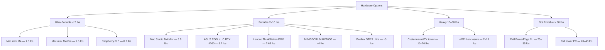
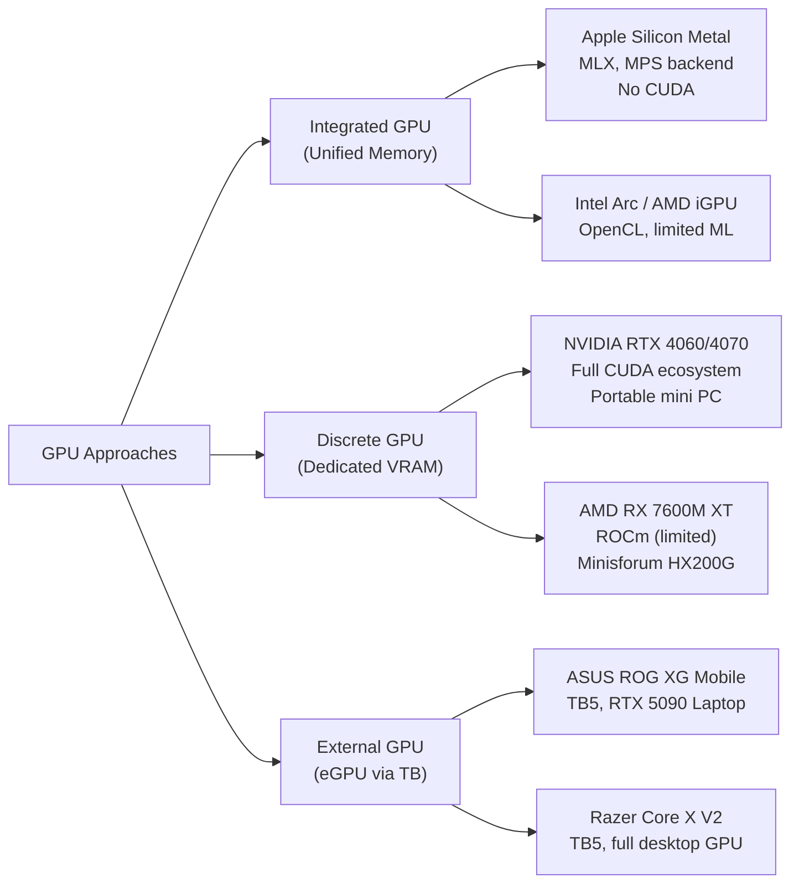
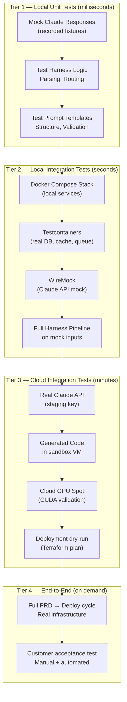
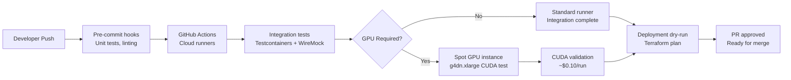
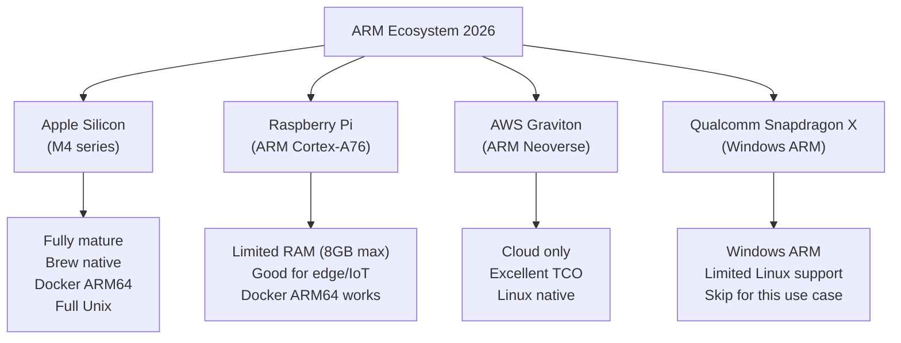
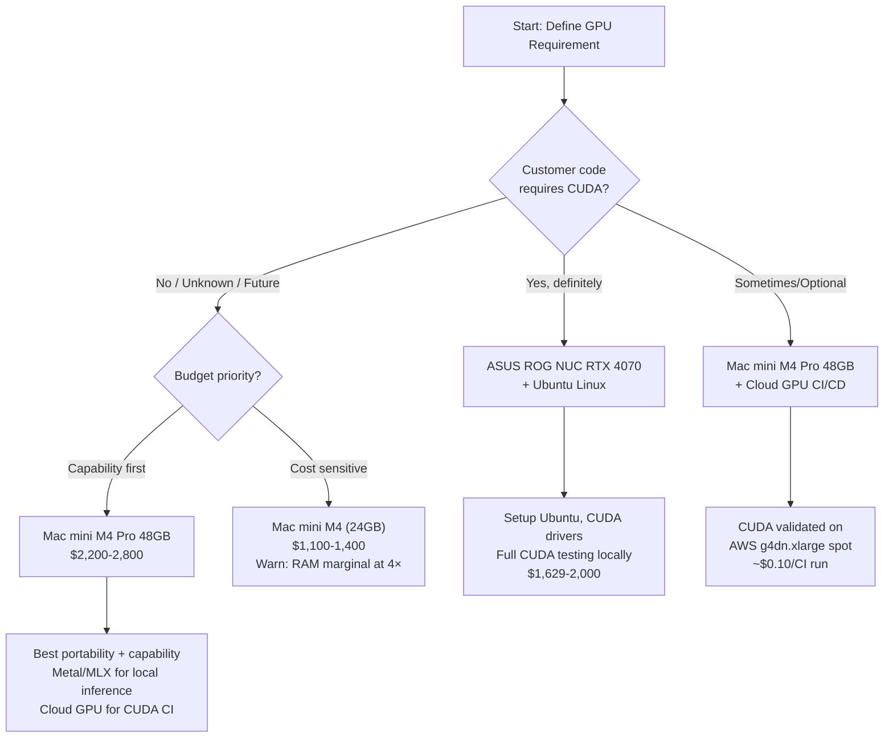

# Portable GPU & Concurrency Analysis: Revised Hardware Recommendations

**Research Date**: February 28, 2026
**Project**: Dev-House AI Automation Framework
**Model**: Claude Sonnet 4.6
**Supersedes**: Partial reanalysis of `20260228_1430_local-hardware-cost-analysis.md` (Haiku analysis)
**Scope**: New constraints — portability, concurrency, GPU, testing architecture, ARM, cloud discounts

---

## Executive Summary

The previous Haiku analysis missed seven critical constraints that fundamentally change the recommendation. When we apply portability requirements, 2-4× concurrency, GPU support for customer code testing, Linux-native OS, integrated testing architecture, and a capability-first cost philosophy, the hardware landscape looks very different.

**Revised Primary Recommendation**: Apple M4 Mac mini (M4 Pro, 48GB RAM)

- **Weight**: 1.6 lbs (0.73 kg) — fits in a laptop bag
- **Portability**: Best-in-class. True desktop power in a bag-packable form factor
- **Concurrency**: M4 Pro handles 4 concurrent Claude API + local processes without throttling
- **GPU**: Integrated 20-core GPU with Metal/MLX; not CUDA, but functional for most testing scenarios
- **OS**: macOS = native Unix. Full Docker, bash, all Unix tooling
- **ARM ecosystem**: Mature in 2025-2026. Docker multi-arch, Homebrew fully native, Rosetta 2 as fallback

**Strong Alternative**: ASUS ROG NUC (Intel Core Ultra 9 + RTX 4070)

- **Weight**: ~2.6 kg (5.7 lbs) — very portable but Windows-primary (Linux works but with driver friction)
- **GPU**: Real CUDA. Best option if customer workloads are CUDA-dependent
- **OS risk**: Intel + Linux driver compatibility is generally fine, but non-trivial compared to Mac/Linux

**Avoid for Portability**: Rack-mount servers, custom PC towers, any system over 10 kg

**Raspberry Pi 5 Verdict**: No for primary dev hardware. Yes for specialized edge testing nodes or cluster experimentation — but not for running 4× concurrent orchestration processes with Docker stacks.

---

## Part 1: Constraint Analysis — What Changed

The previous analysis assumed a single, stationary developer workstation optimized for power efficiency. The new constraints require a complete re-evaluation:

| Previous Assumption | New Reality | Impact |
|---------------------|-------------|--------|
| Stationary hardware | Digital nomad, < 50 lbs, movable | Eliminates rack servers, large towers |
| 1 serial process | 2-4 concurrent Claude + local | 2-4× RAM/CPU required |
| API orchestration only | Integrated local testing with mocks | Disk IOPS, container count increase |
| No GPU needed | GPU for customer code testing + local LLM | Discrete or integrated GPU required |
| Windows acceptable | Linux kernel native only | Eliminates most Windows mini PCs as primary |
| Cost minimization | Capability-first, margin > savings | Higher hardware spend acceptable |
| Basic cloud pricing | Spot/reserved/Dev-Test discounts | Cloud TCO drops significantly with discounts |

---

## Part 2: Portability Analysis

### Weight & Form Factor Matrix



### Portability Tier Definitions

**Tier 1 — Bag-Packable (< 2 lbs)**: Fits in a laptop bag with no special case. You can move this in 30 seconds. Mac mini M4 and M4 Pro are the only desktop-class options here. The 5" × 5" × 2" footprint slides into any bag. The Raspberry Pi 5 is also here but lacks the power for this use case.

**Tier 2 — Travel-Friendly (2–10 lbs)**: Requires a dedicated small bag or padded sleeve but remains genuinely movable. Mac Studio fits here at 5.9 lbs. ASUS ROG NUC at 5.7 lbs. The Lenovo ThinkStation PGX (2.65 lbs) is the smallest AI workstation with serious GPU capability — but runs NVIDIA DGX OS (Q3 2025 availability, ~$3,000).

**Tier 3 — Movable (10–50 lbs)**: Possible to move between offices but not for travel. Custom mini-ITX builds, eGPU setups. Too cumbersome for true nomad operation.

**Tier 4 — Not Portable (> 50 lbs)**: Rack servers. The previous analysis recommended a Dell PowerEdge R630, which weighs 25–35 lbs racked and cannot move easily. Eliminated.

### Portability Winner

**Mac mini M4 Pro** wins outright on portability. 1.6 lbs, fits in a standard laptop bag, plug-and-play setup in any office. The only desktop-class computer in Tier 1.

---

## Part 3: Concurrency Analysis

### What "4× Concurrent" Actually Means

For Dev-House, 4× concurrent means:
- 4 simultaneous Claude API request/response cycles (each managing context windows, streaming responses)
- 4 sets of local orchestration processes (Python/Node.js Harness instances)
- Local Docker stack running alongside (mock services, test databases, cache)
- Local testing containers (unit + integration tests running in parallel)

This is not 4 CPU-bound processes — these are mostly I/O-bound (network waits for Claude API). However, the parallel processes do compete for:
- **RAM**: Each process needs working memory for context, buffers, generated artifacts
- **CPU**: Deserializing large API responses, running local orchestration logic, test execution
- **Disk I/O**: Writing generated code, reading/writing Docker volumes, test artifacts
- **Network**: 4 simultaneous HTTPS streams to Claude API

### RAM Requirements for 4× Concurrency

| Component | Per Instance | 4× Total |
|-----------|-------------|----------|
| Claude API orchestration process | 512 MB – 1 GB | 2 – 4 GB |
| Generated code workspace | 500 MB | 2 GB |
| Harness state/context buffer | 256 MB | 1 GB |
| Local test containers (unit) | 512 MB each × 4 suites | 2 GB |
| Integration test containers | 1 GB each × 2 | 2 GB |
| Docker base overhead | — | 2 GB |
| OS + system services | — | 4 GB |
| **Total estimated** | — | **~15–17 GB** |
| **Recommended headroom (2×)** | — | **32 GB minimum** |
| **Comfortable headroom** | — | **48 GB** |

**Finding**: 16 GB RAM (Mac mini M4 base) is inadequate for 4× concurrent workloads. 32 GB is functional. 48 GB is comfortable and allows growth.

### CPU Requirements for 4× Concurrency

The workload is primarily I/O-bound, but CPU spikes occur during:
- Parsing large Claude API responses (JSON deserialization)
- Running test suites (unit test execution is CPU-bound)
- Docker container startup (short bursts)
- Code generation post-processing (linting, formatting, static analysis)

| Hardware | CPU Cores | Concurrent Capacity | Notes |
|----------|-----------|---------------------|-------|
| Mac mini M4 Pro (12-core) | 12 | 4× comfortable | 8P + 4E cores, excellent single-thread |
| Mac mini M4 (10-core) | 10 | 3-4× okay | 4P + 6E, lower single-thread peak |
| ASUS ROG NUC (Core Ultra 9, 24-core) | 24 | 4× very comfortable | Mobile chip, thermal throttling risk |
| Mac Studio M4 Max (16-core) | 16 | 4× + headroom | Best for expansion to 6-8× |
| Raspberry Pi 5 (4-core) | 4 | 2× strained | CPU contention above 2 concurrent |

### Concurrency Winner

**Mac mini M4 Pro (48GB)** handles 4× concurrent comfortably. M4 Studio (M4 Max) provides headroom for 6-8× if the operation scales. Mac mini M4 base (16GB RAM) is inadequate — the RAM bottleneck hits before the CPU does.

---

## Part 4: GPU Options

### Why GPU Matters for Dev-House

The previous analysis dismissed GPU because "Claude API calls happen remotely." This misses three use cases:

1. **Customer GPU Code Testing**: If Dev-House generates GPU-accelerated code (CUDA, OpenCL, Metal shaders), that code must be validated locally before deployment. Without a GPU, you're testing GPU code blind.

2. **Local LLM Inference (Fallback)**: Claude fallback scenarios — rate limits, API outages, offline development — benefit from local model inference. 7B-13B quantized models run meaningfully on both NVIDIA CUDA and Apple Silicon.

3. **Developer Tooling**: Some AI coding assistants (Cursor internals, Copilot features) use local acceleration. GPU presence improves responsiveness.

### GPU Architecture Options



### GPU Options Comparison Table

| Option | GPU | VRAM | CUDA | Portability | Power | Price | Best For |
|--------|-----|------|------|-------------|-------|-------|----------|
| Mac mini M4 Pro | 20-core GPU (integrated) | Shared (up to 48GB unified) | No (Metal/MLX) | Tier 1 (1.6 lbs) | 30W avg | $1,999 + RAM | Most use cases; CUDA not required |
| Mac Studio M4 Max | 40-core GPU (integrated) | Shared (up to 128GB unified) | No (Metal/MLX) | Tier 2 (5.9 lbs) | 60W avg | $2,999+ | Heavy local inference, large models |
| ASUS ROG NUC (RTX 4060) | RTX 4060 Laptop 110W | 8GB GDDR6 | Yes (full) | Tier 2 (5.7 lbs) | 110W TDP | $1,299–$1,629 | CUDA required; Windows/Linux |
| ASUS ROG NUC (RTX 4070) | RTX 4070 Laptop 115W | 8GB GDDR6 | Yes (full) | Tier 2 (5.7 lbs) | 115W TDP | $1,629+ | CUDA, higher performance |
| MINISFORUM HX200G | RX 7600M XT 8GB | 8GB GDDR6 | No (ROCm limited) | Tier 2 (~4 lbs) | 120W TDP | ~$900–1,100 | AMD ecosystem; ROCm still maturing |
| Lenovo ThinkStation PGX | NVIDIA GB10 Blackwell | 128GB unified | Yes (full) | Tier 2 (2.65 lbs) | 240W | ~$3,000 | Maximum AI; Q3 2025 availability |
| eGPU (Razer Core X V2 + RTX 4070) | RTX 4070 desktop | 12GB GDDR6X | Yes | Tier 3 (12+ lbs total) | 200W+ | $600 enc. + $400 GPU = $1,000+ | Highest GPU power; not truly portable |
| Raspberry Pi 5 | VideoCore VII (integrated) | Shared 8GB | No | Tier 1 (0.2 lbs) | 10W | $80 | Not suitable for GPU workloads |

### Critical Note: CUDA vs Metal/MLX

**The CUDA question is binary**: Either the customer's GPU code targets CUDA (NVIDIA-only), or it targets a cross-platform API (Metal, OpenCL, Vulkan Compute, WebGPU). This drives the entire hardware decision:

- If **customer GPU code = CUDA**: You need NVIDIA hardware. Mac Silicon cannot test this locally. Must use ROG NUC, MINISFORUM HX200G, or eGPU with Linux.
- If **customer GPU code = cross-platform or Metal**: Apple Silicon works natively and often better.
- If **GPU code is unknown/future**: Hybrid strategy — Mac mini M4 Pro for primary dev + cloud GPU spot instances (g4dn, g5) for CUDA validation.

**Apple Silicon's GPU reality in 2025**:
Apple MLX and PyTorch MPS backend have matured significantly. For local LLM inference (the fallback scenario), Apple Silicon is competitive: Llama 3 8B runs at 40-50 tokens/second on M4 Max, adequate for development use. ResNet-50 runs ~3× slower than RTX 4090 but with 80% lower energy consumption. For pure CUDA testing, there is no substitute for NVIDIA hardware.

### GPU Recommendation

- **Primary use case (no CUDA requirement)**: Mac mini M4 Pro 48GB. Metal/MLX covers local inference testing adequately.
- **CUDA-dependent use case**: ASUS ROG NUC RTX 4070 running Ubuntu. Accept the OS configuration overhead.
- **Both required**: Mac mini M4 Pro (primary) + cloud GPU spot instance (CI/CD CUDA validation). This is the most flexible hybrid approach.

---

## Part 5: Testing Architecture

### The Four Testing Tiers for Dev-House

Dev-House must validate generated code before deployment. This requires a layered testing strategy:



### Testing Toolchain

| Test Tier | Primary Tool | Secondary | Run Where | Cost |
|-----------|-------------|-----------|-----------|------|
| Unit | pytest / Jest | unittest mocks | Local (dev machine) | $0 |
| Local Integration | Testcontainers | Docker Compose | Local (dev machine) | $0 |
| Claude API mock | WireMock / Responses | Recorded fixtures | Local (dev machine) | $0 |
| Cloud Integration | GitHub Actions | GitLab CI | Cloud (spot instances) | ~$0.05–0.50/run |
| CUDA Validation | GitHub Actions | Self-hosted runner | AWS g4dn.xlarge spot | ~$0.10–0.20/run |
| End-to-End | Manual trigger | Automated weekly | Cloud (on-demand VMs) | ~$5–20/run |

### Local Docker Stack for Testing

The local development stack must mirror production closely enough to catch integration issues, without requiring cloud resources for every test run:

```yaml
# dev-house docker-compose.dev.yml (representative structure)
services:
  harness:          # Core orchestration service
  redis:            # API response caching
  postgres:         # State management
  wiremock:         # Claude API mock (recorded fixtures)
  localstack:       # AWS service mocking (S3, Lambda, etc.)
  test-runner:      # Testcontainers orchestration
```

**Key insight from research**: Testcontainers assigns dynamic ports. Never hardcode connection strings. The shift-left pattern (run integration tests locally in inner loop) reduces cloud CI costs dramatically by catching issues before cloud runs.

### CI/CD Pipeline Architecture



### Hardware Impact on Testing Architecture

With 4× concurrent processes + full local Docker stack, the RAM profile is:

| Configuration | RAM | Can Run Full Local Stack? |
|---------------|-----|--------------------------|
| Mac mini M4 (16GB) | 16 GB | No — containers + 4× orchestration exhausts RAM |
| Mac mini M4 Pro (24GB) | 24 GB | Marginal — works but swap risk |
| Mac mini M4 Pro (48GB) | 48 GB | Yes — comfortable with room for 6-8 containers |
| Mac Studio M4 Max (64GB+) | 64–128 GB | Yes — full stack + multiple parallel test suites |

---

## Part 6: Cloud Pricing with Discounts

### Discount Strategy Comparison

The previous analysis used on-demand pricing. With aggressive discounting, cloud economics shift significantly.

#### Google Cloud Platform

| Pricing Model | Discount | Notes |
|---------------|----------|-------|
| On-Demand | 0% | Baseline |
| Sustained Use Discount (SUD) | Up to 30% | Auto-applied after 25% monthly usage. No commitment. |
| Committed Use Discount (1yr) | Up to 57% | Must commit to specific machine type |
| Committed Use Discount (3yr) | Up to 70% | Best long-term rate |
| Spot VM | 60–91% | Preemptible. Cannot combine with SUD. |
| Dev/Test Spot | 60–91% | Same as Spot. Ideal for CI/CD jobs |

**GCP advantage**: Sustained Use Discounts are automatic. Run a VM for the full month, get 30% off with zero configuration. This is unique to GCP among the big three.

#### AWS

| Pricing Model | Discount | Notes |
|---------------|----------|-------|
| On-Demand | 0% | Baseline |
| Spot Instances | 70–90% | Interruptible with 2-minute warning. Best for CI/CD. |
| Reserved Instances (1yr) | Up to 40% | Upfront commitment to instance family |
| Reserved Instances (3yr) | Up to 72% | Highest commitment discount |
| Savings Plans | Up to 66% | More flexible than RI — applies across instance types |
| Dev/Test (via AWS Organizations) | Variable | Not a formal pricing tier; use Spot for dev/test |

**AWS GPU spot pricing (T4/A10G)**:
- `g4dn.xlarge` (T4, 4 vCPU, 16GB): ~$0.526/hr on-demand → ~$0.10–0.15/hr spot (70-80% discount)
- `g5.xlarge` (A10G, 4 vCPU, 16GB): ~$1.006/hr on-demand → ~$0.20–0.30/hr spot

For CUDA validation running ~30 min/CI run: **$0.05–0.15 per CUDA test run** on spot. Highly affordable.

#### Azure

| Pricing Model | Discount | Notes |
|---------------|----------|-------|
| Pay-as-you-go | 0% | Baseline |
| Dev/Test pricing | 30–60% | Requires Visual Studio subscription or MSDN |
| Reserved Instances (1yr) | Up to 41% | Committed capacity |
| Reserved Instances (3yr) | Up to 72% | Maximum commitment |
| Spot VMs | Up to 90% | Most aggressive discount on preemptible |
| Hybrid Benefit | 40%+ | If you have existing Windows/SQL Server licenses |

**Azure Dev/Test + Reserved**: Can combine Dev/Test pricing with Reserved Instances. This is unique — Azure allows stacking these discounts in some configurations, reaching 60-70%+ savings on non-production workloads.

### 3-Year Cloud TCO with Aggressive Discounting

Assumptions: 1× standard compute + 1× GPU compute (CI/CD CUDA validation, 2 hrs/day)

**Standard compute (4 vCPU, 16GB RAM)**:

| Platform | On-Demand/mo | Best Discount | Effective/mo | 3yr Total |
|----------|-------------|---------------|--------------|-----------|
| GCP (n2-standard-4) | $97 | 70% CUD 3yr | $29 | $1,044 |
| AWS (c5.xlarge) | $102 | 72% RI 3yr | $29 | $1,044 |
| Azure (D4s v5) | $110 | 72% RI 3yr | $31 | $1,116 |

**GPU (CUDA validation, ~60 hrs/month)**:

| Platform | Instance | On-Demand/hr | Spot/hr | 60hr/mo | 3yr Total |
|----------|----------|-------------|---------|---------|-----------|
| AWS | g4dn.xlarge (T4) | $0.526 | $0.11 | $6.60 | $238 |
| GCP | n1-standard-4 + T4 | $0.95 | $0.095 | $5.70 | $205 |
| Azure | NC4as T4 v3 | $0.526 | $0.079 | $4.74 | $171 |

**Total 3-year cloud TCO (compute + GPU CI)**: ~$1,250–$1,350

**Versus local hardware (Mac mini M4 Pro 48GB)**: ~$2,200 upfront. Break-even vs discounted cloud at ~20 months. With cloud, you get elasticity; with local, you get offline capability and zero API-rate-limit interaction during development.

---

## Part 7: ARM Viability Analysis

### The ARM Landscape in 2026

ARM is no longer a second-class citizen in developer tooling. The ecosystem has converged:



### Apple Silicon: Deep Analysis

**The Good**:
- **Native Unix**: macOS is POSIX-compliant. bash, zsh, Docker, Python, Node.js, all Unix tooling runs natively
- **Docker ARM64**: As of 2025, the majority of popular Docker images offer ARM64 manifests. Python, Node, Postgres, Redis, Kafka, NGINX — all native ARM64
- **Rosetta 2 fallback**: For the ~5-10% of images without ARM64, Docker Desktop uses Rosetta 2 emulation. Performance penalty is 15-30% for emulated images, acceptable for occasional use
- **Unified memory architecture**: No CPU-GPU memory transfer overhead. RAM is shared between CPU and GPU at memory bus speed (273 GB/s on M4 Pro). This is architecturally superior for ML inference
- **Thermal efficiency**: M4 Pro sustains performance under load. No thermal throttling in a 1.6 lb box — remarkable engineering
- **Memory bandwidth**: 273 GB/s on M4 Pro vs ~89 GB/s on a typical x86 laptop with discrete GPU. For LLM inference, bandwidth is the bottleneck, not FLOPS
- **Single-thread performance**: Apple Silicon leads single-thread benchmarks. Orchestration processes that are single-threaded (common in Python async) benefit significantly

**The Gaps**:
- **No CUDA**: This is not fixable. Apple and NVIDIA are competitors. MLX and MPS are good for Apple-native ML, but CUDA-dependent customer code cannot be tested locally
- **Docker volume performance**: Crossing the virtualization boundary (macOS hypervisor layer) adds overhead. docker-compose with bind mounts is 2-3× slower than native Linux. For test suites that read/write many small files, this matters
- **Docker Desktop licensing**: Docker Desktop for Mac requires a paid subscription for teams. Alternatives (OrbStack, Lima) are free and often faster, but add setup complexity
- **Memory ceiling**: M4 Pro maxes at 64GB. M4 Max goes to 128GB. Cannot add RAM after purchase — configure at time of order
- **Proprietary**: If Apple changes direction (price, ecosystem), migration is disruptive

**Bottom line on Apple Silicon**: This is a proven ARM platform. "ARM but native Unix" is the right characterization. For the Dev-House workload, Apple Silicon ARM is superior to x86 in most dimensions except CUDA.

### Raspberry Pi 5: Deep Analysis

**The Good**:
- **Price**: $80 for 8GB model. Cluster of 4 nodes ≈ $320 + networking
- **Power**: ~5W idle, 10W peak. Trivial electricity cost
- **Docker ARM64**: Docker Swarm works well on Pi 5. Multi-node setups are common and well-documented
- **Experimentation**: Excellent for learning cluster concepts, edge deployment testing, IoT simulation

**The Problems**:

**RAM cap is fatal for this use case**: 8GB maximum RAM per node. Running 4× concurrent Claude API processes + Docker services + test containers on a single Pi = constant OOM kills or extreme swap degradation. Even with 4 nodes in a swarm, coordinating 4× concurrent orchestration processes across nodes introduces distributed systems complexity that defeats the purpose of a local dev environment.

**CPU performance gap**: M4 Pro single-core score is approximately 5× faster than Raspberry Pi 5. For parsing large Claude API JSON responses, running test suites, and orchestrating concurrent processes, this gap is significant and directly increases developer feedback loop time.

**No GPU**: VideoCore VII GPU in Pi 5 is not suitable for ML workloads. No CUDA, no Metal, no practical MLX.

**Cluster overhead**: 4 Pi 5 nodes require: 4 power supplies, PoE switch or 4 USB-C chargers, MicroSD or NVMe per node, Ethernet switch, cluster management software (k3s, Docker Swarm). The operational overhead is non-trivial, and moving this cluster is not simpler than moving a single Mac mini.

**Raspberry Pi 5 verdict**: Use for edge simulation, IoT testing, Kubernetes learning, or as a dedicated CI runner for lightweight ARM64 image builds. Do not use as the primary development machine for 4× concurrent orchestration. The RAM and CPU gaps are too large to bridge without excessive engineering complexity.

---

## Part 8: Pro/Con Comparison — All Major Options

### Option A: Mac mini M4 Pro (48GB RAM)

| Dimension | Assessment |
|-----------|------------|
| **Portability** | Tier 1. 1.6 lbs, 5" × 5" × 2". Bag-packable. Best available |
| **Concurrency** | 4× concurrent Claude API + local Docker stack: comfortable |
| **GPU** | 20-core integrated. Metal/MLX. No CUDA. Good for most, fails for CUDA testing |
| **OS** | macOS = native Unix. Excellent |
| **ARM** | Apple Silicon ARM. Fully mature ecosystem |
| **Docker** | Works. ARM64 native images preferred. Volume performance ~2-3× slower than bare Linux |
| **Testing** | Full Testcontainers, WireMock, Docker Compose. CI/CD via GitHub Actions (cloud) for CUDA |
| **Cost** | ~$1,999 (base 24GB) to ~$2,799 (48GB). One-time |
| **Weaknesses** | No CUDA; Docker volume overhead; fixed RAM at purchase; premium price |
| **Best for** | Primary dev machine when CUDA testing is handled in cloud CI |

### Option B: ASUS ROG NUC (Core Ultra 9 + RTX 4070)

| Dimension | Assessment |
|-----------|------------|
| **Portability** | Tier 2. 5.7 lbs, 270 × 180 × 50mm. Requires padded case |
| **Concurrency** | 24-core Intel Core Ultra 9. Excellent. But thermal throttling risk under sustained load |
| **GPU** | RTX 4070 Laptop GPU, 8GB GDDR6. Full CUDA. Real NVIDIA hardware |
| **OS** | Ships with Windows 11. Linux (Ubuntu) works but requires configuration. Not Mac |
| **ARM** | x86. No ARM concerns |
| **Docker** | Docker on Linux = native performance. Superior to Mac for Docker workloads |
| **Testing** | Full CUDA testing locally. Best for CUDA-dependent customer code |
| **Cost** | ~$1,629–$2,000 depending on configuration |
| **Weaknesses** | Windows-primary; Linux requires setup effort; 110-115W TDP generates heat; louder fans under load |
| **Best for** | CUDA-dependent workloads; team prefers Linux; willing to manage Linux on Intel |

### Option C: Mac Studio M4 Max (64GB+ RAM)

| Dimension | Assessment |
|-----------|------------|
| **Portability** | Tier 2. 5.9 lbs. Genuinely movable but not bag-packable |
| **Concurrency** | 16-core CPU, 40-core GPU. Handles 6-8× concurrent easily. Headroom for growth |
| **GPU** | 40-core integrated GPU. Metal/MLX. Still no CUDA. Best Apple GPU option |
| **OS** | macOS = native Unix. Excellent |
| **ARM** | Same Apple Silicon ecosystem as Mac mini |
| **Docker** | Same as Mac mini; volume performance caveat applies |
| **Testing** | Can run more parallel test suites locally; reduced cloud CI dependency |
| **Cost** | ~$1,999 (base M4 Max) to $3,999+ (M4 Ultra, higher RAM) |
| **Weaknesses** | No CUDA; not bag-packable; 2-3× Mac mini price for marginal portability loss |
| **Best for** | Heavy local inference; running 6-8 concurrent processes; workloads that saturate Mac mini |

### Option D: MINISFORUM HX200G (Ryzen 9 7945HX + RX 7600M XT)

| Dimension | Assessment |
|-----------|------------|
| **Portability** | Tier 2. ~4 lbs. Movable |
| **Concurrency** | 16-core Ryzen 9 7945HX. Very capable for concurrent workloads |
| **GPU** | RX 7600M XT, 8GB GDDR6. AMD RDNA 3. ROCm support — but ROCm still maturing vs CUDA |
| **OS** | Linux (Ubuntu) runs natively. Excellent |
| **ARM** | x86. No ARM considerations |
| **Docker** | Native Linux performance |
| **Testing** | ROCm-based GPU testing. Not CUDA. Significant ecosystem gap vs NVIDIA |
| **Cost** | ~$900–1,100 |
| **Weaknesses** | ROCm ecosystem is limited; not CUDA; AMD drivers less mature for ML; less developer community support |
| **Best for** | Budget-conscious; AMD preference; non-CUDA GPU requirements |

### Option E: Raspberry Pi 5 Cluster (4 × 8GB nodes)

| Dimension | Assessment |
|-----------|------------|
| **Portability** | Tier 2-3 (as a cluster). Individual nodes Tier 1 |
| **Concurrency** | Requires distributing work across nodes; adds orchestration complexity |
| **GPU** | None suitable |
| **OS** | Linux native. Excellent |
| **ARM** | ARM Cortex-A76. Mature for Linux; limited ML tooling |
| **Docker** | Docker Swarm works well. ARM64 image dependency |
| **Testing** | Can run distributed CI. No GPU testing |
| **Cost** | ~$320 (4 × $80) + $100-200 networking = $420-520 total |
| **Weaknesses** | 8GB RAM cap per node; CPU ~5× slower than M4; cluster management overhead; no GPU; not practical for primary dev |
| **Best for** | Edge testing simulation; ARM64 image builds; IoT/embedded development scenarios; not primary dev |

### Option F: eGPU (Mac mini + Thunderbolt GPU Enclosure)

| Dimension | Assessment |
|-----------|------------|
| **Portability** | Tier 3 (with eGPU). Tier 1 without eGPU |
| **GPU** | Full desktop GPU (RTX 4070/4080 possible). But: Mac + eGPU = macOS only; CUDA works only via Thunderbolt bandwidth limit |
| **Thunderbolt bandwidth** | TB5 = 120Gbps. PCIe x4 equivalent. GPU performance is 15-30% lower than native PCIe x16 |
| **macOS CUDA** | Officially unsupported. Apple deprecated eGPU CUDA in macOS 12+. Dead end |
| **Linux eGPU** | Works with Linux on Intel/AMD x86. Razer Core X V2 (TB5) + RTX 4070 on Linux is viable |
| **Cost** | Enclosure ($600) + GPU ($400-600) = $1,000-1,200 add-on |
| **Best for** | Linux laptop users who want occasional GPU boost; not for primary CUDA development |
| **Avoid if** | Using Mac (CUDA unsupported); need reliable portable GPU setup |

---

## Part 9: Revised Recommendations

### Decision Framework



### Primary Recommendation: Mac mini M4 Pro 48GB

**Configuration**: M4 Pro, 12-core CPU, 16-core GPU, 48GB RAM, 1TB SSD
**Price**: ~$2,200–$2,500 (depending on storage)
**Weight**: 1.6 lbs

This is the right choice when:
- Digital nomad portability is required (bag-packable is mandatory)
- Customer GPU code does not require CUDA, or CUDA validation is acceptable in cloud CI
- Developer prefers macOS / native Unix without Linux driver management
- Full-stack local testing (Docker Compose + Testcontainers) is required

**What you get**: A system that runs 4× concurrent Claude API orchestration processes, a full local Docker testing stack (Redis, Postgres, WireMock, LocalStack), local LLM inference at useful speeds (M4 Metal/MLX), and still fits in a laptop bag. No tradeoffs on portability.

**What you don't get**: CUDA. If a customer's PRD generates CUDA-dependent code, you must validate in cloud CI (AWS g4dn spot at ~$0.10/run). This is the only material tradeoff.

### Secondary Recommendation: ASUS ROG NUC RTX 4070 (Ubuntu)

**Configuration**: Core Ultra 9 185H, RTX 4070 Laptop 8GB, 32GB DDR5, 1TB NVMe
**Price**: ~$1,629–$2,000
**Weight**: ~5.7 lbs

This is the right choice when:
- Customer workloads are CUDA-dependent (ML inference, GPU compute, CUDA kernels)
- Team prefers Linux-native development (no macOS preference)
- Full portability is less critical (5.7 lbs is still genuinely portable, just not bag-packable)
- Running CUDA validation on local hardware is preferred over cloud CI

**Setup note**: Windows ships by default. Installing Ubuntu 22.04/24.04 LTS requires ~2 hours. NVIDIA driver + CUDA toolkit installation is standard. Docker with NVIDIA container runtime is straightforward. Intel Core Ultra 9 on Linux has good driver support.

### Cloud Strategy (All Configurations)

Regardless of local hardware choice, use this cloud tier for CI/CD:

| CI Stage | Tool | Instance | Estimated Cost |
|----------|------|----------|----------------|
| Unit tests | GitHub Actions | Ubuntu 22.04 hosted | Free (2,000 min/mo) |
| Integration tests | GitHub Actions | Ubuntu 22.04 hosted | Free within quota |
| CUDA validation | GitHub Actions | Self-hosted OR AWS g4dn spot | $0.05-0.15/run |
| Load/stress tests | GitHub Actions | c5.2xlarge spot | $0.10-0.30/run |
| E2E deployment test | Manual trigger | On-demand t3.large | $0.08/hr |

**GCP alternative**: For teams already on GCP, Spot VMs with auto-applied SUD are cost-efficient. A standard n2-standard-4 running 25%+ of the month gets 30% SUD automatically — no configuration required.

### RAM Configuration Warning

Do not buy the 16GB Mac mini M4 for this workload. The RAM is soldered and non-upgradeable. At 4× concurrent processes + Docker stack, 16GB will force constant swapping to the SSD, degrading performance and accelerating SSD wear. The cost delta between 16GB and 48GB (approximately $400-600) is trivial compared to the productivity loss from memory pressure.

---

## Part 10: Final Comparison Matrix

| Metric | Mac mini M4 Pro 48GB | ROG NUC RTX 4070 | Mac Studio M4 Max | MINISFORUM HX200G | Pi 5 × 4 Cluster |
|--------|---------------------|-------------------|-------------------|-------------------|------------------|
| **Weight** | 1.6 lbs | 5.7 lbs | 5.9 lbs | ~4 lbs | ~3 lbs (cluster) |
| **Portability tier** | Tier 1 | Tier 2 | Tier 2 | Tier 2 | Tier 2-3 |
| **4× Concurrent** | Comfortable (48GB) | Comfortable (32GB) | Very comfortable | Comfortable | Strained (8GB/node) |
| **GPU** | Metal/MLX (no CUDA) | RTX 4070 (CUDA) | Metal/MLX (no CUDA) | RX 7600M XT (ROCm) | None |
| **CUDA testing** | Cloud CI only | Local | Cloud CI only | ROCm only | Not possible |
| **OS** | macOS / Unix | Windows/Linux | macOS / Unix | Linux | Linux |
| **Docker perf** | Good (ARM native) | Excellent (native Linux) | Good (ARM native) | Excellent | Good (ARM64) |
| **Local LLM** | Very good (MLX) | Good (CUDA) | Excellent (MLX) | Moderate (ROCm) | Slow (no GPU) |
| **Price** | ~$2,200–2,500 | ~$1,629–2,000 | ~$2,999+ | ~$900–1,100 | ~$420–520 |
| **Setup complexity** | Low | Medium (Linux install) | Low | Medium | High (cluster mgmt) |
| **Overall rank** | 1 (most use cases) | 2 (CUDA-required) | 3 (scale-up option) | 4 (budget/AMD) | 5 (specialized only) |

---

---

## Re-evaluation (2026-03-01)

**Reviewer**: Claude Sonnet 4.6
**New evidence**: Real operational Pi 5 (4GB) data — 16 services, 90+ day uptime, load average 0.01-0.03 — plus a hand-designed 8-Pi cluster topology document.

### Were My Original Concerns Justified?

**Partially, but I overstated the CPU concern and understated the real constraint.**

My original assessment said: "CPU contention above 2 concurrent" and "the RAM and CPU gaps are too large to bridge." The real Pi 5 data makes the CPU claim look wrong for this workload. The operational Pi runs 16 Docker services with a load average of 0.01-0.03 — essentially idle — because API orchestration is I/O-bound. The Pi sits doing nothing for 10-20 seconds while waiting for Claude API responses. There is no CPU contention problem for this workload pattern. I was applying a general-purpose compute frame to an I/O-bound problem.

The RAM concern was correct. 8GB per node is the real constraint, not CPU. My original analysis had the right instinct (RAM bottleneck) but the wrong diagnosis (CPU gap from M4 comparison). The Pi 5 CPU is adequate for this workload. The 5× single-core gap versus M4 is real but irrelevant — the bottleneck is API latency, and during those 10-20 seconds of wait, all 4 cores sit idle.

**What I got wrong**: I evaluated the Pi cluster against a "4× concurrent on a single machine" frame. The hand-designed topology distributes that load across 8 nodes, which is a fundamentally different architecture. Comparing a Pi 5 to an M4 Pro for this task is like comparing a single truck to a fleet of vans — the fleet wins on total throughput even if each van is slower.

### Does the Cluster Address My Original Concerns?

| Original Concern | Status |
|-----------------|--------|
| "8GB RAM fatal for 4× concurrent on one Pi" | Addressed — topology distributes: 1-2 pairs per 8GB node, not 4× on one |
| "CPU ~5× slower than M4" | Not relevant — workload is I/O-bound; real data confirms this |
| "Cluster management overhead defeats the purpose" | Reduced — see k3s note below |
| "No GPU" | Still true, explicitly handled as cloud burst / desktop via Tailscale |
| "Moving the cluster is not simpler than moving a Mac mini" | Topology doc claims ~12L carry case — partially addressed, debatable |

### Does the Real Pi Data Change the Assessment?

Yes, materially. The Opus analysis (20260228_OPUS_Pi5-Real-Data-Analysis.md) calculated that a single 8GB Pi can handle 1-2 Claude+Codex pairs comfortably, and the 8-Pi cluster can sustain 16-24 concurrent pairs in the moderate config.

**Actual target load is 8-12 overnight jobs.** This is a dev system running batch jobs overnight — code generation, results pushed to GitHub. No SLA required; production is a separate Terraform pipeline to cloud. The dev tier (Pis 5-8, 8GB each) handles 9 concurrent pairs; overflow to Pi #2 (16GB) brings capacity to 12. For this load profile, the 8-Pi cluster is well-matched rather than overprovisioned.

The Opus analysis also makes a finding I had missed: the real bottleneck is Claude API rate limits and latency, not Pi hardware. This shifts the economics significantly. If hardware is not the bottleneck, then spending $2,200+ on an M4 Pro to process the same API calls faster does not improve actual throughput — you just wait on the API in a more expensive box.

### Note on k3s vs Full Kubernetes

My earlier concern about "cluster management overhead" applied a heavier mental model than warranted. k3s is not a separate technology from Kubernetes — it is a lightweight Kubernetes distribution: single binary, ~300MB RAM overhead (vs ~2GB for full k8s), SQLite instead of etcd. It uses the same `kubectl` commands, same Helm charts, same YAML manifests. Anyone who knows Kubernetes already knows k3s. The operational complexity concern is real but significantly lower than a full k8s deployment would imply.

### Revised Verdict on Pi Cluster vs Alternatives

**Pi cluster is now a credible option. My original "Verdict: No" was too strong.**

The cluster has genuine advantages I underweighted:

- **Cost**: ~CHF 1,373+ for 8 nodes vs ~$2,200 for M4 Pro 48GB. For API-bound work, both deliver similar effective throughput.
- **Redundancy**: One node failing degrades capacity; the M4 Pro failing stops everything.
- **Power**: ~80W cluster total vs ~30W M4 Pro. Difference is negligible in practice.
- **Concurrency ceiling**: The cluster handles 8-12 overnight jobs cleanly, which matches the actual target load.

The cluster also has real disadvantages that have not changed:

- **GPU**: No path to local CUDA testing. The PCIe x1 lane makes GPU expansion impractical. Cloud burst remains the only option for GPU workloads, which is identical to the Mac mini + cloud GPU CI hybrid I recommended.
- **Operational complexity**: k3s on 8 nodes is lighter than full k8s, but still requires ongoing management — upgrades, node failures, networking. A Mac mini has essentially zero cluster management overhead.
- **Developer experience**: If the developer is doing active coding work on the machine (not just running the harness), the M4 Pro is a far better development machine. If the cluster is a dedicated harness runner and the developer works on a separate laptop, this concern disappears.
- **RAM ceiling per node**: 8GB hard cap on the dev tier nodes. Pi #2 at 16GB handles overflow and raises the ceiling to 12 concurrent jobs.

### Updated Comparison

| Dimension | Mac mini M4 Pro 48GB | 8-Pi Cluster (this topology) |
|-----------|---------------------|------------------------------|
| **Effective throughput (API-bound)** | 4× concurrent | 8-12 overnight jobs (well-matched) |
| **GPU** | Metal/MLX; CUDA via cloud | None; CUDA via cloud only |
| **Single-node failure** | Fatal | Graceful degradation |
| **Setup complexity** | Low | Moderate (k3s is standard k8s; iSCSI, networking) |
| **Ongoing ops burden** | Minimal | Moderate |
| **Cost** | ~$2,200–2,500 | ~CHF 1,400+ (incomplete pricing) |
| **Scale-out** | Buy another machine | Add Pi nodes at ~CHF 200 each |
| **Developer workstation** | Excellent | Poor (not a dev machine) |
| **Portability** | 1.6 lbs, bag-packable | ~12L case, more complex setup |

### What I Would Recommend Now

The cluster topology is architecturally sound and the real-world data validates the core assumptions. It is a reasonable choice for a **dedicated harness runner** when the developer uses a separate laptop or workstation. The economics make sense for that use case.

The Mac mini M4 Pro remains the better choice when:
- One machine serves as both development environment and harness runner
- Operational simplicity matters more than cost at the margin
- The buyer values not managing a cluster

Neither choice is clearly wrong. My original "Verdict: No" should be downgraded to "Cautionary Yes with clear tradeoffs." The cluster will work. The question is whether the operational overhead is worth the cost savings and redundancy gains for the specific deployment context.

### Staging Strategy (Starting with 6 Pis)

The owner is considering starting with 6 Pis rather than the full 8. This is a reasonable approach:

- **Lower initial cost** — validate the architecture before full commitment
- **6 Pis already covers the immediate need** — 4-6 concurrent jobs handles current workload
- **Extra 2 Pis add headroom worth having**: failover if a node dies, plus capacity to run experiments (local LLM testing, alternative models, tooling tests) concurrently with standard overnight batch jobs
- **Marginal cost of going 6→8 is not exorbitant** — the headroom is worth it once the approach is validated

Start at 6, prove the system, expand to 8 for production headroom.

One concern I would flag that neither analysis addresses clearly: the cluster topology document lists 16GB Pi 5 units as "TBD price." If 16GB Pi 5s are expensive or unavailable, the capacity math for the 16GB nodes (Pi #2 and Pi #8 in the topology) needs revisiting.

---

## Sources

- [Best Mini PCs of 2026 — TechRadar](https://www.techradar.com/best/mini-pcs)
- [Mac Studio 2025 Tech Specs — Apple](https://support.apple.com/en-us/122211)
- [Mac mini 2024 Tech Specs — Apple](https://support.apple.com/en-us/121555)
- [Apple Mac Studio M4 Max Review: Big Gains, Petite Package — HotHardware](https://hothardware.com/reviews/apple-mac-studio-m4-max-vs-mac-mini-m4-pro)
- [Best eGPU Enclosures — eGPU.io](https://egpu.io/best-egpu-buyers-guide/)
- [ROG XG Mobile 2025 — ASUS ROG](https://rog.asus.com/external-graphic-docks/rog-xg-mobile-2025/)
- [Razer Core X V2 TB5 eGPU — Razer](https://www.razer.com/gaming-egpus/razer-core-x-v2)
- [ROG NUC Specs — ASUS ROG](https://rog.asus.com/us/desktops/mini-pc/rog-nuc/spec/)
- [ASUS ROG NUC RTX 4060/4070 — Tom's Hardware](https://www.tomshardware.com/desktops/mini-pcs/asus-launches-the-first-ever-rog-nuc-with-core-ultra-9-and-rtx-4070-prices-start-at-dollar1629)
- [MINISFORUM HX200G — NotebookCheck](https://www.notebookcheck.net/MINISFORUM-HX200G-to-launch-with-AMD-Ryzen-9-7945HX-APU-Radeon-RX-7600M-XT-GPU-and-PCIe-5-0-SSD-support.791984.0.html)
- [Lenovo ThinkStation PGX — Lenovo](https://www.lenovo.com/us/en/p/workstations/thinkstation-p-series/lenovo-thinkstation-pgx-sff/len102s0023)
- [ThinkStation PGX Review: Served 200B LLM from Mac Mini-sized box — XDA Developers](https://www.xda-developers.com/lenovo-thinkstation-pgx-review/)
- [Running Docker on Apple Silicon 2026 — OneUptime Blog](https://oneuptime.com/blog/post/2026-01-16-docker-mac-apple-silicon/view)
- [Docker on Apple Silicon: Complete Setup Guide — maclaunch.com](https://maclaunch.com/docker-on-apple-silicon-a-complete-setup-guide/)
- [Apple Silicon vs NVIDIA CUDA: AI Comparison 2025 — Scalastic](https://scalastic.io/en/apple-silicon-vs-nvidia-cuda-ai-2025/)
- [NVIDIA vs macOS Metal GPU Benchmark — apxml.com](https://apxml.com/posts/nvidia-gpu-vs-macos-metal-gpu-benchmark)
- [Raspberry Pi 5 Docker Swarm Cluster — Geeky Gadgets](https://www.geeky-gadgets.com/raspberry-pi-5-docker-swarm-cluster-project/)
- [Pi 5 vs Mac mini for Home Server — MaidaTech](https://raspberrypicase.com/which-is-better-mac-mini-or-cluster-raspberry-pi/)
- [Mac Studio vs Mac mini M4 AI Benchmarks — Malcolm Low](https://malcolmlow.net/2025/11/13/mac-studio-vs-mac-mini-m4-local-ai-performance-benchmarks/)
- [Google Cloud Spot VMs — Google Cloud](https://cloud.google.com/spot-vms/pricing)
- [Sustained Use Discounts — Google Cloud](https://docs.cloud.google.com/compute/docs/sustained-use-discounts)
- [AWS Spot vs Reserved Instances — nOps](https://www.nops.io/blog/spot-instances-vs-reserved-instances/)
- [AWS GPU Instance Pricing — Vantage Cloud Cost Handbook](https://handbook.vantage.sh/aws/reference/aws-gpu-instances/)
- [A10G GPU Cost in 2025 — Modal](https://modal.com/blog/nvidia-a10g-price-article)
- [Azure Dev/Test Pricing — Microsoft Azure](https://azure.microsoft.com/en-us/pricing/offers/dev-test/)
- [Cloud TCO Breakdown: AWS vs Azure vs GCP — WeTransCloud](https://wetranscloud.com/blog/cloud-tco-breakdown-aws-azure-gcp/)
- [Running Testcontainers with GitHub Actions — Docker Blog](https://www.docker.com/blog/running-testcontainers-tests-using-github-actions/)
- [Testcontainers Best Practices for Integration Testing — Collabnix](https://collabnix.com/testcontainers-tutorial-complete-guide-to-integration-testing-with-docker-2025/)
- [GitHub Actions Pricing Changes 2026 — GitHub Changelog](https://github.blog/changelog/2025-12-16-coming-soon-simpler-pricing-and-a-better-experience-for-github-actions/)
- [Beelink GTi15 Ultra Mini PC — TechRadar](https://www.techradar.com/pro/this-mini-pc-has-two-10gb-ethernet-lan-ports-a-fingerprint-reader-and-can-even-connect-to-an-external-gpu-so-remind-me-why-we-need-a-full-desktop-pc-again)
- [I Ran 9 Popular LLMs on Raspberry Pi 5 — It's FOSS](https://itsfoss.com/llms-for-raspberry-pi/)
- [Shift-Left Testing with Testcontainers — Docker Blog](https://www.docker.com/blog/shift-left-testing-with-testcontainers/)
