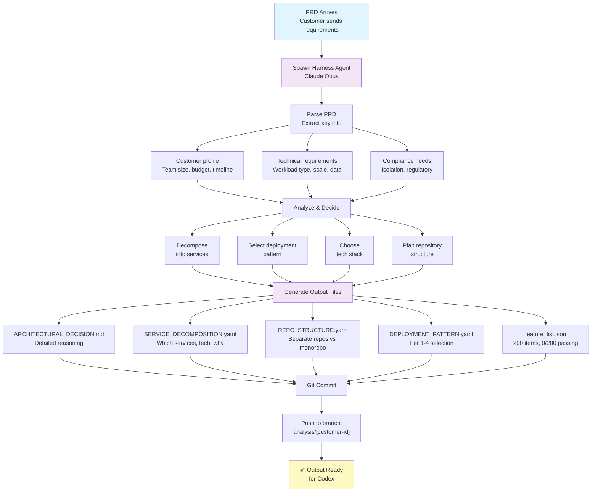
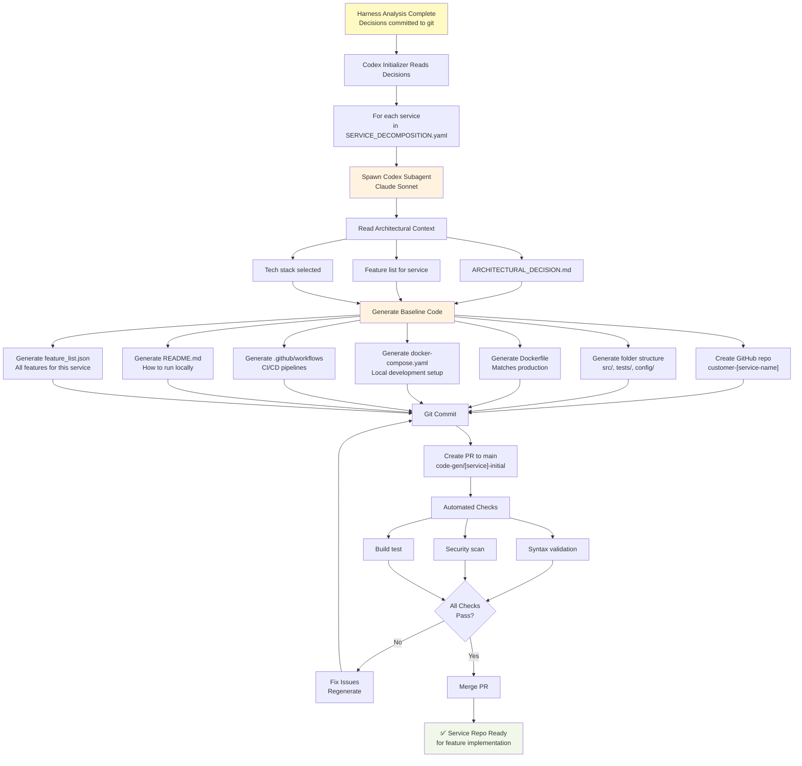
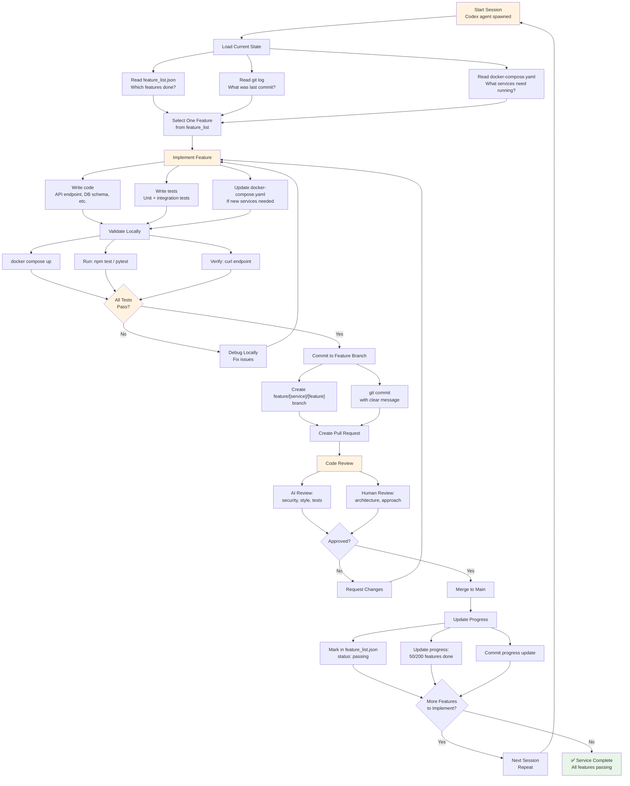
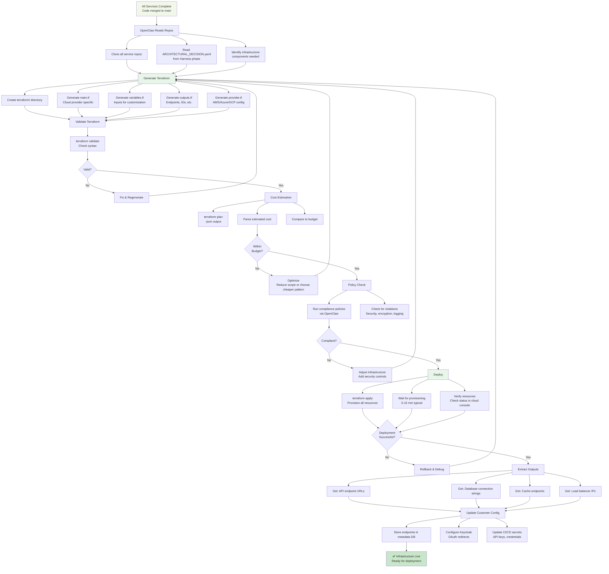
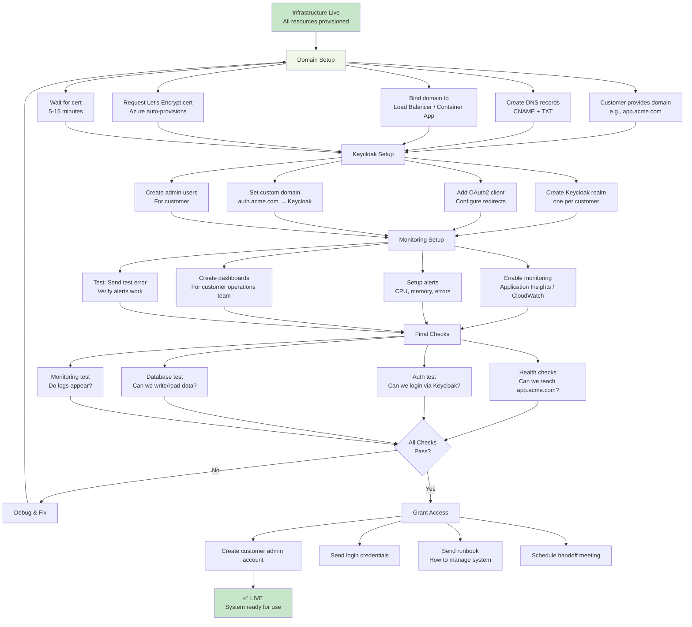
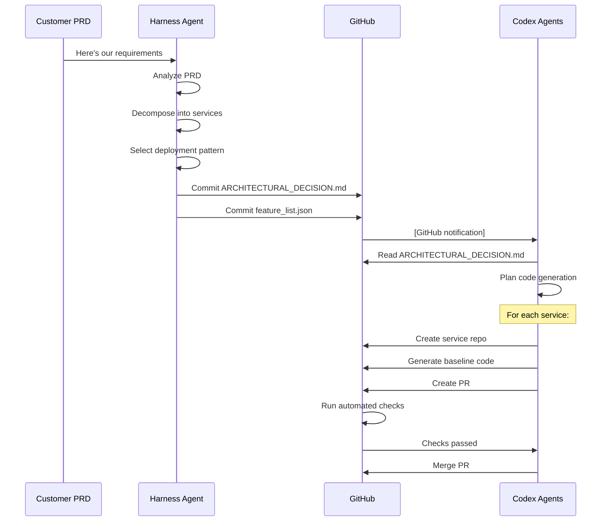
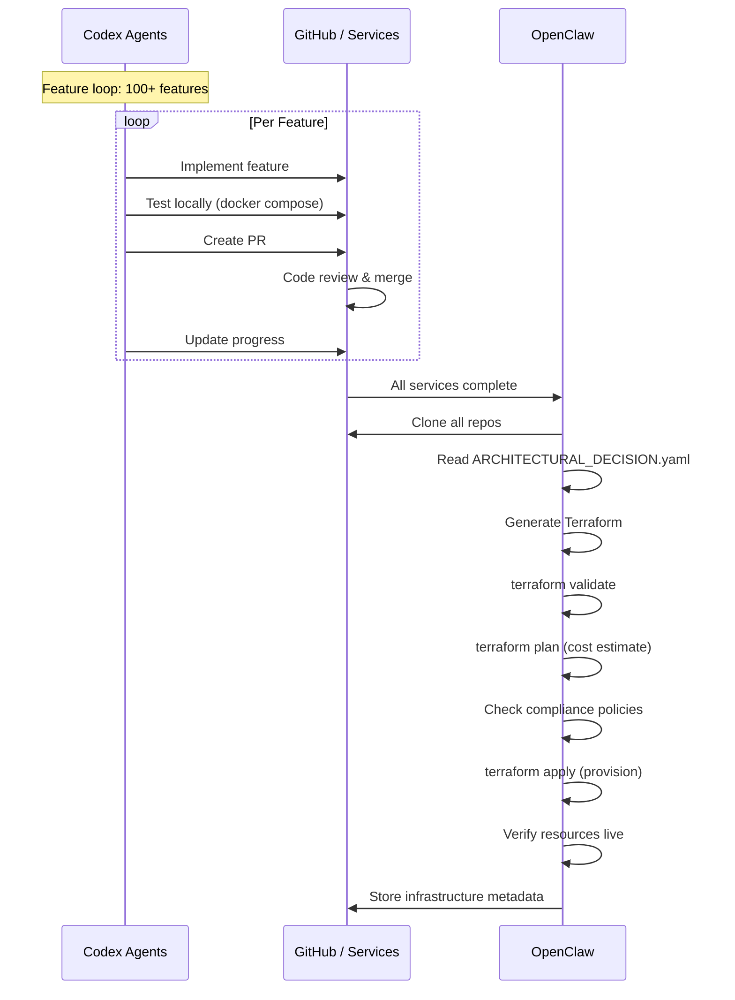
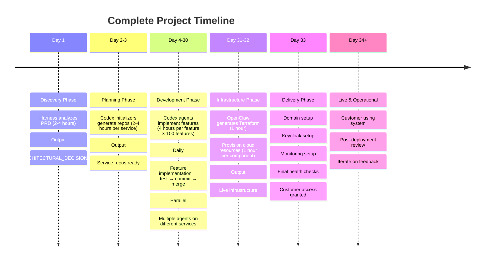

# Complete Process Flow: Discovery to Delivery

**End-to-end process showing every step, interaction point, and potential failure mode.**

---

## The Complete Cascade: All Phases

```mermaid
graph TD
    A["📋 DISCOVERY<br/>Customer PRD Arrives"] --> B["Analysis<br/>Harness Initializer"]

    B --> B1["Read & Parse PRD"]
    B1 --> B2["Analyze Requirements"]
    B2 --> B3["Decompose Services"]
    B3 --> B4["Select Pattern"]
    B4 --> B5["Plan Repos"]
    B5 --> B6["Output Decisions"]
    B6 --> C["✅ PLANNING<br/>Harness→Codex Handoff"]

    C --> D["Code Generation<br/>Codex Initializers"]
    D --> D1["Read Architectural Decisions"]
    D1 --> D2["Spawn Subagents"]
    D2 --> D3["Generate Service Repos"]
    D3 --> D4["Create Baseline Code"]
    D4 --> D5["Setup CI/CD"]
    D5 --> D6["Output: Repos Ready"]
    D6 --> E["✅ DEVELOPMENT<br/>Codex Feature Loop"]

    E --> E1["Session N: Pick Feature"]
    E1 --> E2["Implement in Code"]
    E2 --> E3["Run docker compose up"]
    E3 --> E4["Run Tests"]
    E4 --> E5["Create PR"]
    E5 --> E6["AI Code Review"]
    E6 --> E7["Merge to Main"]
    E7 --> E8["Update Progress"]
    E8 --> E9{All Features<br/>Implemented?}
    E9 -->|No| E1
    E9 -->|Yes| F

    F["✅ INFRASTRUCTURE<br/>OpenClaw Provisioning"]

    F --> F1["Read Service Repos"]
    F1 --> F2["Generate Terraform"]
    F2 --> F3["Validate Syntax"]
    F3 --> F4["Estimate Costs"]
    F4 --> F5["Check Policies"]
    F5 --> F6["Create terraform/plan"]
    F6 --> F7["Review Plan"]
    F7 --> F8["Apply: Provision"]
    F8 --> F9["Verify Deployment"]
    F9 --> F10{All Components<br/>Live?}
    F10 -->|No| F1
    F10 -->|Yes| G

    G["✅ DELIVERY<br/>Customer Ready"]
    G --> G1["Domain Provisioning"]
    G1 --> G2["Keycloak Setup"]
    G2 --> G3["Monitoring Active"]
    G3 --> G4["Customer Access"]
    G4 --> H["🎉 LIVE<br/>System Running"]

    style A fill:#e1f5ff
    style B fill:#f3e5f5
    style C fill:#fff9c4
    style D fill:#fff3e0
    style E fill:#fff3e0
    style F fill:#e8f5e9
    style G fill:#f1f8e9
    style H fill:#c8e6c9
```

---

## Phase 1: DISCOVERY (Harness Initializer)

**Timeline**: ~2-4 hours

**Goal**: Analyze PRD → Produce architectural decisions

### Process Flow

### Potential Breakdown Points

| Step | Failure Mode | Detection | Recovery |
|------|--------------|-----------|----------|
| **Parse PRD** | Ambiguous or incomplete requirements | Harness output lacks detail | Ask customer for clarification |
| **Decompose services** | Too many or too few services | Feature list seems wrong | Adjust decomposition; regenerate |
| **Select pattern** | Wrong Tier chosen (too cheap or expensive) | Customer rejects cost | Use workbook; re-evaluate |
| **Choose tech stack** | Unsupported or obsolete technologies | Customer can't run code | Use approved stack list |
| **Generate files** | Conflicting decisions in output | Files contradict each other | Harness re-analyzes with constraints |
| **Git commit** | Merge conflict (multiple PRDs same time) | Push fails | Rebase on latest main |

---

## Phase 2: PLANNING (Codex Initializers)

**Timeline**: ~2-4 hours per service

**Goal**: Generate service repos with baseline code

### Process Flow

### Potential Breakdown Points

| Step | Failure Mode | Detection | Recovery |
|------|--------------|-----------|----------|
| **Read context** | Decisions incomplete or contradictory | Codex output is inconsistent | Harness re-analyzes and clarifies |
| **Generate repo** | GitHub org access missing | Push fails | Verify credentials, retry |
| **Generate code** | Generated code doesn't match Dockerfile | Build fails in Docker | Regenerate with constraints |
| **Dockerfile parity** | Local != production | Test passes locally, fails in cloud | Verify env vars, dependencies |
| **CI/CD generation** | Workflows target wrong cloud provider | Pipeline fails | Regenerate for correct provider |
| **Security scan** | Vulnerable dependencies in generated code | Scan blocks merge | Upgrade dependencies, regenerate |

---

## Phase 3: DEVELOPMENT (Codex Feature Loop)

**Timeline**: ~4 hours per feature (100+ features total = 400+ hours)

**Goal**: Implement services feature-by-feature

### Process Flow (Per Feature)

### Potential Breakdown Points

| Step | Failure Mode | Detection | Recovery |
|------|--------------|-----------|----------|
| **Load state** | Previous session's work lost | git log empty or feature_list missing | Restore from backup; regenerate |
| **Select feature** | Feature unclear or ambiguous | Generated code is guessing | Add detail to feature description |
| **Implement** | Generated code hallucinating side effects | Tests fail mysteriously | Simplify feature; add constraints |
| **Docker parity** | Works locally, breaks in cloud | Environment variables differ | Sync .env files, dockerfile |
| **Tests pass** | Tests don't test the right thing | Code works locally, fails cloud | Improve test coverage |
| **Code review** | Security issue missed | Scan catches vulnerability later | Improve review criteria |
| **Merge conflict** | Multiple agents changing same file | Git merge fails | Resolve conflict; rebase |
| **Progress tracking** | feature_list.json gets out of sync | Count doesn't match reality | Rebuild from git commits |

---

## Phase 4: INFRASTRUCTURE (OpenClaw Provisioning)

**Timeline**: ~1 hour per component (10-15 components)

**Goal**: Provision cloud infrastructure

### Process Flow

### Potential Breakdown Points

| Step | Failure Mode | Detection | Recovery |
|-------|-------------|-----------|----------|
| **Generate Terraform** | Provider mismatch (AWS config for Azure) | Deployment fails | Regenerate with correct provider |
| **Validate syntax** | Invalid HCL in generated code | terraform validate fails | Fix syntax errors |
| **Cost estimation** | Estimate way off from actual | Bill surprises customer | Re-estimate with realistic assumptions |
| **Policy violations** | Security issue detected too late | Compliance scan fails | Add controls before deployment |
| **Apply fails** | Resource quota exceeded | "Quota exceeded" error | Request quota increase; use smaller instance size |
| **Deployment hangs** | Let's Encrypt cert provisioning stuck | 30 min with no progress | Check certificate status; retry |
| **Resource mismatch** | Generated code conflicts with existing infra | Apply reports conflict | Rename resources; use state import |
| **Outputs missing** | Key outputs not captured | Later steps can't find endpoints | Regenerate outputs.tf |

---

## Phase 5: DELIVERY (Customer Ready)

**Timeline**: ~1-2 hours

**Goal**: Set up custom domain, identity, monitoring

### Process Flow

### Potential Breakdown Points

| Step | Failure Mode | Detection | Recovery |
|-------|-------------|-----------|----------|
| **Domain DNS** | Customer forgets to create DNS record | Health check fails | Send DNS setup guide to customer |
| **Cert provisioning** | Let's Encrypt cert stuck in pending | 30 min timeout with no cert | Check Azure binding status; retry |
| **Keycloak realm** | Realm name conflicts with existing | Realm creation fails | Use customer ID as unique identifier |
| **OAuth redirect** | Redirect URI mismatch (app expects different domain) | Login redirects to wrong URL | Update OAuth client config |
| **Database connection** | App can't reach database from container | Health check fails | Verify VNet/security group settings |
| **Monitoring setup** | Logs not appearing in dashboard | Debugging blind | Check app logging is enabled; verify sink |
| **Health checks** | Endpoint returns 500 after provisioning | Health check fails | Check application logs; restart app |

---

## Cross-Phase: Sequence Diagrams

### Harness → Codex Handoff

### Codex → OpenClaw Handoff

---

## Complete Timeline

---

## Where Things Break Down (Critical Points)

| Rank | Issue | Impact | Prevention |
|------|-------|--------|-----------|
| 🔴 **1** | Harness produces ambiguous decisions | All downstream work based on unclear architecture | Use detailed PRD assessment + have human review |
| 🔴 **2** | Codex generates code that doesn't match Dockerfile | Works locally, fails in production | Verify env vars, dependencies match |
| 🔴 **3** | Feature implementation stalls (test failures) | Progress stops, agent spins on same feature | Set timeout per feature; move to next if stuck |
| 🟠 **4** | Terraform generation targets wrong provider | Deployment fails; resources created in wrong place | Verify cloud provider from ARCHITECTURAL_DECISION |
| 🟠 **5** | Infrastructure cost overruns | Customer rejects bill | Review terraform plan before apply |
| 🟠 **6** | Domain provisioning async timeout | Custom domain not working | Don't block on cert; retry in background |
| 🟡 **7** | Database connection string wrong | App can't reach database | Verify VNet/security group settings |
| 🟡 **8** | Feature list gets out of sync with git | Progress tracking wrong | Rebuild from git commits periodically |

---

## See Also

- **[GETTING-STARTED.md](../architecture/GETTING-STARTED.md)** — High-level story
- **[CRITICAL-SEPARATIONS.md](../architecture/CRITICAL-SEPARATIONS.md)** — Why separation matters
- **[anthropic-harness-pattern-extended.md](../architecture/anthropic-harness-pattern-extended.md)** — Pattern explanation
- **[execution-streams-codex-vs-harness.md](../architecture/execution-streams-codex-vs-harness.md)** — Detailed execution flows
